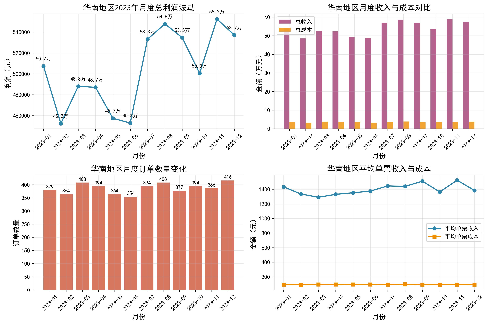
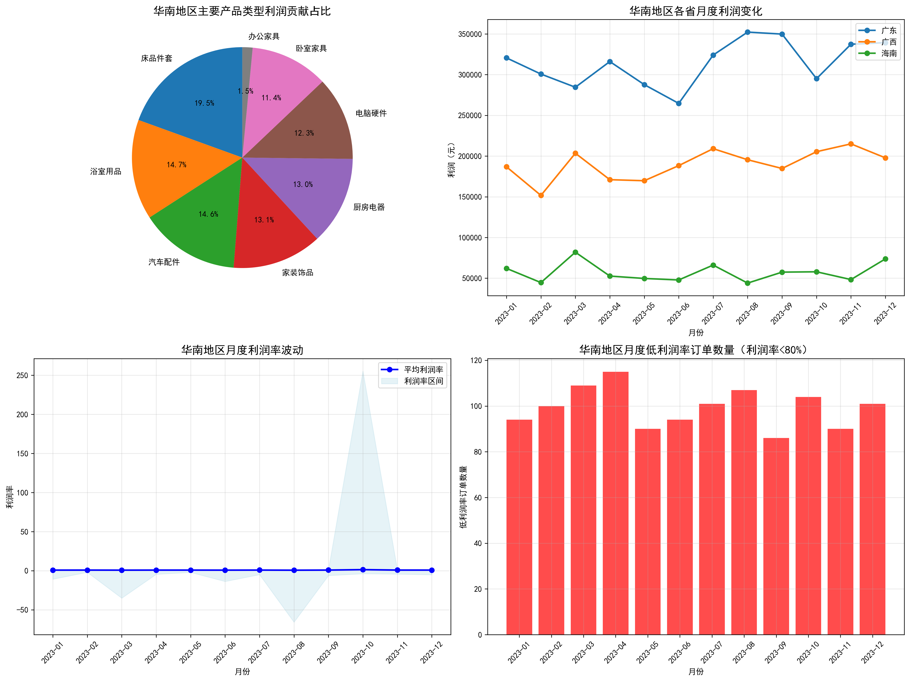
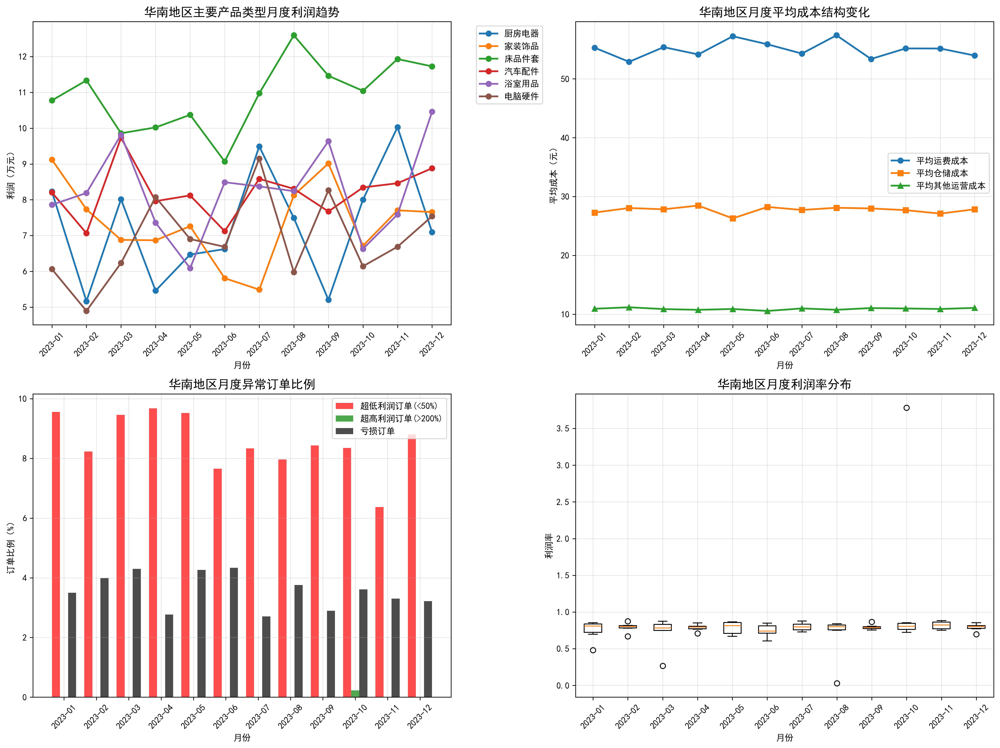

# 华南地区月度利润波动分析报告

## 执行摘要

华南地区2023年月度总利润呈现明显波动，利润变异系数为7.36%，在45.3-55.2万元之间波动。通过深入分析发现，利润波动主要受产品类型结构、季节性因素和异常订单影响，其中厨房电器类产品波动最大（变异系数21.8%）。

## 一、利润波动概况

### 关键发现：
- **利润区间**：45.3万元（6月）至55.2万元（11月）
- **变异系数**：7.36%，属于中等波动水平
- **峰值月份**：7-9月和11-12月相对较高
- **低谷月份**：2月、5-6月相对较低

### 波动特征：
1. **季节性明显**：下半年利润普遍高于上半年
2. **收入驱动**：利润波动主要受总收入变化影响
3. **成本控制**：单票成本相对稳定，在92-96元之间波动

## 二、利润波动原因深度分析

### 2.1 地区分布影响
- **广东省**：贡献377万元利润，占比55.8%
- **广西**：贡献228万元利润，占比33.7%
- **海南省**：贡献69万元利润，占比10.2%

### 2.2 产品类型结构
主要利润来源及其波动性：
- 厨房电器：波动最大（变异系数21.8%）
- 电脑硬件：波动较大（变异系数17.2%）
- 浴室用品：中等波动（变异系数15.6%）

### 2.3 利润率异常分析
- **利润率范围**：65.7%-136.2%
- **异常订单**：全年低利润率订单1,191单，占比12.1%
- **极端情况**：个别订单利润率低至-6580%，高至25530%

## 三、季节性波动特征

### 3.1 产品季节性
- **厨房电器**：3-4月和9-10月利润较高
- **电脑硬件**：下半年表现优于上半年
- **浴室用品**：相对稳定的季节性模式

### 3.2 异常订单分布
- **3月份异常最多**：超低利润订单44单，亏损订单20单
- **异常订单占比**：全年12.1%的订单存在利润异常
- **成本波动**：运费成本在27-49元之间波动

## 四、问题根因分析

### 4.1 产品结构问题
1. **高波动产品占比过高**：厨房电器等波动性大的产品占比较大
2. **产品组合不够均衡**：缺乏稳定利润的"现金牛"产品

### 4.2 季节性因素
1. **需求季节性**：部分产品受季节性需求影响明显
2. **成本季节性**：运营成本存在季节性波动

### 4.3 运营管理问题
1. **定价策略不稳定**：部分订单利润率异常，反映定价策略问题
2. **成本控制不足**：异常订单比例偏高，需要加强成本控制

## 五、改进建议

### 5.1 优化产品组合
1. **增加稳定型产品**：引入利润稳定、季节性波动小的产品
2. **平衡高风险产品**：控制厨房电器等高波动产品的占比
3. **建立产品分层管理**：区分"现金流产品"和"利润产品"

### 5.2 加强季节性管理
1. **提前备货策略**：针对季节性产品提前调整库存
2. **动态定价机制**：根据季节性需求调整定价策略
3. **成本控制预案**：制定季节性成本波动应对预案

### 5.3 提升运营效率
1. **异常订单预警**：建立利润率异常订单预警机制
2. **精细化成本管理**：加强运费、仓储等成本控制
3. **定价策略优化**：建立基于成本的动态定价模型

### 5.4 区域差异化策略
1. **广东市场深耕**：作为核心市场，应重点维护
2. **广西市场拓展**：有较大增长空间，可加大投入
3. **海南市场培育**：作为新兴市场，需要耐心培育

## 六、预期效果

通过实施上述建议，预计可以：
- 将月度利润变异系数从7.36%降低至5%以下
- 减少异常订单比例从12.1%降至8%以下
- 提升全年利润稳定性，减少月度波动
- 建立更加可持续的盈利模式

## 结论

华南地区月度利润不稳定的问题主要源于产品结构不均衡、季节性因素和运营管理精细化程度不足。通过优化产品组合、加强季节性管理和提升运营效率，可以有效改善利润稳定性，实现更加可持续的发展。
