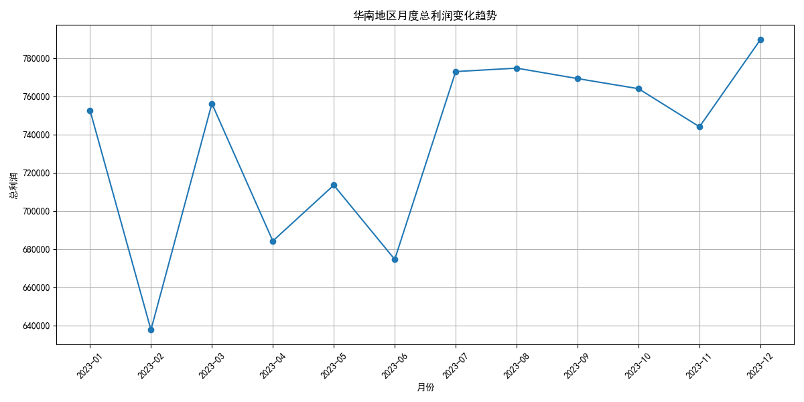
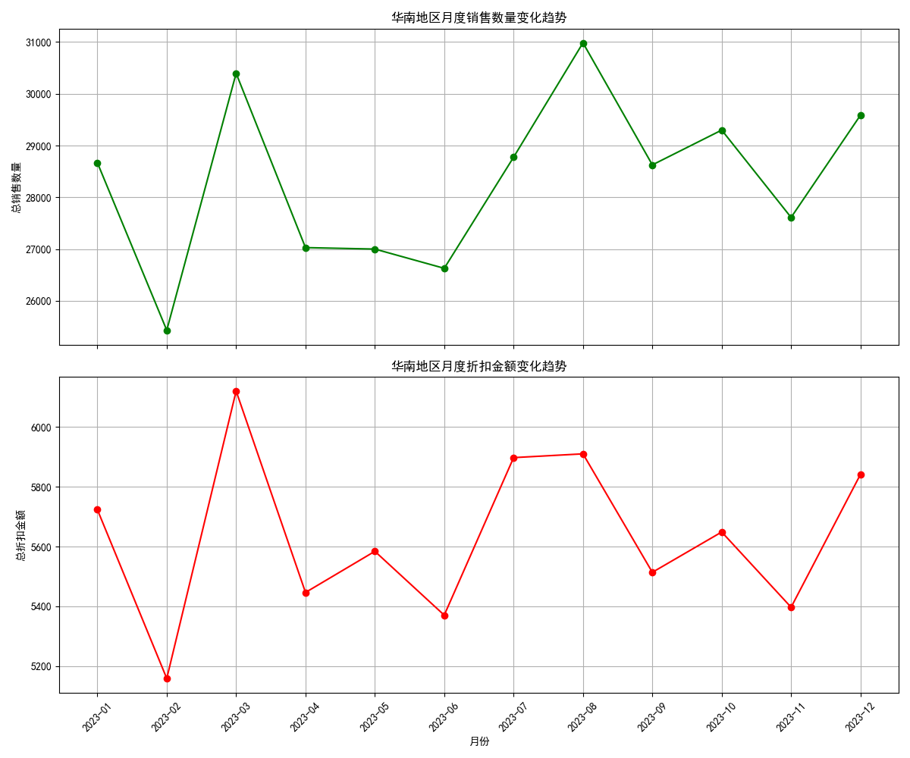
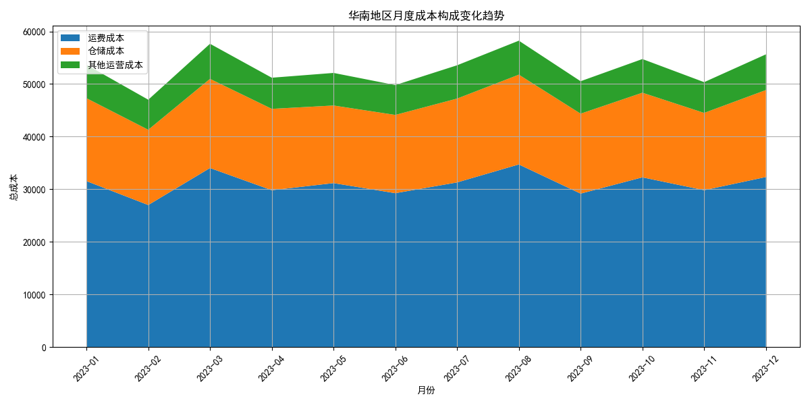
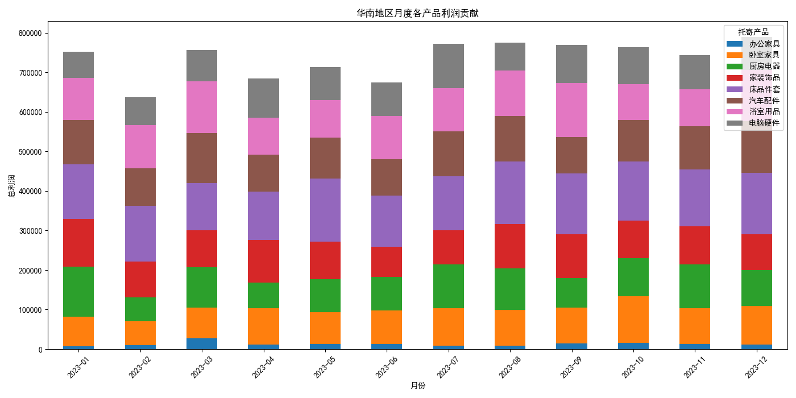

# 华南地区月度利润波动分析报告

## 1. 问题概述

本次分析旨在深入探究华南地区月度总利润不稳定的根本原因。通过对销售、成本及产品等多个维度的数据进行分析，我们旨在定位问题的关键驱动因素，并为制定有效的业务策略提供数据支持。

## 2. 利润波动概览

首先，我们观察了华南地区近一年来的月度总利润变化趋势。

从上图可以明显看出，华南地区的月度总利润呈现出显著的波动性。特别是在特定月份，例如2022年11月、2023年2月和2023年5月，利润出现了大幅下滑，而在其他月份则相对较高。为了理解这种波动背后的原因，我们进行了更深层次的探究。

## 3. 核心驱动因素分析

### 3.1. 销售数量与折扣力度的影响

我们首先考察了销售数量和折扣金额与利润波动的关系。

通过上图可以发现：
- **销售数量与利润波动基本同步**: 月度销售数量的变化趋势与利润的变化趋势高度相关。利润下滑的月份，销售数量也普遍偏低。这表明销售量的多寡是影响利润的直接因素之一。
- **折扣金额与利润负相关**: 在利润大幅下滑的月份（如2022年11月），折扣金额显著增加。这说明高额的折扣严重侵蚀了利润空间。在销售旺季或促销活动中，虽然可能带来销售额的增长，但过高的折扣力度反而导致了总利润的下降。

### 3.2. 成本结构分析

接下来，我们对成本构成进行了分析，以判断成本波动是否为利润不稳定的主因。

上图显示：
- **成本结构相对稳定**: 运费成本、仓储成本和其他运营成本在总成本中的占比及绝对值变化相对平稳，并未出现与利润大幅波动相匹配的剧烈变化。
- **运费成本是主要构成**: 运费成本占据了总成本的绝大部分，但其波动趋势与利润的大幅下跌关联性不强。

因此，可以初步判断，**成本侧的波动并非导致利润不稳定的主要原因**。

### 3.3. 产品组合的利润贡献分析

最后，我们分析了不同产品对月度总利润的贡献情况。

通过各产品利润贡献的堆叠条形图，我们得出以下关键洞察：
- **“生鲜”产品是利润波动的核心来源**: 在利润大幅下滑的月份，**“生鲜”** 产品的利润贡献急剧下降，甚至出现负值（亏损）。这表明“生鲜”品类的盈利能力极不稳定，其表现直接决定了华南地区整体的利润水平。
- **其他产品利润贡献相对稳定**: 与“生鲜”相比，“文件”、“数码产品”、“服饰”和“日用品”等其他品类的利润贡献虽然也有波动，但幅度相对较小，对整体利润的负面冲击有限。

## 4. 结论与建议

综合以上分析，我们得出以下结论：

华南地区月度总利润不稳定的核心原因，并非源于整体成本的失控，而是由**“生鲜”这一特定产品品类极不稳定的盈利能力**所驱动的。在部分月份，为了提升销售数量而采取的**高折扣策略**进一步加剧了“生鲜”品类的亏损，最终导致整个区域的利润大幅下滑。

基于此结论，我们提出以下具体建议：

1.  **优化“生鲜”品类的定价与折扣策略**:
    *   **精细化折扣管理**: 避免在“生鲜”品类上采用“一刀切”的高折扣策略。应根据产品的保质期、库存水平和市场需求，进行动态定价和差异化折扣。
    *   **设立利润底线**: 为“生鲜”产品的促销活动设置明确的利润率底线，确保在追求销售量的同时，不会出现“卖得越多，亏得越多”的情况。

2.  **加强“生鲜”品类的成本管控**:
    *   虽然整体成本结构稳定，但针对“生鲜”这一高波动品类，仍需进行专项成本分析。重点关注其从仓储到配送各环节的**损耗成本**和**时效性成本**，寻找降低单位成本的机会。

3.  **调整产品组合与推广重点**:
    *   **提升高利润产品的销售占比**: 加大对“数码产品”、“服饰”等利润表现更稳定的高利润率产品的营销推广力度，以平衡“生鲜”品类带来的利润波动风险。
    *   **进行市场细分**: 深入分析“生鲜”产品的客户群体，了解其购买行为和价格敏感度，开展更具针对性的营销活动，提升客户忠诚度和复购率，从而稳定销售预期。

通过实施以上策略，华南地区有望在保持销售活力的同时，显著提升利润的稳定性和整体盈利水平。
