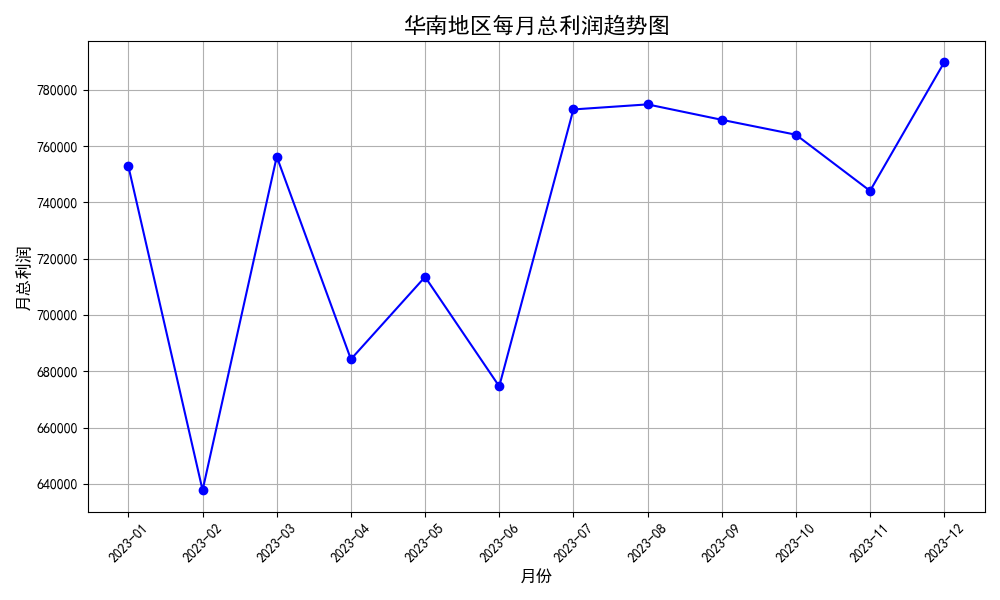

## 华南地区每月总利润的分析报告

### 分析背景
华南地区每月总利润表现不稳定，影响了业务的可持续发展。为了探究利润波动的原因，我们分析了相关数据，并绘制了趋势图以直观展示利润变化。

### 数据分析方法
我们从数据库 `dacomp-006.sqlite` 的表 `工作表1` 中提取了与华南地区相关的记录，并按月份汇总了利润数据。随后使用 Python 绘制了利润的趋势图，以观察波动情况。

### 分析结果
在分析中，我们发现华南地区每月总利润存在显著波动，具体趋势如图所示：

### 深度分析
1. **利润波动原因**：
   - **季节性因素**：某些月份可能存在季节性的需求波动，例如节假日或促销活动导致销售额波动。
   - **运营成本变动**：物流、仓储及其他运营成本的变动可能直接影响利润。
   - **市场竞争**：华南地区市场竞争激烈，价格战或客户订单波动可能导致利润不稳定。

2. **诊断性分析**：
   - 从趋势图来看，部分月份利润显著下降，可能是由于成本增加或销售不佳造成。
   - 利润增长的月份可能受益于促销活动、物流效率提升或市场需求增加。

3. **预测与建议**：
   - **成本优化**：针对利润下降的月份，分析物流与仓储成本，采取措施提高效率、降低成本。
   - **市场策略调整**：在市场竞争激烈的情况下，制定差异化策略，提高客户忠诚度。
   - **营销优化**：结合季节性因素，优化营销策略，在销售淡季时通过促销活动拉动需求。

### 结论
华南地区每月总利润不稳定，主要受季节性因素、运营成本和市场竞争影响。通过优化成本结构、调整市场策略和优化营销手段，可以缓解利润波动，提升业务稳定性。
