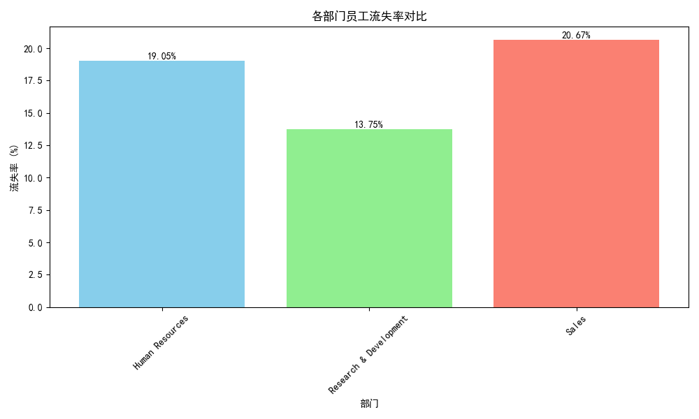
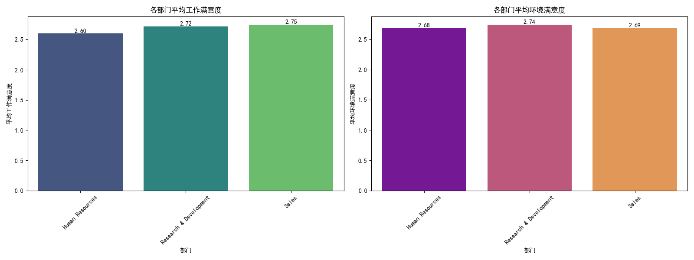
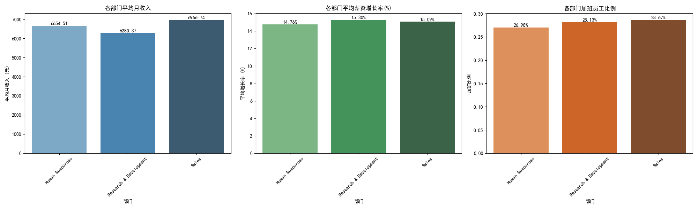
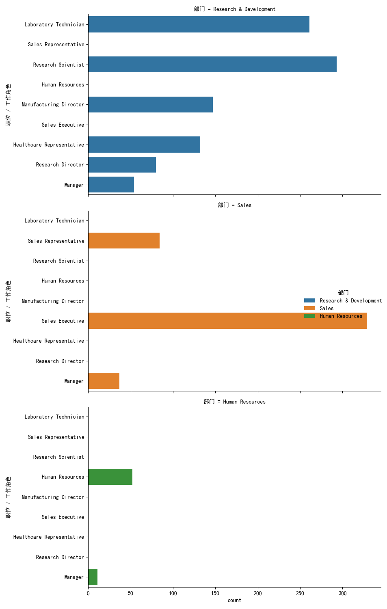

# 报告：为何研发部门的员工流失率远低于其他部门？

## 一、核心结论

经过对公司各部门员工数据的深入分析，我们发现，**研发部门（Research & Development）之所以拥有显著低于销售（Sales）和人力资源（Human Resources）部门的员工流失率，其核心原因并非来自薪酬福利或工作强度的优势，而在于其内部构建了一个更多元化、更富挑战性的职业生态系统。** 具体而言，研发部门为员工提供了更多样的工作角色选择和更丰富的内部职业发展路径，这成为留住技术人才的关键。

## 二、分析过程与发现

### 1. 研发部门流失率确实显著更低

首先，我们验证了业务问题的前提。数据显示，研发部门的流失率约为13.75%，远低于销售部门的20.67%和人力资源部门的19.05%，差异显著。

### 2. 传统归因的“失灵”：满意度、薪酬与加班并非主因

在传统认知中，员工流失往往与满意度低、薪酬不高或工作压力大有关。然而，我们的分析排除了这些因素作为解释部门间流失率差异的主要原因。

*   **满意度差异微乎其微**：无论是工作满意度还是环境满意度，研发部门与其他部门相比均无明显优势。各部门的平均满意度评分都非常接近，这点微小的差异不足以导致流失率的巨大不同。

    

*   **薪酬与加班不占优势**：令人意外的是，研发部门的平均月收入（约6280元）实际上是三个部门中最低的。同时，其加班比例（28.13%）与销售部门（28.67%）几乎持平。这表明，研发部的低流失率并非得益于“钱多事少”。

    

### 3. 深入探索：职业发展路径的差异

既然传统因素无法解释，我们将目光投向了员工的职业生涯发展。

*   **晋升速度与在职年限相似**：分析显示，各部门员工的平均在司年限、现任职位年限以及距离上次晋升的年限都非常接近。这说明，公司在不同部门间提供了相对公平的晋升节奏和职业稳定性。

    

*   **【关键发现】职位构成的巨大差异**：真正的差异体现在部门内部的“职位生态”上。
    *   **销售部和人力资源部**的职位构成相对**单一**。员工的职业路径非常线性，例如，超过73%的销售部员工是“销售主管”。
    *   **研发部**则呈现出**高度多样化**的职位构成，包括研究科学家、实验室技术员、制造总监、医疗代表、研究总监等多种角色。没有任何一个职位的占比超过1/3。

      *(注：上图为绝对数量计数，旨在展示角色多样性)*

## 三、原因解析与业务建议

### 解析：为何职位多样性如此重要？

对于技术驱动的研发人员而言，工作的内在价值、挑战性以及持续学习和成长的机会，往往是比外部薪酬更重要的激励因素。一个多样化的职位生态系统意味着：
1.  **更广阔的内部发展空间**：员工不必“向上走”才能发展，也可以在不同技术角色间“横向移动”，拓展技能广度。
2.  **持续的挑战与新鲜感**：丰富的项目和角色降低了工作的枯燥感，满足了技术人才对新知识、新技能的追求。
3.  **清晰的专家路径**：除了转向管理，员工能清晰地看到成为领域专家（如研究科学家、研究总监）的可能性，这对于留住核心技术人才至关重要。

### 建议：将研发部门的成功经验推广

研发部门的低流失率，为公司的人才保留策略提供了宝贵的启示。我们建议：

1.  **对销售及人力资源部门进行“职位丰富化”改造**：
    *   **销售部**：是否可以借鉴研发部的模式，设立如“行业解决方案专家”、“大客户策略顾问”、“市场分析师”等更多元的角色，为资深销售人员提供除管理之外的其他发展路径？
    *   **人力资源部**：可以细分职能，设立“人才发展专家”、“薪酬绩效专家”、“员工关系专家”等专业化岗位，构建专家成长路径。

2.  **强化内部流动机制**：鼓励和简化跨部门、跨角色的内部人才流动。让员工看到在公司内部实现职业梦想的可能性，而不是将“跳槽”作为唯一的出路。

3.  **宣传职业路径多样性**：在招聘和内部沟通中，大力宣传公司内部丰富的职业发展路径，将此作为吸引和保留人才的核心竞争力。

通过借鉴研发部门的成功经验，将“职位生态多样性”作为人才战略的重要一环，公司有望在更广泛的范围内降低员工流失率，构建更稳定、更具活力的团队。
