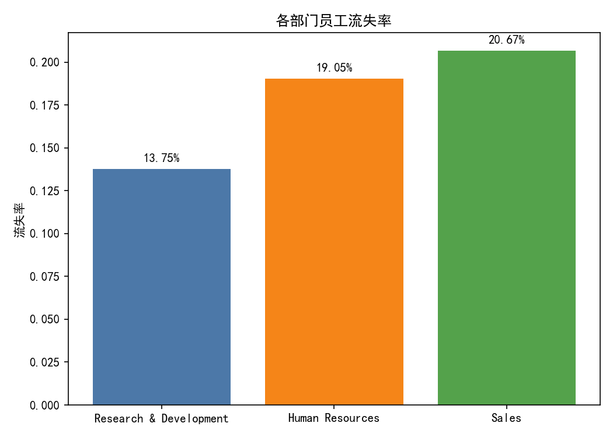
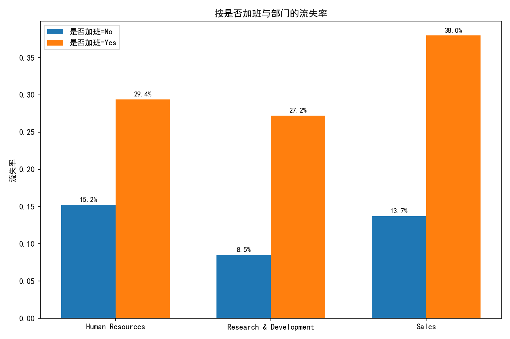
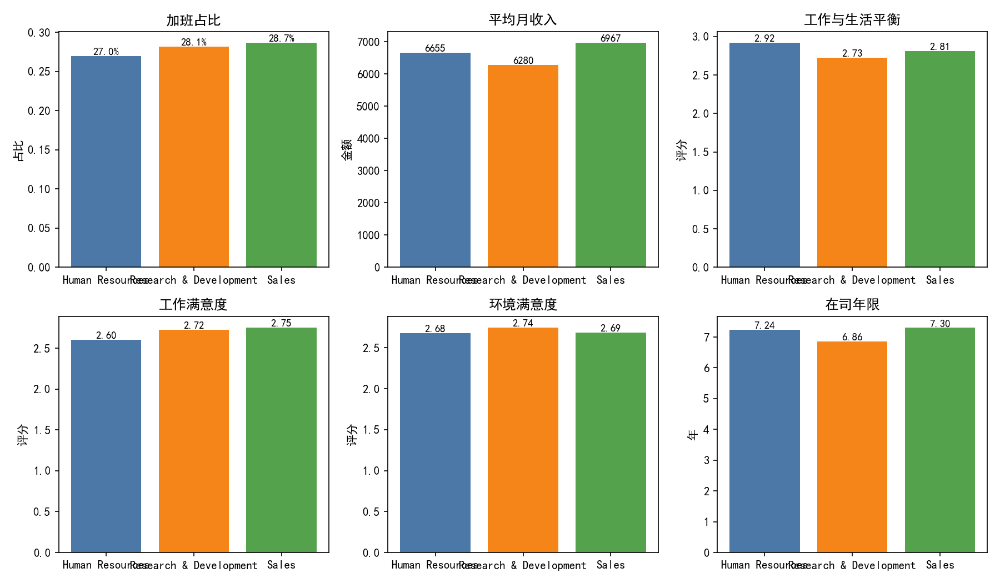

## 研发部门流失率为何显著更低？基于SQLite数据的诊断性分析

### 结论摘要
- 研发部 Research & Development 的总体流失率最低（13.75%），显著低于人力（19.05%）与销售（20.67%）。见图：
  - 图片：
- 研发部的低流失并非因为“加班占比更低”或“平均薪资更高”。事实相反：三部门加班占比接近（HR 27.0%、RD 28.1%、Sales 28.7%），研发部平均月收入反而更低（RD ¥6,280 < Sales ¥6,967 < HR ¥6,655）。
- 在相同条件下（同一加班状态、同一满意度档、同一工作生活平衡档、同一薪资档），研发部的离职风险依然更低，提示其在“内部流动/晋升节奏、岗位匹配度、管理与环境”等方面具有更强的保护性机制。
- 研发部表现出“晋升更及时、岗位停留时间更短”的特征（距离上次晋升年限更短：2.13年 vs 销售2.36年；现任职位年限更短：4.15年 vs 销售4.49年），这很可能通过职业发展预期来降低离职。

---

### 关键证据一：总体流失率差异显著
- 各部门流失率（SQL核算）
  - RD：133/967 = 13.75%
  - HR：12/63 = 19.05%
  - Sales：93/450 = 20.67%
- 可视化：

### 关键证据二：加班是“普遍放大器”，但并非解释研发更低流失的核心
- 各部门加班占比相近：HR 26.98%、RD 28.13%、Sales 28.67%（Python度量）
- 同一部门内，“是否加班”对离职率的影响（Python度量）：
  - HR：不加班 15.22% → 加班 29.41%（+14.2个百分点）
  - RD：不加班 8.49% → 加班 27.21%（+18.7个百分点）
  - Sales：不加班 13.71% → 加班 37.98%（+24.3个百分点）
- 可视化：
- 解读：加班对流失具有显著放大效应，且销售受影响最大。然而，因加班占比三部门相近，它不足以解释“研发整体更低”的现象。

### 关键证据三：在同等体验层级下，研发仍更稳定
- 工作满意度分层下的流失率（SQL）
  - 满意度=4：RD 9.46% vs Sales 14.86% vs HR 11.76%
  - 满意度=1：RD 19.49% vs Sales 27.59% vs HR 45.45%
- 工作与生活平衡分层下的流失率（SQL）
  - 平衡=3（样本最多）：RD 11.74% vs Sales 18.35% vs HR 21.43%
  - 平衡=2：RD 13.62% vs Sales 23.08% vs HR 28.57%
- 解读：在相同满意度/工作生活平衡层级内，研发部的离职率依然显著更低，提示除满意度与WLB之外，研发在岗位匹配、技术成长路径、团队氛围与管理实践上具备额外的保护性。
- 可视化（关键驱动因素均值对比）：
  - 虽然RD的工作与生活平衡均值不高于其他部门，但其环境满意度略高，并且“晋升相关指标”更优（见下）。

### 关键证据四：职业发展与内部流动在研发更顺畅
- 部门均值（SQL）
  - 距离上次晋升年限：RD 2.13 < Sales 2.36 < HR 1.78（HR更短但基数小，且整体流失仍高）
  - 现任职位年限：RD 4.15 < Sales 4.49，RD在岗位上“等待时间”更短，流动与发展更积极。
  - 与现任经理共事年限：RD 4.09、Sales 4.26、HR 3.61（销售更长，但流失更高，说明仅“共事时长”不足以抑制流失）。
- 解读：研发部较快的晋升节奏与岗位流动，可能增强了长期发展预期，抵消了部分薪资与加班等压力的负面影响，从而降低离职意愿。

### 关键证据五：薪资结构不是主因，但在研发“中高段”极具留存力
- 平均月收入：RD 6,280 < HR 6,655 < Sales 6,967（研发更低）。
- 同一薪资档的离职率（SQL）：
  - RD：Upto 5k 19.82%；5k-10k 5.45%；10k-15k 8.00%；15k+ 3.26%
  - Sales：Upto 5k 26.54%；5k-10k 17.14%；10k-15k 25.53%；15k+ 6.45%
- 解读：在相同薪资档位，研发离职风险明显低于销售，尤其中高薪档位极低，这表明研发的“薪资-成长-成就感”耦合度更高，薪资的边际留才效应更强。

---

### 诊断总结（Why）
综合上述证据，研发部流失率更低的主要原因可能包括：
1) 职业发展机制更顺畅：研发部“距上次晋升年限更短、现任职位年限更短”，体现更及时的晋升与内部流动，提升发展预期并降低离职。
2) 在相同体验层级下风险更低：在同样的满意度、工作生活平衡档位，研发的离职率都更低，说明岗位匹配、技术成长、团队协作与管理实践具有额外保护力。
3) 薪资并非主导因素，但与成长耦合更紧：尽管研发平均薪资不高，但中高薪档的离职率极低，表明薪酬结构与成长路径的组合在研发更具粘性。
4) 加班是“共识别的风险放大器”，但不是研发更低的解释：加班占比三部门相近，研发仍显著更低；销售对加班的敏感度最高，应优先治理。

---

### 可操作建议（What we should do）
针对销售与人力部门，建议复制与增强研发的“保护性机制”：
- 优化晋升与岗位流动：
  - 为销售与人力设计更明确的职级晋升与轮岗通道，将“距离上次晋升年限”目标化（例如部门平均≤2.0年），缩短“现任职位年限”的滞留。
- 系统性降本增效地削峰加班（优先销售）：
  - 将“加班导致的流失率抬升”列为运营KPI，针对销售实施排班平衡、目标拆解与CRM流程优化，力争将销售加班人群的流失率从38%压降至25%以内（按24.3个百分点加成估算，降幅可观）。
- 强化中高薪档的人才黏性策略：
  - 在销售与人力复制研发“薪酬+成长”的正反馈：为中高薪档员工匹配更清晰的专业路径、技术/管理双通道认证、项目曝光与技术/业务深度，放大薪酬的留才效应。
- 提升满意度与WLB的针对性治理：
  - 在HR与销售的满意度较低群体（满意度=1或2）建立预警机制；对销售在“WLB=2/3”的大盘人群，提出弹性排班与工具赋能以降低不必要加班。
- 经理能力与团队氛围：
  - 尽管销售“与经理共事年限”更长，但并未有效抑制流失，应强化一线经理的目标拆解、反馈辅导、负荷管理、认可机制等能力，以质量提升代替“共事时长”的表面指标。

---

### 可视化与代码
- 部门流失率：
- 部门关键驱动因素对比：
- 按是否加班与部门的流失率：

以下为生成上述图表的核心Python代码片段（已在当前目录运行并输出图片）：
```python
import sqlite3
import pandas as pd
import numpy as np
import matplotlib.pyplot as plt

# 字体设置，确保中文可显示
plt.rcParams['font.sans-serif'] = ['SimHei']
plt.rcParams['axes.unicode_minus'] = False

conn = sqlite3.connect('dacomp-007.sqlite')
df = pd.read_sql_query(\"SELECT * FROM '工作表1';\", conn)
conn.close()

# 衍生列
df['流失'] = (df['员工流失'] == 'Yes').astype(int)
df['加班_指示'] = (df['是否加班'] == 'Yes').astype(float)

# 1) 部门流失率图
dept_attr = df.groupby('部门')['流失'].mean().sort_values()
fig, ax = plt.subplots(figsize=(7,5))
ax.bar(dept_attr.index, dept_attr.values)
ax.set_title('各部门员工流失率')
ax.set_ylabel('流失率')
for i, v in enumerate(dept_attr.values):
    ax.text(i, v+0.003, f\"{v:.2%}\", ha='center')
plt.tight_layout()
plt.savefig('dept_attrition.png', dpi=150)
plt.close()

# 2) 关键驱动因素对比（示例包含：加班占比、月收入、满意度、在司年限、距家距离等）
metrics = {
    '加班占比': df.groupby('部门')['加班_指示'].mean(),
    '月收入': df.groupby('部门')['月收入'].mean(),
    '工作与生活平衡': df.groupby('部门')['工作与生活平衡'].mean(),
    '工作满意度': df.groupby('部门')['工作满意度'].mean(),
    '环境满意度': df.groupby('部门')['环境满意度'].mean(),
    '在司年限': df.groupby('部门')['在司年限'].mean(),
    '距家距离': df.groupby('部门')['距家距离'].mean(),
}
metrics_df = pd.DataFrame(metrics)
fig2, axes = plt.subplots(2, 3, figsize=(12, 7))
axes = axes.flatten()
plot_items = [
    ('加班占比', '加班占比', '占比'),
    ('月收入', '平均月收入', '金额'),
    ('工作与生活平衡', '工作与生活平衡', '评分'),
    ('工作满意度', '工作满意度', '评分'),
    ('环境满意度', '环境满意度', '评分'),
    ('在司年限', '在司年限', '年'),
]
colors = ['#4C78A8','#F58518','#54A24B']
for idx, (col, title, ylabel) in enumerate(plot_items):
    ax = axes[idx]
    vals = metrics_df[col]
    ax.bar(metrics_df.index, vals, color=colors)
    ax.set_title(title)
    ax.set_ylabel(ylabel)
    for i, v in enumerate(vals):
        label = f\"{v:.2f}\"
        if ylabel == '占比':
            label = f\"{v:.1%}\"
        ax.text(i, v, label, ha='center', va='bottom', fontsize=9)
plt.tight_layout()
plt.savefig('dept_drivers.png', dpi=150)
plt.close()

# 3) 是否加班 x 部门 的流失率对比
ovt = df.groupby(['部门','是否加班'])['流失'].mean().unstack()
fig3, ax3 = plt.subplots(figsize=(9,6))
width = 0.35
x = np.arange(len(ovt.index))
for i, col in enumerate([c for c in ['No','Yes'] if c in ovt.columns]):
    ax3.bar(x + i*width - width/2, ovt[col].values, width, label=f'是否加班={col}')
ax3.set_xticks(x)
ax3.set_xticklabels(ovt.index)
ax3.set_ylabel('流失率')
ax3.set_title('按是否加班与部门的流失率')
ax3.legend()
for i, dept in enumerate(ovt.index):
    for j, col in enumerate([c for c in ['No','Yes'] if c in ovt.columns]):
        v = ovt.loc[dept, col]
        ax3.text(i + j*width - width/2, v+0.003, f\"{v:.1%}\", ha='center')
plt.tight_layout()
plt.savefig('dept_overtime_attrition.png', dpi=150)
plt.close()
```

---

### 数据字典与字段说明（节选）
- 员工流失：Yes/No
- 部门：Research & Development / Sales / Human Resources
- 是否加班：Yes/No
- 月收入、薪资等级：收入水平
- 工作满意度、环境满意度、人际关系满意度、工作投入度、工作与生活平衡：1-4评分
- 在司年限、现任职位年限、距离上次晋升年限、与现任经理共事年限：年数

如需，我可以进一步：
- 按“职位/工作角色”“年龄段”分层做流失对比，或构建简易逻辑回归/树模型，拆解各因子的边际贡献，帮助更精准地制定部门级留才策略。
