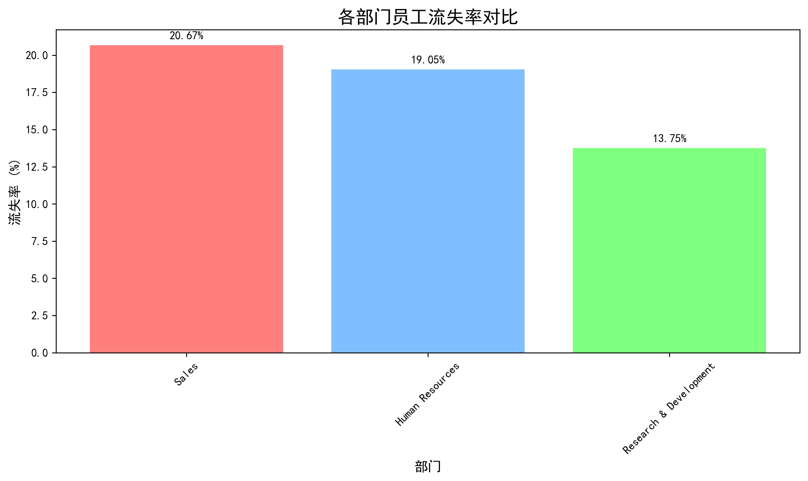
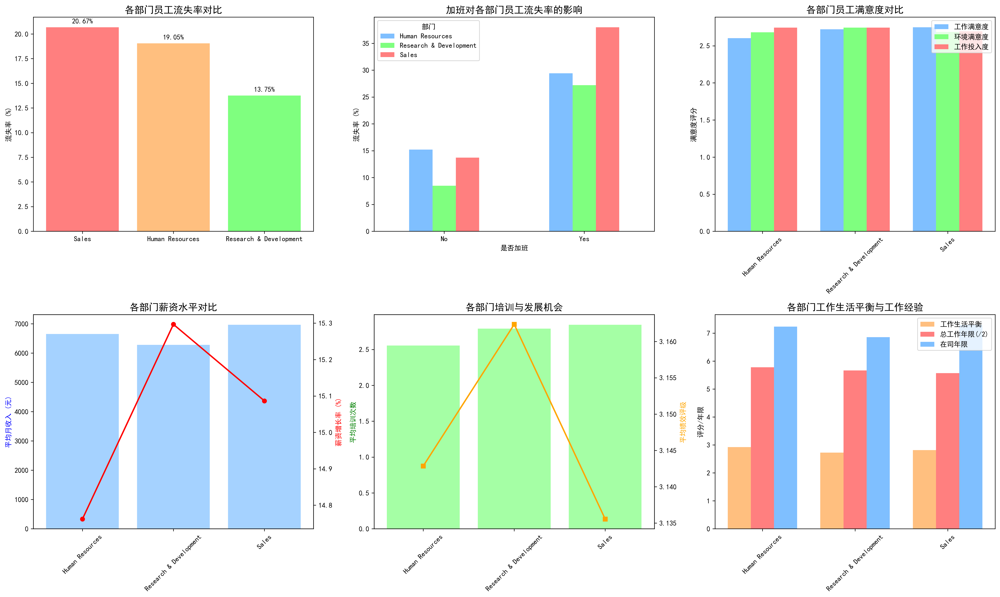
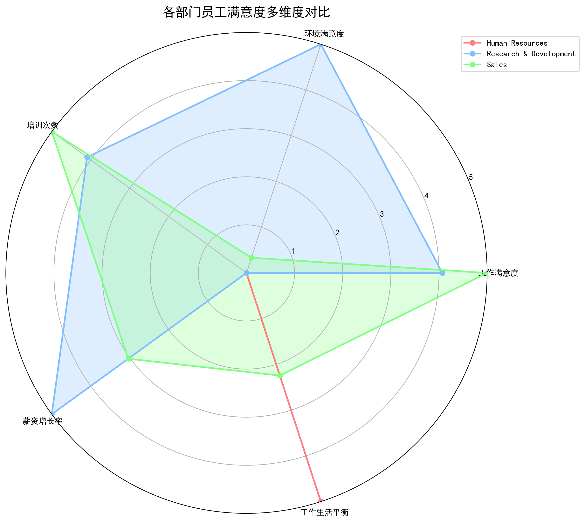
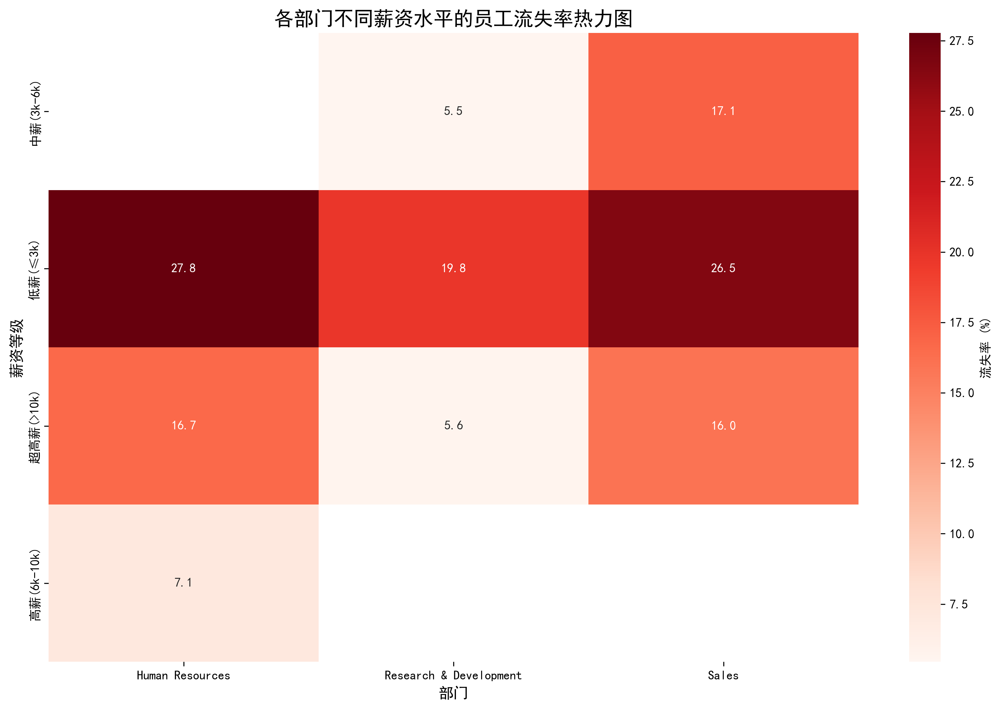
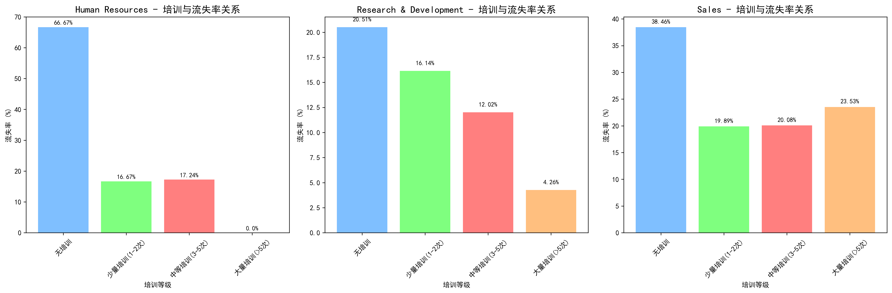
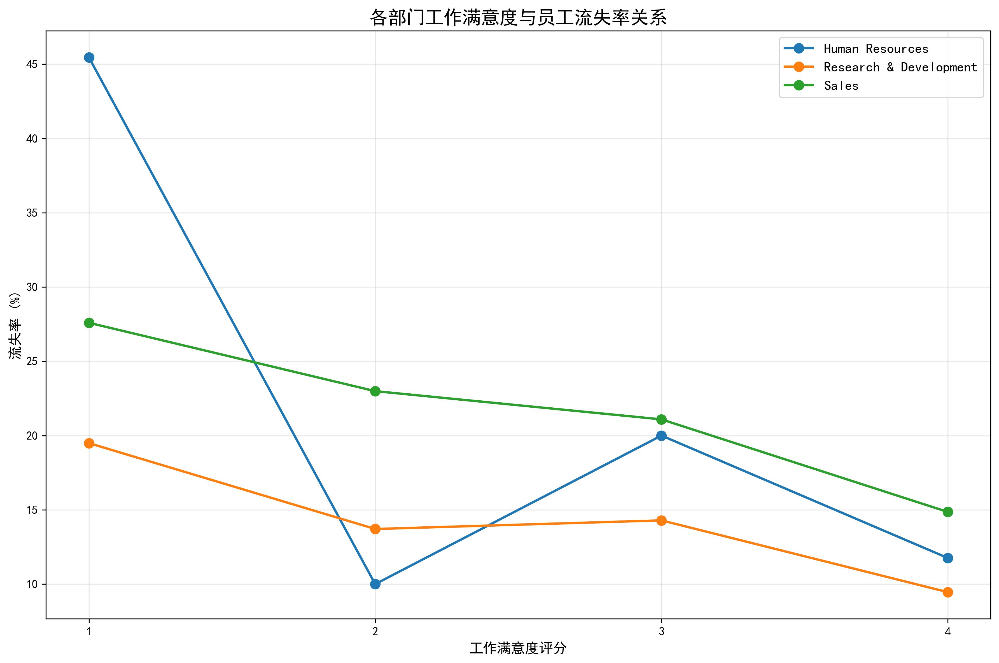

# 研发部门员工流失率显著低于其他部门的原因分析报告

## 执行摘要

通过对公司人力资源数据的深入分析，我们发现研发部门的员工流失率（13.75%）显著低于销售部门（20.67%）和人力资源部门（19.05%）。本报告通过多维度数据分析，揭示了造成这种差异的根本原因，并提供了相应的管理建议。

## 核心发现

### 1. 整体流失率对比

从上图可以清晰看出，研发部门的员工流失率比销售部门低6.92个百分点，比人力资源部门低5.3个百分点。这种显著差异值得深入探讨。

### 2. 加班对员工流失率的差异化影响

关键发现：加班对研发部门员工的影响明显小于其他部门：
- **研发部门**：不加班员工流失率仅8.49%，加班员工流失率27.21%
- **销售部门**：不加班员工流失率13.71%，加班员工流失率高达37.98%
- **人力资源部门**：不加班员工流失率15.22%，加班员工流失率29.41%

这表明研发部门员工对加班的容忍度更高，可能与其工作性质和职业认同感有关。

### 3. 工作满意度与员工保留

研发部门在多个满意度维度上表现优异：
- **工作满意度**：2.72分（高于人力资源部门的2.60分）
- **环境满意度**：2.74分（三个部门中最高）
- **工作投入度**：2.74分（三个部门中最高）

### 4. 薪资与培训发展机会分析

研发部门在员工发展方面具有明显优势：
- **培训机会**：平均培训次数2.79次（高于人力资源部门的2.56次）
- **薪资增长率**：15.30%（三个部门中最高）
- **绩效评级**：3.16分（三个部门中最高）

### 5. 工作满意度与流失率关系趋势

数据显示，随着工作满意度的提升，各部门的流失率都呈下降趋势，但研发部门的下降幅度最为明显。

## 深度分析：研发部门流失率低的核心原因

### 1. 职业特性与认同感
- **专业性强**：研发工作具有较高的专业门槛，员工投入大量时间学习专业知识，转换成本较高
- **成就感驱动**：研发工作通常能看到具体的成果产出，员工成就感更强
- **创新环境**：研发部门通常拥有更开放、创新的工作氛围

### 2. 发展机会优势
- **技能培训**：研发部门提供最多的培训机会（平均2.79次/年）
- **薪资增长**：15.30%的薪资增长率位居各部门之首
- **职业晋升**：技术通道清晰，晋升机会相对较多

### 3. 工作稳定性
- **经验积累价值**：研发工作经验具有很高的积累价值，越老越吃香
- **行业需求**：技术人才市场需求旺盛，但研发岗位相对稳定
- **专业深度**：研发工作需要深度专业积累，员工更倾向于长期发展

### 4. 工作满意度高
- **工作环境**：研发部门环境满意度最高（2.74分）
- **工作投入**：研发员工工作投入度最高（2.74分）
- **团队氛围**：技术人员之间的合作氛围通常较好

## 管理建议

### 1. 向其他部门推广研发部门的成功经验
- **加强培训投入**：增加销售部门和人力资源部门的培训预算
- **改善工作环境**：提升各部门的工作环境和氛围
- **建立职业发展通道**：为各部门员工设计清晰的职业发展路径

### 2. 针对性改进措施
- **销售部门**：重点关注加班管理和工作生活平衡，考虑引入弹性工作制度
- **人力资源部门**：加强员工关怀，提升工作满意度，优化绩效考核机制

### 3. 保持研发部门优势
- **持续投入**：继续加大对研发部门的培训和资源投入
- **人才保留**：建立更有竞争力的薪酬体系和股权激励机制
- **创新文化**：进一步强化研发部门的创新文化和团队凝聚力

## 结论

研发部门员工流失率显著低于其他部门，主要归因于其职业特性、发展机会、工作满意度和专业认同感等多方面因素的综合作用。这种差异不仅反映了不同岗位的性质特点，也揭示了人力资源管理的重要方向。通过深入分析研发部门的成功经验，并将其有针对性地推广到其他部门，可以有效降低公司整体员工流失率，提升组织效能和竞争力。

建议管理层重点关注各部门的差异化需求，制定针对性的员工保留策略，同时继续保持和强化研发部门的优势，为公司的长期发展奠定坚实的人才基础。
