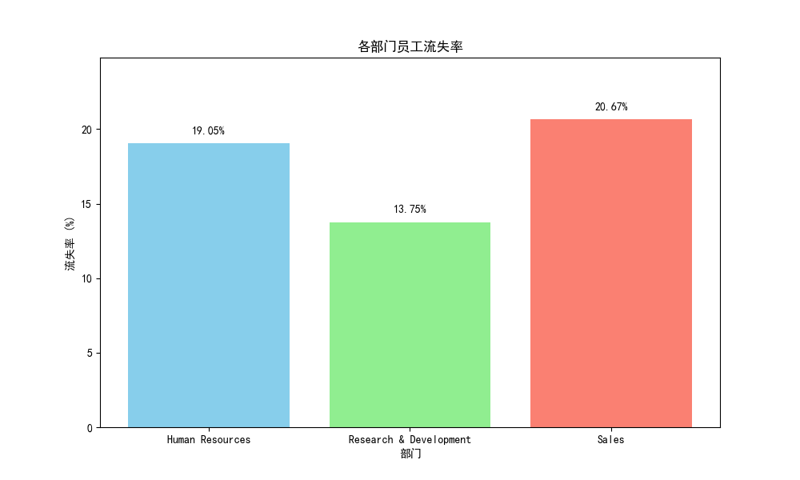
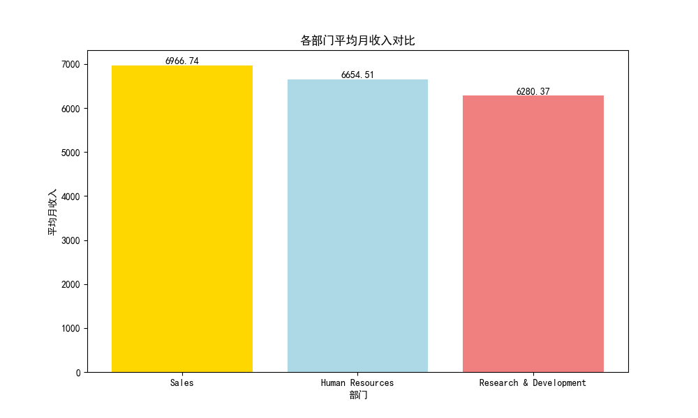
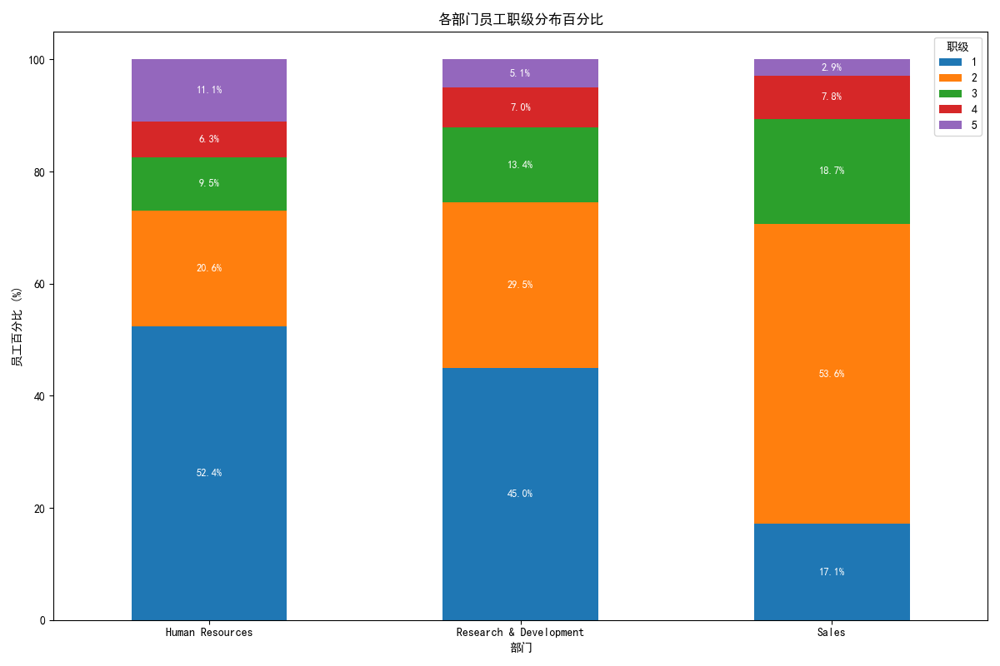

# 关于研发部门低员工流失率的深度分析报告

## 1. 核心结论

本次分析旨在探究研发部门（Research & Development）员工流失率显著低于销售（Sales）和人力资源（Human Resources）部门的原因。

经过对薪酬、工作负荷、满意度及职业发展等多维度数据的深入挖掘，我们得出核心结论：**研发部门的低流失率并非源于高薪酬或低工作强度等传统优势，而是得益于其健康、稳定的“橄榄型”人才结构。该结构为员工提供了更清晰的专业成长路径和归属感，从而构成了强大的内部留存动力。**

---

## 2. 分析过程与发现

### 2.1 确认问题：研发部门流失率显著更低

首先，我们确认了问题的真实性。数据显示，研发部门的流失率仅为 **13.75%**，远低于销售部门的 **20.67%** 和人力资源部门的 **19.05%**。

### 2.2 排除传统假设：薪酬、加班与满意度并非主因

为了找到差异背后的原因，我们首先检验了几个常见的假设，但结果出人意料：

*   **薪酬并非优势**: 与直觉相反，研发部门的平均月收入在三个部门中是**最低**的。这表明高薪不是留住研发人才的关键因素。

    

*   **工作负荷与满意度无显著差异**: 进一步分析显示，无论是加班比例、工作满意度还是环境满意度，三个部门之间都**没有显著差异**。这排除了工作清闲或环境优越是研发部门低流失率主因的可能性。

### 2.3 关键洞察：人才结构揭示了根本差异

在排除了传统因素后，我们转向职业发展路径的分析，并最终在**员工职级分布**上找到了突破口。

这张图清晰地揭示了不同部门间巨大的人才结构差异：

*   **研发部门 (橄榄型结构)**: 该部门拥有一个庞大且稳定的**中层技术骨干群体**（2级和3级员工合计占比高达 **42.9%**）。这个强大的中间层构成了部门的基石。他们或许不追求最快的晋升，但更看重技术深度和专业成长，这种稳定的结构本身就创造了极强的留存力。

*   **销售部门 (金字塔结构)**: 该部门的员工高度集中在初中级（1级和2级合计占比超过 **70%**），而通往高级职位的路径却非常狭窄（3级及以上比例远低于研发部）。这种**“晋升瓶颈”**极易导致大量中层员工因看不到发展前景而流失，从而推高了整体流失率。

*   **人力资源部门**：其结构更偏向于初级员工，但由于其部门规模小，结构特点不如另外两个部门典型。

**因此，我们可以断定，稳定、健康的职业阶梯和人才结构，是研发部门能够有效留住人才的核心秘密。**

---

## 3. 业务建议

基于以上分析，我们提出以下具体建议：

1.  **重塑销售部门的职业发展路径**:
    *   **审视晋升瓶颈**: 销售部门高层应审视当前的职业结构，探讨为何大量员工停滞在2级。
    *   **开辟多元化发展通道**: 除了管理晋升通道外，应建立“高级客户经理”或“销售专家”等**个人贡献者（IC）**发展路径，让不适合或暂时无法进入管理岗的优秀员工也能获得职级和薪酬上的成长，减少因晋升无望导致的流失。

2.  **巩固研发部门的留存优势**:
    *   **认可并激励核心骨干**: 管理层应明确认识到，研发部门的稳定依赖于其中层技术骨干。应持续通过有挑战性的项目、前沿技术培训和设立“技术专家”荣誉等方式，来激励和认可这部分核心员工。
    *   **警惕结构变化**: 在未来的招聘和晋升中，应注意维持现有健康的橄榄型结构，避免出现人才断层或底部过于臃肿的问题。

3.  **推行定制化的人才策略**:
    *   **放弃“一刀切”**: 各部门的业务性质、组织结构和员工诉求截然不同。公司在制定人才保留策略时，必须杜绝“一刀切”，应与各部门负责人合作，制定符合其自身特点的定制化方案。
