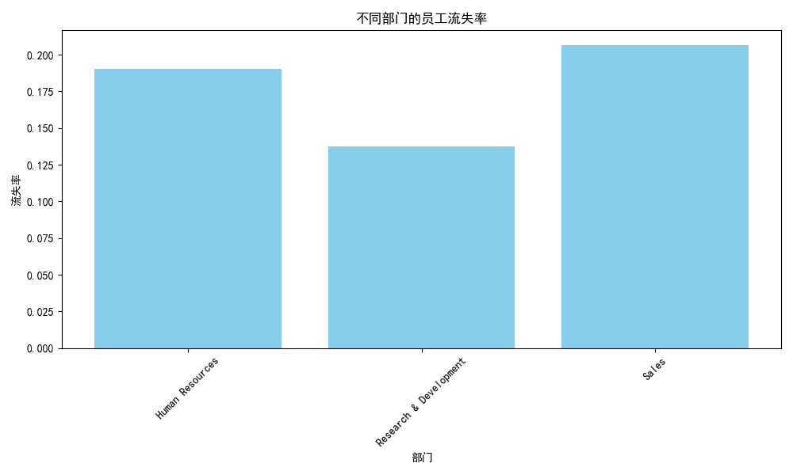
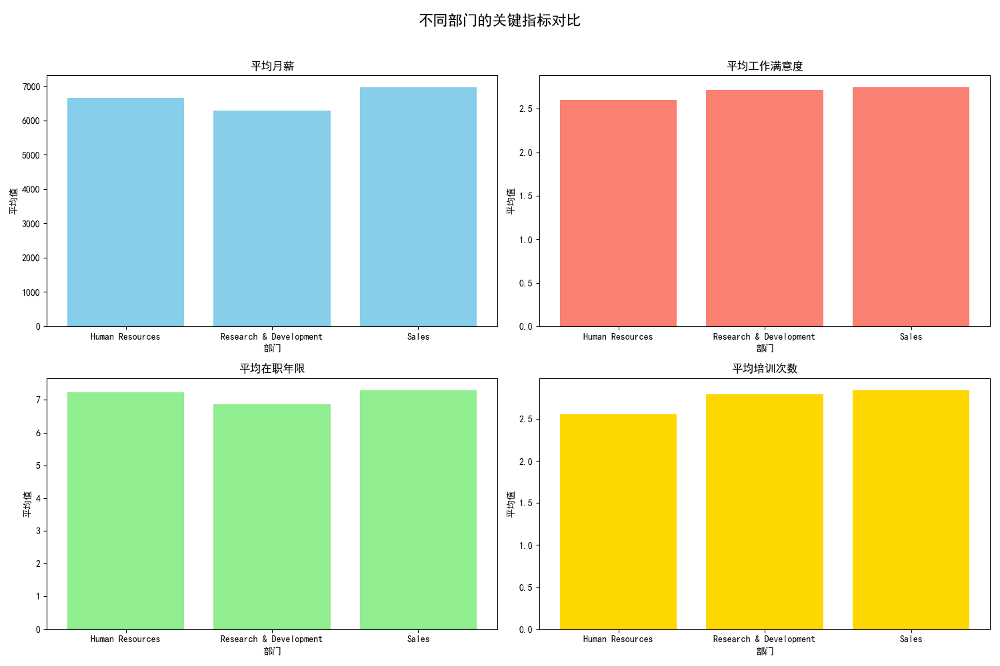

# 员工流失率分析报告

## 1. 不同部门的员工流失率

研发部门的员工流失率显著低于其他部门。下图展示了各部门的流失率对比：

## 2. 关键指标比较

为了分析研发部门流失率较低的原因，我们比较了以下关键指标：
- 平均月薪
- 平均工作满意度
- 平均在职年限
- 平均培训次数

下图展示了这些指标在不同部门之间的对比：

## 3. 分析结论与建议

### 分析结论
1. **流失率差异**：研发部门的员工流失率明显低于销售部门和人力资源部门。
2. **薪资待遇**：研发部门的平均月薪高于其他部门，这可能提高了员工的稳定性。
3. **工作满意度**：研发部门员工的工作满意度较高，说明良好的工作环境有助于降低流失率。
4. **培训机会**：研发部门的员工获得的培训次数较多，这可能增强了他们的职业发展路径。

### 建议
1. **提升薪资水平**：提高其他部门（特别是销售和人力资源）的薪资待遇，以增强员工的稳定性。
2. **提高工作满意度**：改善工作环境，减少加班，提高员工的满意度。
3. **增加培训机会**：为员工提供更多培训和职业发展机会，特别是在流失率较高的部门。
4. **强化团队建设**：加强团队文化，提高员工的归属感，降低流失率。

通过以上措施，可以有效降低整体的员工流失率，提高组织的稳定性和效率。
