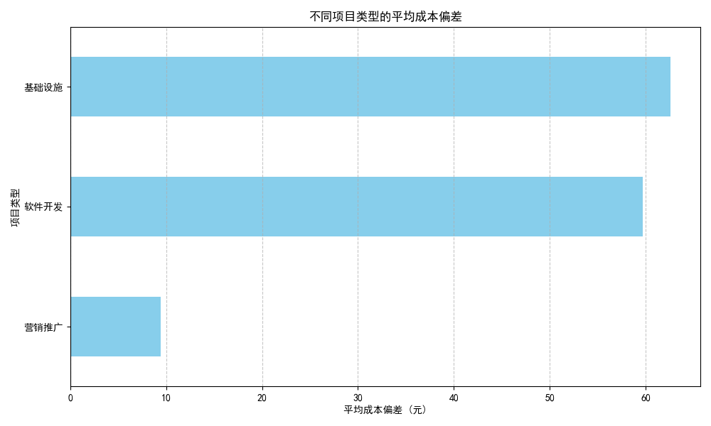
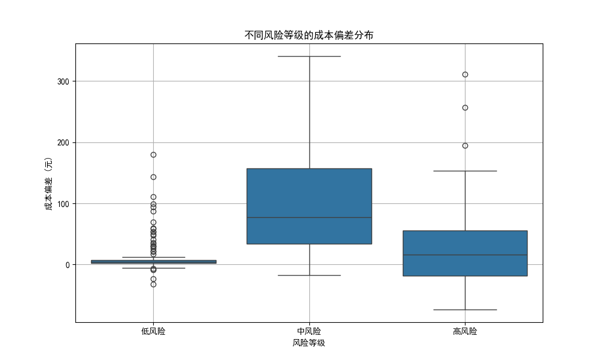
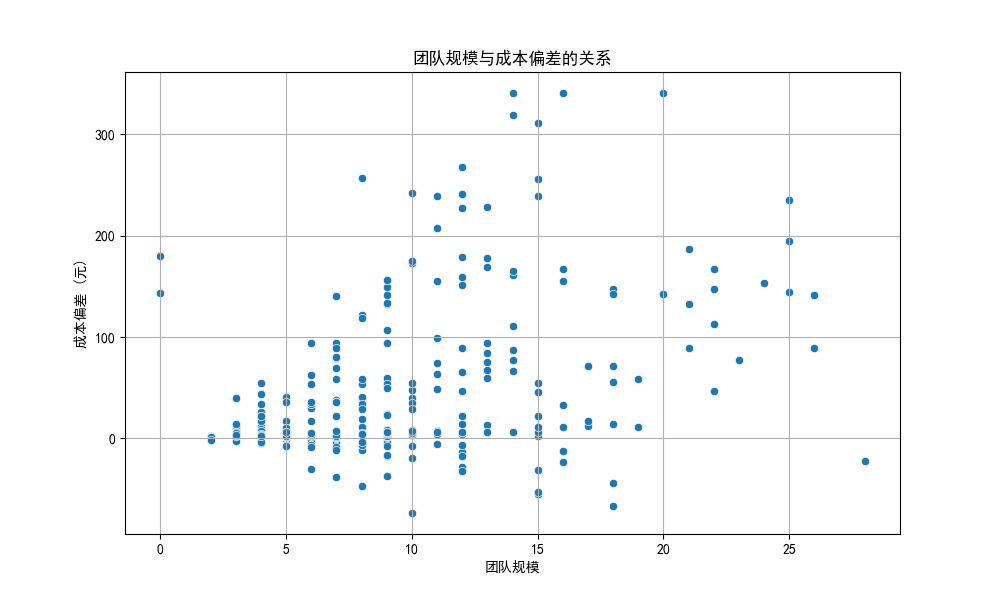
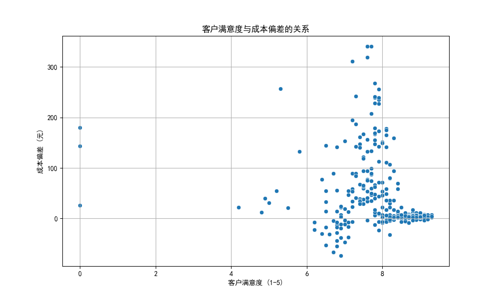

# 项目成本偏差深度分析报告

## 1. 分析背景与目标

本项目旨在深入分析影响项目成本偏差（预算金额 - 实际成本）的关键因素。通过对项目类型、风险等级、团队规模和客户满意度等多个维度的探索，我们旨在揭示成本超支或节余背后的驱动因素，并为未来的项目管理和预算制定提供数据驱动的、可行的优化策略。

---

## 2. 核心发现与洞察

### 2.1. 项目类型是成本偏差的关键影响因素

我们的分析显示，不同类型的项目在成本控制上表现出显著差异。

- **洞察**：“基础设施”和“软件开发”项目的平均成本偏差远高于“营销推广”项目，这意味着这两类项目更容易出现成本超支。
- **原因分析**：
  - **基础设施与软件开发项目**：通常涉及更高的技术不确定性、更长的项目周期以及更复杂的依赖关系，这些都可能导致初期预算低估和执行过程中意外开支的增加。
  - **营销推广项目**：其范围和成本构成相对更明确，预算更容易控制。

### 2.2. 项目风险等级与成本失控概率正相关

项目的风险等级是预测其成本偏差的有力指标。风险越高的项目，其财务结果的不确定性也越大。

- **洞察**：“高风险”项目的成本偏差分布范围最广，且中位数显著为负，表明其不仅波动性大，而且整体倾向于超出预算。“低风险”项目的成本偏差则紧密围绕零值，显示出优秀的预算可控性。
- **诊断**：这证实了风险评估在预算制定中的重要性。“高风险”标签本身就预示着存在大量未知因素，这些因素在项目执行中往往转化为实际的额外成本。

### 2.3. 团队规模与成本偏差的关系

- **洞察**：团队规模与成本偏差之间没有发现简单的线性关系。然而，值得注意的是，成本偏差的绝对值（无论是超支还是节余）随着团队规模的增大有增大的趋势。
- **分析**：大型项目（团队规模大）由于其固有的复杂性、沟通成本和管理难度，其预算估算的难度也相应增加，从而导致最终成本偏离预算的可能性和幅度都更大。

### 2.4. 成本控制与客户满意度：追求平衡是关键

过度的成本超支或节余都可能对客户满意度产生负面影响。

- **洞察**：客户满意度最高的项目，其成本偏差往往趋近于零。当项目严重超支（成本偏差为较大的负数）时，客户满意度很少能达到高分，这可能是因为预算问题引发了交付延迟或范围缩减。反之，大幅度的预算节余（成本偏差为较大的正数）也并不总能带来最高的满意度，这可能暗示着项目范围未被充分满足，或初期预算制定过于宽松。

---

## 3. 诊断性结论与业务建议

综合以上分析，我们可以得出结论：项目的内在属性（类型、风险）是影响成本偏差的主要因素，而有效的成本控制是实现高客户满意度的重要保障。

为此，我们提出以下具体建议：

1.  **实施差异化的预算管理策略**：
    - **对于“基础设施”和“软件开发”项目**：应采用更审慎的预算编制方法。建议在初期预算中强制性地包含**15%-25%的应急储备金**，以应对技术不确定性和范围蔓延风险。
    - **对于“营销推广”项目**：保持现有的预算控制流程，重点关注执行效率。

2.  **强化基于风险的成本控制**：
    - **对于“高风险”项目**：必须成立专门的风险应对小组，在项目全周期内（至少每两周一次）进行风险识别和评估，并动态调整预算和资源计划。不能仅仅将“高风险”作为一个标签，而应将其作为启动严格管理流程的信号。

3.  **优化大型项目的预算监控**：
    - 对于团队规模超过特定阈值（例如15人）的项目，应设立更为严格的成本监控和报告机制，例如实施挣值管理（EVM），以实现对项目进度和成本的实时跟踪，提前预警偏差。

4.  **将“成本偏差”作为客户沟通的关键指标**：
    - 将预算执行情况定期、透明地通报给客户，尤其是当出现不可避免的成本增加时。主动的沟通可以管理客户预期，将因预算问题导致的满意度下降风险降至最低。追求合理的预算执行，而非无底线的“节省”，才是赢得客户信任的关键。

通过采纳以上建议，企业可以更科学地预测和控制项目成本，降低财务风险，并最终提升项目成功率和客户满意度。
