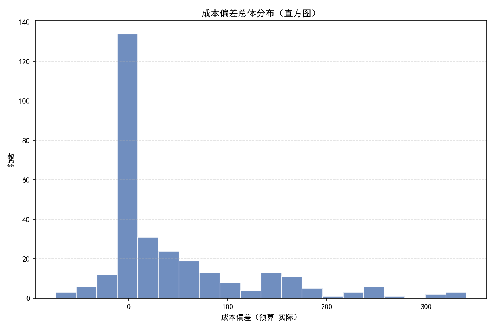
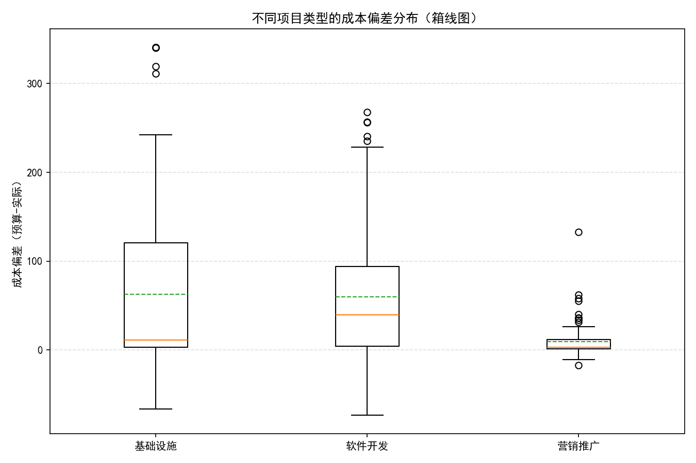
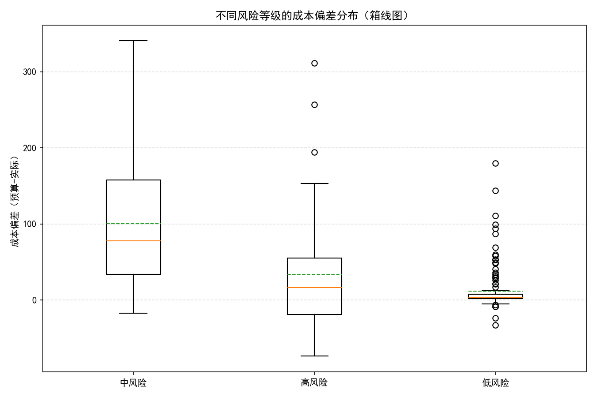
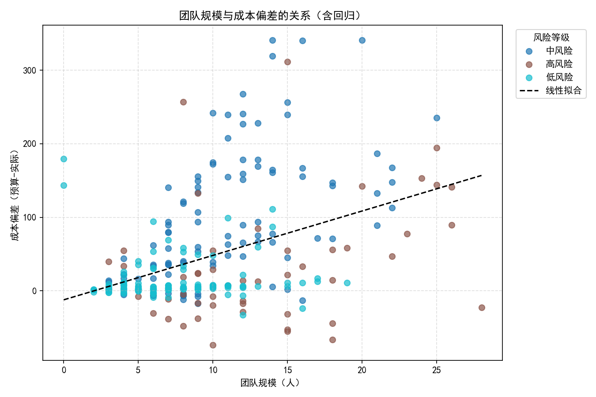
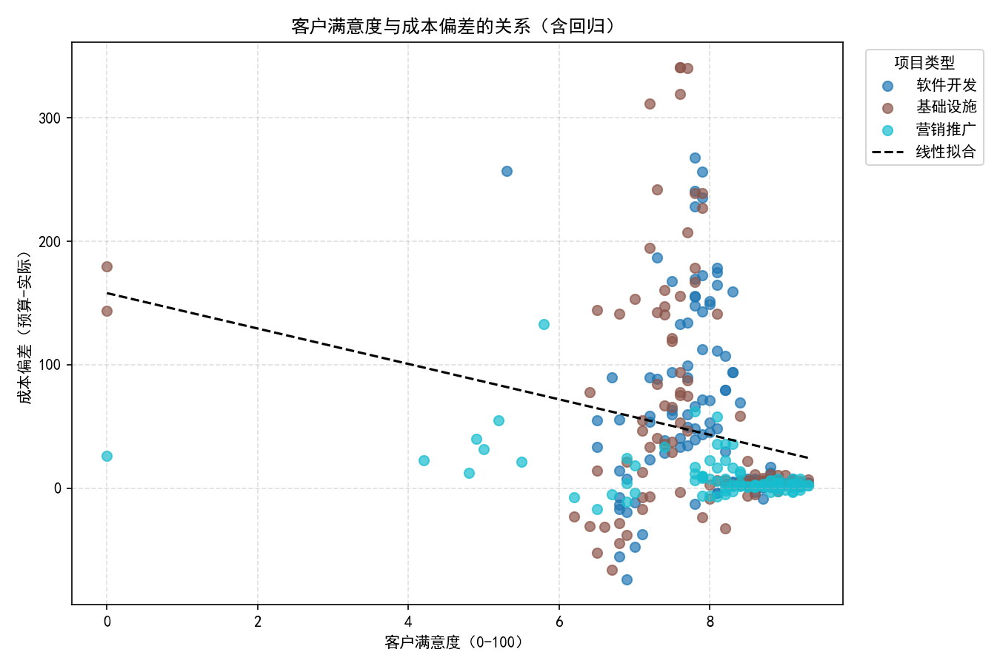

# 项目成本偏差分析报告（预算金额-实际成本）

## 一、背景与任务
- 成本偏差定义：预算金额-实际成本。为正表示“低于预算”（预算结余），为负表示“超支”。
- 目标：分析不同项目类型的平均成本偏差及其分布，并探索团队规模、风险等级、客户满意度等因素与成本偏差的联系，给出诊断性洞察与可操作建议。

## 二、数据与方法
- 数据源：SQLite 数据库 dacomp-008.sqlite 的表“工作表1”。
- 主要字段：项目类型、预算金额、实际成本、团队规模、风险等级、客户满意度。
- 指标与方法：
  - 成本偏差派生：成本偏差=预算金额-实际成本。
  - 分布分析：直方图与箱线图。
  - 相关与回归：Pearson相关；线性回归（成本偏差 ~ 团队规模 + 客户满意度 + 风险等级 + 项目类型）。
- 可视化均使用Python生成，图片保存在当前目录。

## 三、核心发现
1) 不同项目类型的平均成本偏差（单位同原币种）
   - 基础设施：62.57
   - 软件开发：59.71
   - 营销推广：9.45
   说明：基础设施与软件项目整体“低于预算”更多，而营销推广更接近预算，但同时其超支风险更高（见下）。

2) 风险等级与成本偏差（平均值）
   - 中风险：100.73（显著高的预算结余）
   - 高风险：33.97
   - 低风险：11.95
   说明：中风险项目预算普遍更保守，导致更大的结余；低风险项目预算更贴近实际。

3) 超支比例（成本偏差<0）
   - 总体超支比例：16.72%
   - 按项目类型的超支比例：
     - 营销推广：19.35%
     - 基础设施：18.18%
     - 软件开发：13.08%
   说明：营销推广项目虽然平均偏差较小，但超支概率最高，表明其分布更“分散”，存在不稳定项目。

4) 团队规模与成本偏差关系
   - 相关系数：0.416（正相关）
   - 分段均值：
     - 大(≥11人)：88.84
     - 中(6-10人)：28.09
     - 小(≤5人)：12.56
   说明：团队越大，越容易产生预算结余（正偏差更高），潜在原因是人员配置偏保守或资源利用率不高。

5) 客户满意度与成本偏差关系
   - 相关系数：-0.225（负相关）
   说明：客户满意度越高，成本偏差越低，可能意味着为了提升满意度会投入更多资源、缩小结余甚至出现超支。

6) 预算规模效应
   - 预算金额与成本偏差相关系数：0.629（较强正相关）
   说明：预算越高，结余越大，显示预算制定偏保守或支出控制较严。

7) 多变量回归（方向性）
   - 模型：成本偏差 ~ 截距 + 团队规模 + 客户满意度 + 风险等级(低/高，相对中风险) + 项目类型(营销/软件，相对基础设施)
   - R²：0.417（中等解释力）
   - 系数方向：
     - 团队规模：正向（团队越大，偏差越大）
     - 客户满意度：负向（满意度越高，偏差越小）
     - 相对中风险：低风险与高风险均为负向（说明中风险结余最大）
     - 相对基础设施：营销推广与软件开发均为负向（说明基础设施结余最大）
   提示：系数数值大小受变量量纲影响，建议用于方向性判断，不宜做精确点预测。

## 四、分布与图示
- 成本偏差总体分布呈右偏，Q90=155.72，显示有一批项目存在较大的预算结余；同时Q10=-6.22表明尾部有超支案例。
- 图示：
  - 成本偏差总体分布：
  - 按项目类型的成本偏差箱线图：
  - 按风险等级的成本偏差箱线图：
  - 团队规模 vs 成本偏差（按风险着色，含回归）：
  - 客户满意度 vs 成本偏差（按项目类型着色，含回归）：

## 五、诊断性洞察（为什么）
- 预算制定偏保守：
  - 中风险与高预算项目的结余显著，可能由于在风险与规模维度上预留了较大的缓冲。
- 人员配置偏保守或资源利用率不高：
  - 大团队与高结余的正相关，提示存在冗余配置或效率不足。
- 项目不确定性导致波动：
  - 营销推广超支比例最高，业务活动的效果与投入常受外部因素影响，导致预算难以精准。
- 以满意度为导向的投入：
  - 为提升客户满意度，项目团队可能在交付质量/范围上追加资源投入，压缩结余甚至产生超支。

## 六、预测性推断（将会发生什么）
- 在现有模式下：
  - 预算越高、团队越大、风险标记为“中风险”的项目，更可能出现较大的预算结余。
  - 若客户满意度提升，结余倾向下降，预算更贴近真实支出。
- 应用简单线性模型可做粗粒度预判（方向性），用于早期预警与资源调度。

## 七、规范性建议（我们应该做什么）
- 风险分级预算校准：
  - 中风险项目：适度收紧预算缓冲，依据历史偏差做风险加权的精准预算。
  - 高风险项目：在关键里程碑引入滚动预测与阶段性预算重估，防止阶段性超支。
- 团队规模优化与资源复盘：
  - 对大团队项目进行人员利用率审计，识别低效环节；尝试以“核心小队+专家池”的方式降低常设人力成本。
- 针对营销推广的费用管理：
  - 采用A/B测试与分阶段投放，设置“止损阈值”，避免一次性重投入导致超支；引入更细粒度的费用跟踪与效果归因。
- 以满意度指标驱动的预算动态分配：
  - 为客户满意度关键里程碑预置弹性预算池，通过变更评审机制控制质量与范围的追加投入。
- 高预算项目的事前控制：
  - 对预算金额较大的项目实施更严格的事前成本拆解与责任到人，配合月度滚动差异分析，及时回收未动用预算。

## 八、数据支撑摘录
- 类型均值（平均成本偏差）：基础设施 62.57；软件开发 59.71；营销推广 9.45。
- 风险均值：中风险 100.73；高风险 33.97；低风险 11.95。
- 超支比例：总体 16.72%；营销推广 19.35%；基础设施 18.18%；软件开发 13.08%。
- 相关系数：团队规模 0.416；客户满意度 -0.225；预算金额 0.629。
- 团队规模分段均值：大 88.84；中 28.09；小 12.56。
- 回归模型R²：0.417。

## 九、局限与下一步
- 模型未做标准化与统计显著性检验，结论以方向为主；建议后续引入标准化、交互项与稳健性检验。
- 满意度量纲（0-100）会导致回归系数量级较大，后续可考虑分层或归一化分析。
- 建议补充周期维度（计划/实际起止时间）与完成百分比，做时序上的成本燃尽与进度偏差耦合分析。

## 十、绘图代码片段（中文显示设置）
```python
import matplotlib.pyplot as plt
plt.rcParams['font.sans-serif'] = ['SimHei']
plt.rcParams['axes.unicode_minus'] = False
```

以上结论与建议由SQL与Python分析结果支撑，并通过图表清晰展示，供预算优化、团队配置与风险管理决策参考。
