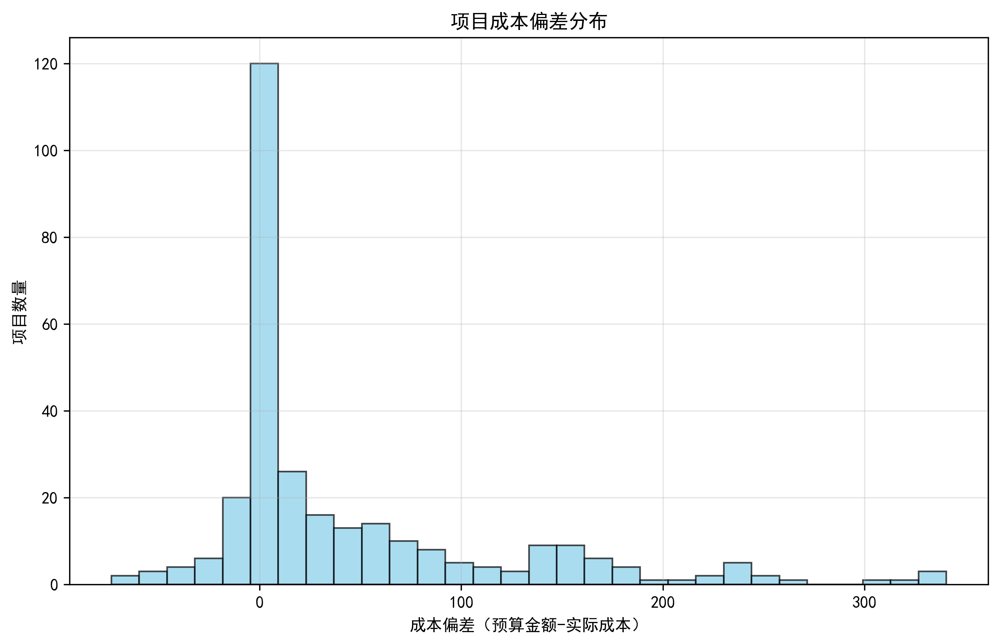
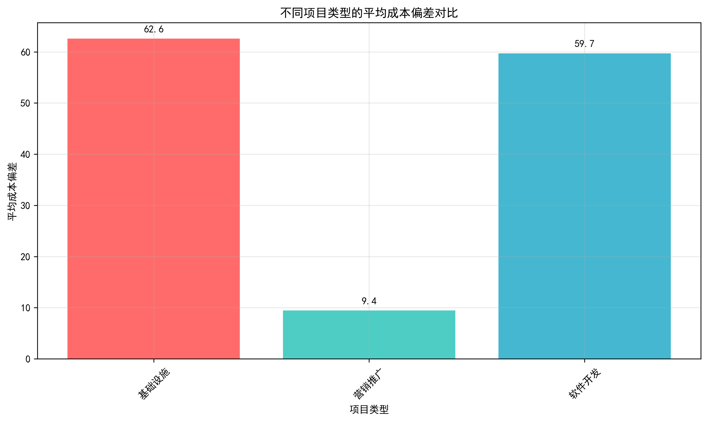
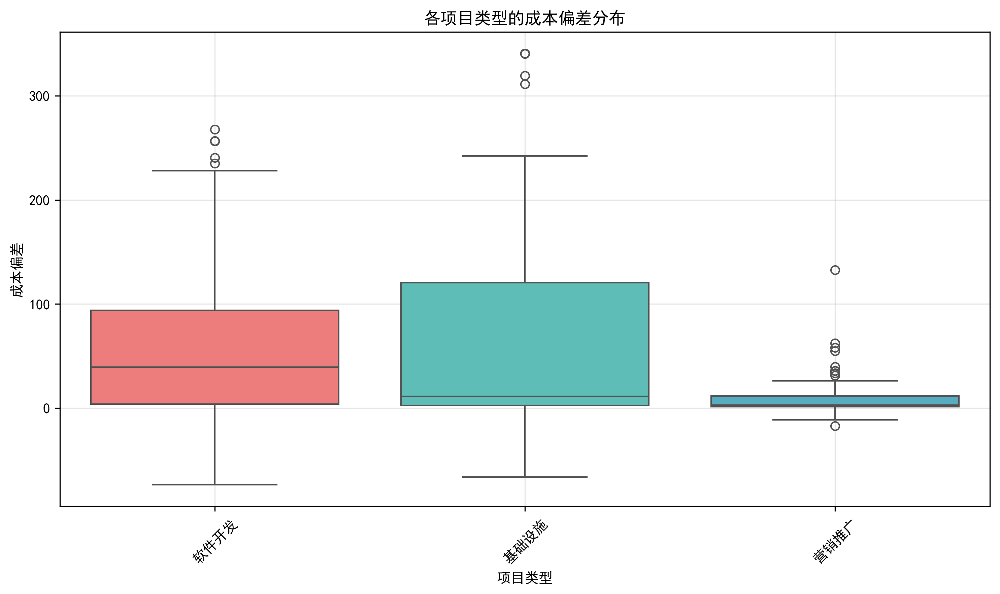
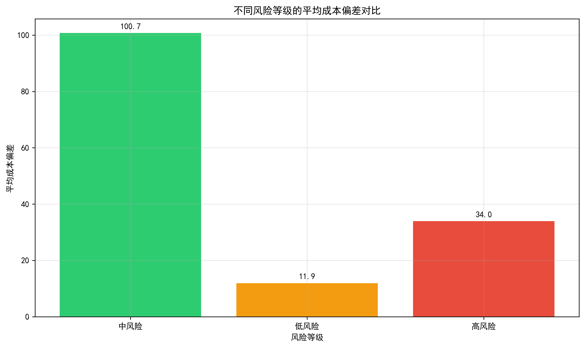
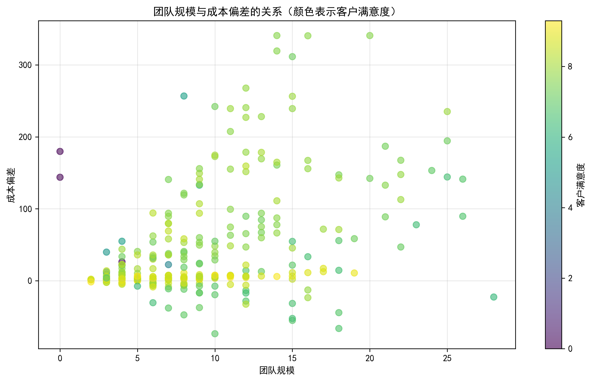
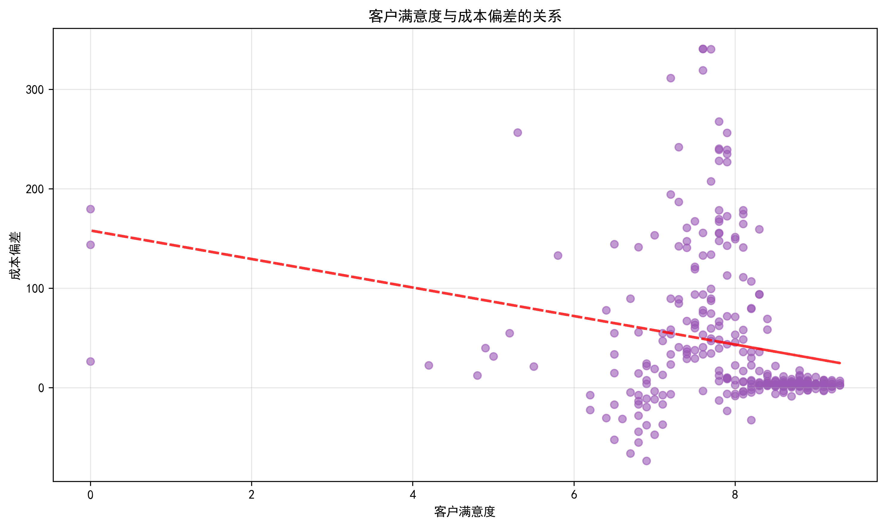
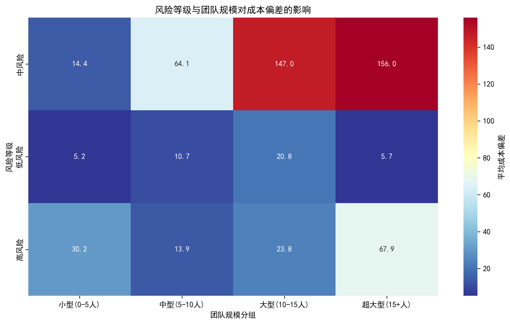

# 项目成本偏差分析报告

## 执行摘要

本报告基于299个项目的全面数据分析，深入探讨了不同项目类型的成本偏差情况及其影响因素。分析发现，所有项目类型平均成本偏差为45.03万元，表明整体成本控制良好。然而，不同项目类型、风险等级和组织因素对成本偏差有显著影响。

## 1. 整体成本偏差概况

**关键发现：**
- 平均成本偏差：45.03万元（正值表示实际成本低于预算）
- 标准差：75.44万元，表明各项目成本偏差差异较大
- 成本偏差范围：-73.6万元至340.7万元
- 整体趋势：大部分项目实际成本低于预算，成本控制相对良好

## 2. 不同项目类型的成本偏差分析

### 2.1 平均成本偏差对比

**核心洞察：**
- **基础设施项目**：平均成本偏差62.6万元，成本控制最佳
- **软件开发项目**：平均成本偏差59.7万元，成本控制良好
- **营销推广项目**：平均成本偏差9.4万元，成本控制相对较差

### 2.2 成本偏差分布特征

**分布特征分析：**
- 基础设施项目：成本偏差波动最大，存在极端高值项目
- 软件开发项目：成本偏差相对稳定，但仍有部分超预算项目
- 营销推广项目：成本偏差最为集中，但平均值最低

## 3. 风险等级对成本偏差的影响

**重要发现：**
- **中风险项目**：平均成本偏差100.7万元，成本控制最佳
- **高风险项目**：平均成本偏差34.0万元，成本控制一般
- **低风险项目**：平均成本偏差11.9万元，成本控制最差

**反直觉洞察：** 中风险项目反而具有最好的成本控制能力，这可能是因为：
1. 中风险项目获得了适度的风险管理关注
2. 高风险项目可能获得了更多资源投入和严格监控
3. 低风险项目可能缺乏足够的成本管控重视

## 4. 组织因素与成本偏差关系

### 4.1 团队规模影响

**关键观察：**
- 团队规模与成本偏差呈正相关（相关系数：0.416）
- 较大团队项目倾向于产生更高的成本偏差（更好的成本控制）
- 客户满意度在散点图中显示与成本控制存在复杂关系

### 4.2 客户满意度与成本偏差

**相关性分析：**
- 客户满意度与成本偏差呈负相关（相关系数：-0.225）
- 趋势线显示客户满意度越高，成本偏差倾向于降低
- 这表明过度成本控制可能影响客户满意度

### 4.3 多因素综合影响

**综合洞察：**
- 中风险+大型团队组合产生最高的成本偏差（最佳成本控制）
- 低风险+小型团队组合成本偏差最低（成本控制较差）
- 团队规模对成本偏差的影响程度超过风险等级

## 5. 相关系数分析

**各因素与成本偏差的相关性排序：**
1. 预算金额（0.629）：强正相关
2. 团队规模（0.416）：中等正相关
3. 实际成本（0.138）：弱正相关
4. 客户满意度（-0.225）：弱负相关

## 6. 业务建议

### 6.1 项目类型策略
1. **基础设施项目**：继续保持优秀的成本控制能力，但需要关注极端偏差项目
2. **软件开发项目**：成本控制良好，可适度提高预算准确性
3. **营销推广项目**：需要加强成本管控，建立更精确的预算机制

### 6.2 风险管理优化
1. **重新评估风险分级标准**：当前中风险项目表现最佳，建议重新审视风险评估体系
2. **加强低风险项目监控**：低风险项目成本控制最差，需要适度增加管理关注
3. **平衡风险管理投入**：避免过度保守或过度乐观的风险评估

### 6.3 团队配置建议
1. **适度扩大团队规模**：数据显示较大团队更有利于成本控制
2. **优化团队结构**：在预算允许范围内，配置更充足的团队资源
3. **平衡成本与满意度**：避免过度追求成本控制而影响客户满意度

### 6.4 预算管理改进
1. **差异化预算策略**：根据不同项目类型和风险等级制定差异化预算标准
2. **动态预算调整**：建立基于团队规模和风险等级的动态预算调整机制
3. **客户满意度考量**：在成本控制与客户满意度之间找到最佳平衡点

## 7. 结论

本次分析揭示了项目成本控制的复杂性和多维影响因素。总体而言，组织的项目成本控制表现良好，但存在显著的改进空间。通过优化风险评估体系、合理配置团队资源、平衡成本控制与客户满意度，可以进一步提升项目管理效率和成功率。

建议管理层重点关注营销推广项目的成本管控，重新审视风险分级标准，并在团队配置和预算制定中考虑多因素的综合影响。
