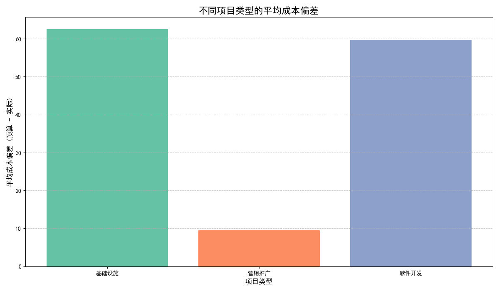
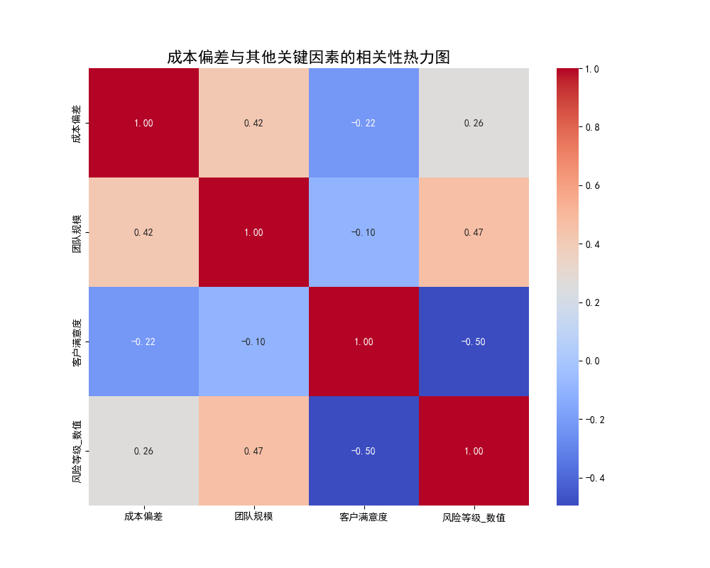

# 项目成本偏差分析报告

## 摘要

本报告旨在深入分析不同项目类型的成本偏差情况，并探索其与团队规模、风险等级及客户满意度等关键因素之间的联系。分析结果表明，项目预算制定与执行存在显著优化空间，尤其是在平衡成本节约与客户满意度方面。

## 1. 不同项目类型的平均成本偏差分析

通过对项目数据进行分析，我们发现不同类型的项目在成本控制上表现出明显差异。成本偏差被定义为“预算金额”减去“实际成本”，正值表示项目成本低于预算（结余），负值表示超出预算（超支）。

**核心发现:**

*   **基础设施与软件开发项目预算过于宽松**: 这两类项目的平均成本结余分别高达 **62.6** 和 **59.7**。这表明它们的初始预算可能被高估，导致大量资金被过度锁定，未能发挥最大效益。
*   **营销推广项目预算相对精确**: 此类项目的平均成本结余仅为 **9.4**，显示其预算制定和成本控制更为精准。

**建议:**

*   **审查与优化预算模型**: 针对基础设施和软件开发项目，应重新评估预算制定流程，引入更精确的成本估算模型，避免过度预留缓冲资金。
*   **推广优秀实践**: 研究营销推广项目的预算管理方法，并将其成功经验推广至其他项目类型。

## 2. 成本偏差与其他关键因素的关联性分析

为了探究影响成本偏差的深层原因，我们分析了它与团队规模、风险等级和客户满意度之间的相关性。

**核心发现:**

1.  **团队规模与成本结余呈正相关 (0.42)**: 项目团队规模越大，成本结余越多的趋势越明显。这可能意味着大型项目获得了与其规模不成比例的过度预算，或者大型团队在资源管理上实现了未被预见的规模效应。

2.  **客户满意度与成本结余呈负相关 (-0.22)**: 这是一个至关重要的洞察。数据显示，**项目成本结余越多，客户满意度反而有轻微下降的趋势**。这强烈暗示，为了达成“节约成本”的目标，项目团队可能在牺牲质量、缩减交付范围或减少客户沟通，从而损害了客户的最终体验。

3.  **风险等级与成本结余呈弱正相关 (0.26)**: 高风险项目通常会预留更多应急资金，但分析结果显示，即便如此，这些项目依然倾向于产生结余。这进一步印证了预算制定整体偏向保守的判断。

## 3. 综合结论与战略建议

综合来看，公司在项目管理上取得了表面上的“成本节约”成功，但这种成功可能是以牺牲客户满意度和资金利用效率为代价的。

**战略建议:**

*   **从“节省预算”转向“价值驱动”**: 企业文化应从单纯追求低于预算，转向在预算内实现客户价值最大化。项目成功的衡量标准应将**客户满意度**放在与成本控制同等重要的位置。
*   **实施动态预算调整**: 对于周期较长的基础设施和软件开发项目，可考虑引入动态预算审查机制，根据项目进展和实际需求，灵活调整资金分配，将未使用的预算重新投入到更高价值的活动中。
*   **深入调查“满意度-成本”悖论**: 针对成本结余高但客户满意度低的项目进行案例复盘。通过访谈项目经理和客户，查明导致满意度下降的具体原因（例如：功能削减、质量不达标、服务响应慢等），并制定改进措施。

通过实施以上建议，公司不仅能优化资本配置，还能建立更健康的客户关系，实现可持续的长期成功。
