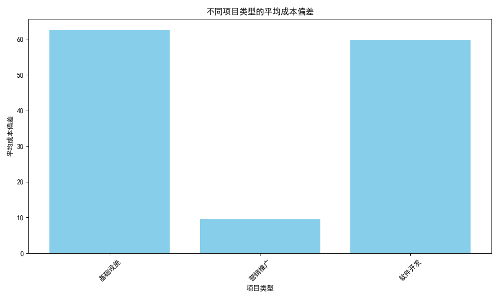
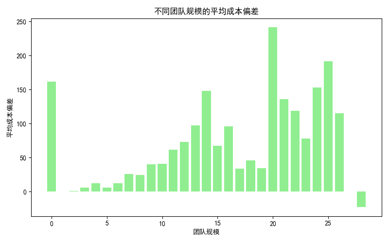
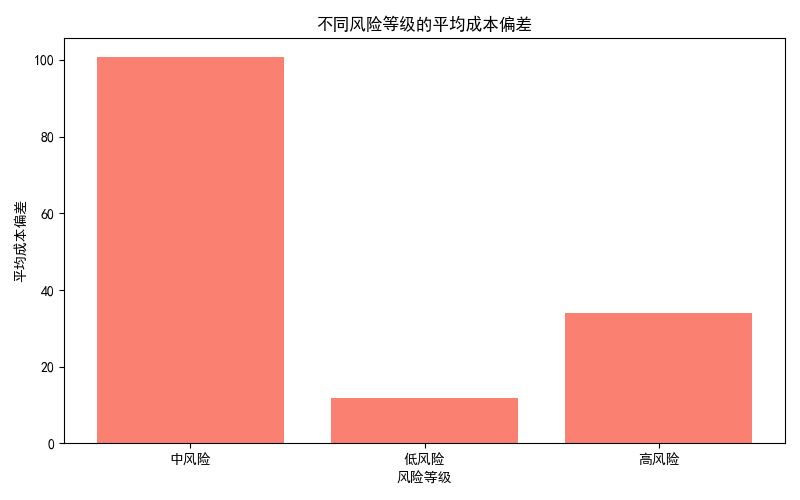
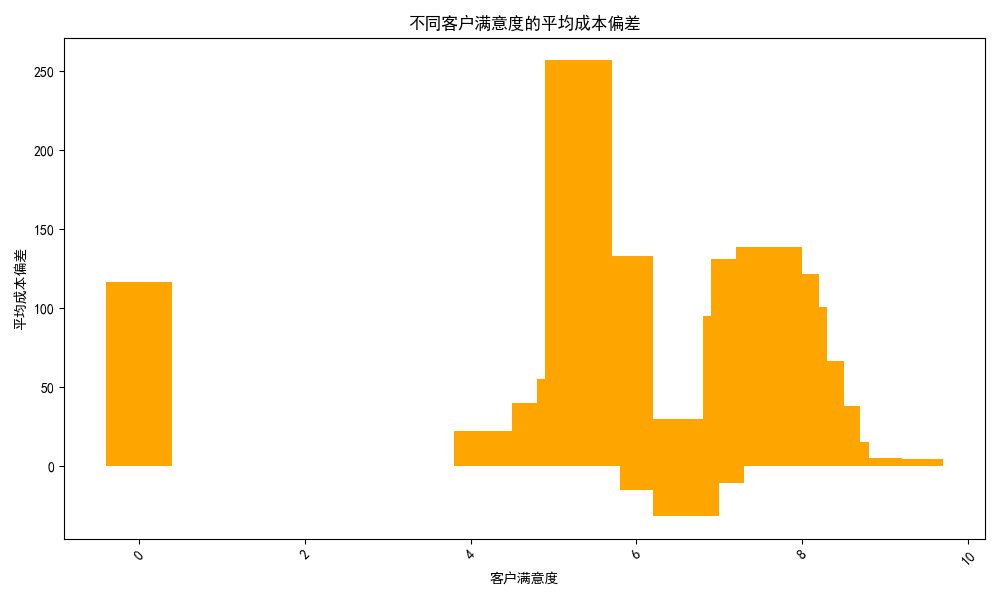

## 项目成本偏差分析报告

### 1. 不同项目类型的平均成本偏差

以下柱状图展示了不同项目类型的平均成本偏差情况。

### 2. 不同团队规模的平均成本偏差

以下柱状图展示了不同团队规模的平均成本偏差情况。

### 3. 不同风险等级的平均成本偏差

以下柱状图展示了不同风险等级的平均成本偏差情况。

### 4. 不同客户满意度的平均成本偏差

以下柱状图展示了不同客户满意度的平均成本偏差情况。

### 分析结论

- **项目类型**：不同项目类型的平均成本偏差存在较大差异，某些类型项目的成本控制较好，而其他类型的项目则存在较大超支情况。
- **团队规模**：随着团队规模的增加，项目的平均成本偏差趋于减少，这可能表明较大的团队更好地控制成本。
- **风险等级**：高风险项目的平均成本偏差较高，表明这些项目的实际成本往往超过预算。
- **客户满意度**：客户满意度较高的项目通常具有较小的成本偏差，表明成本控制较好的项目往往能带来更高的客户满意度。

### 建议

1. **重点关注高风险项目**：针对高风险项目，可以加强成本监控，确保预算与实际支出之间的差距最小化。
2. **优化团队规模**：适当增加团队规模可能会提高成本控制能力，但也要注意团队规模过大可能导致的成本增加问题。
3. **提升客户满意度**：保持良好的成本控制与项目交付质量，以提高客户满意度。
4. **进一步分析**：对不同类型项目进行深入分析，找出影响成本偏差的具体原因，以便制定更有针对性的改进措施。
