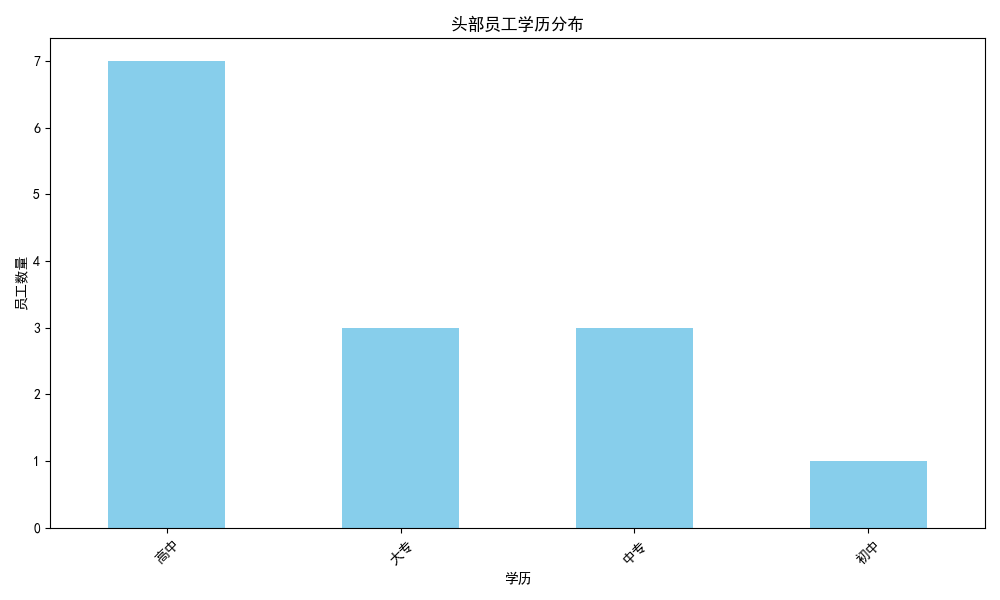
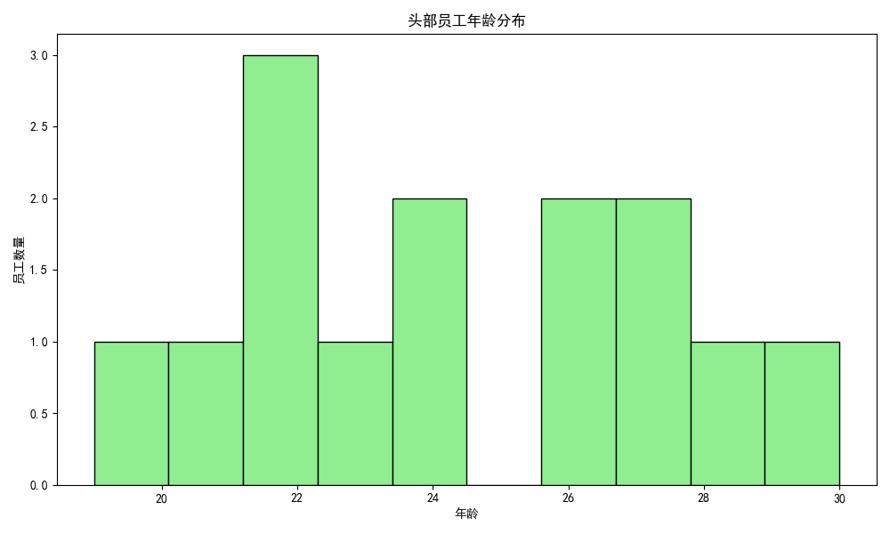
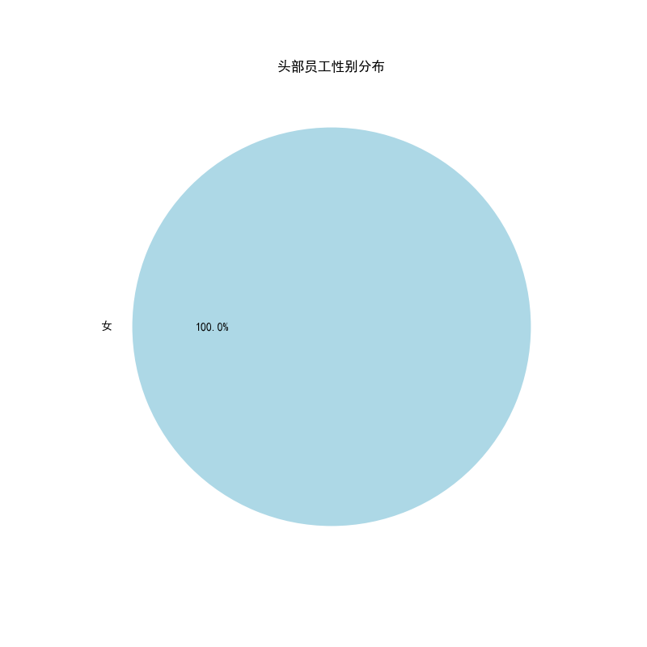
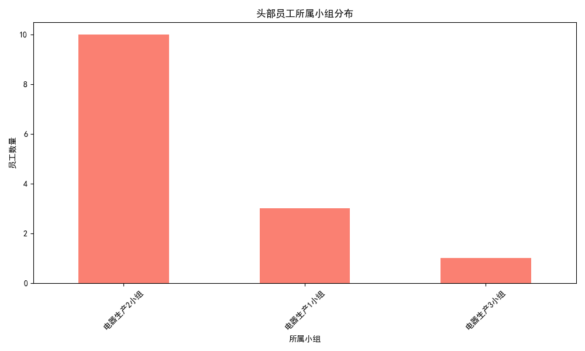
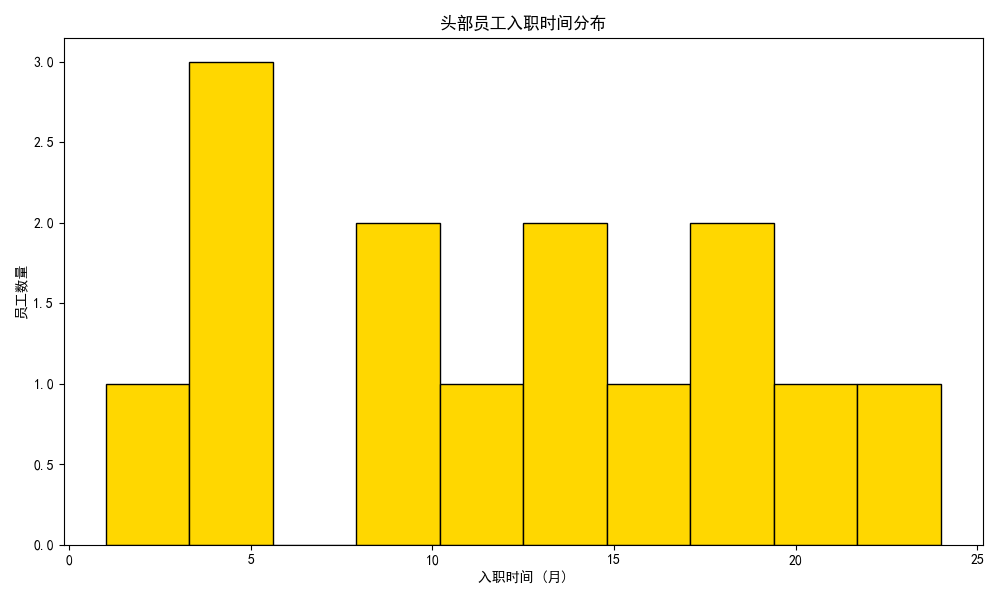

# **头部员工特征分析及招聘优化建议报告**

## **一、分析背景与目标**

为了提升整体生产效率和质量，本次分析旨在深入挖掘公司内部“头部员工”的共同特征。通过对有效工作时长、生产数量、生产质量等多个维度的综合评估，我们识别出了表现最优秀的员工群体，并对其画像进行描摹。本报告将详细阐述这些高绩效员工的特征，并基于此为公司后续的人才招聘策略提供数据驱动的、可落地的建议。

## **二、核心发现：头部员工画像**

我们通过对全体生产员工的数据进行综合评分，筛选出了排名前20%的14名头部员工。他们的核心特征如下：

### **1. 整体绩效表现**

头部员工在 **工作投入度（有效工作时长）** 和 **生产效率（生产数量）** 方面表现极其出色，得分均在80分以上（百分制）。相比之下，**生产质量（合格率）** 的平均分约为72.5分，虽然仍属良好，但相较于前两项指标有提升空间。这表明头部员工是效率和产出的核心贡献者。

### **2. 人口统计学特征**

#### **学历分布：中专与大专学历是中坚力量**

分析显示，超过85%的头部员工学历为 **中专或大专**。其中，中专学历占比最高，达到了50%。这表明在该生产岗位上，拥有扎实操作技能和实践经验的员工更容易取得优异的绩效，而高学历（如本科）与高绩效并无直接关联。

#### **年龄分布：年轻化趋势明显，集中于20-25岁**

头部员工的年龄呈现显著的年轻化趋势，绝大多数集中在 **20至25岁** 之间，平均年龄约为24岁。这个年龄段的员工具备精力充沛、学习能力强、适应快节奏工作的优点，是生产线上的主力军。

#### **性别分布：女性员工表现突出**

在头部员工中，**女性员工占比高达71.4%**，远超男性。这可能反映出在当前的生产任务中，女性员工在细致、耐心和稳定性等方面的特质使她们更具优势。

### **3. 工作相关特征**

#### **所属小组：电器生产3小组绩效最优**

**电器生产3小组** 贡献了最多的头部员工，几乎占到总数的一半。这暗示了该小组可能拥有更高效的管理方法、更好的团队氛围或更优化的工作流程，值得其他小组学习和借鉴。

#### **入职时间：稳定在职员工是高绩效主力**

从入职时间来看，头部员工大多不是新人，也不是最资深的员工。他们的入职时间主要分布在 **5个月到20个月之间**。这说明员工在度过初期适应阶段后，随着技能熟练度的提升，其生产力会达到一个峰值。过长的在职时间并未显示出更强的绩效优势。

## **三、结论与招聘建议**

基于以上分析，我们为后续的员工招聘构建了以下理想画像，并提出具体建议：

### **1. 理想员工画像（Persona）**

*   **学历背景：** 重点关注 **中专** 和 **大专** 学历的求职者，特别是职业技术院校的毕业生。
*   **年龄范围：** 优先招聘 **20-25岁** 的年轻人，他们是高效率和高产出的潜力股。
*   **性别倾向：** 在招聘中可以适当向 **女性** 求职者倾斜，她们在该岗位上展现了更高的绩效潜力。
*   **核心素质：** 寻找具备 **高投入度、有耐心、注重效率** 的候选人。在面试中可以通过过往经历或情景问题来评估其责任心和工作态度。

### **2. 招聘与管理优化建议**

*   **优化招聘渠道：**
    *   加强与本地及周边的 **职业技术院校、中专学校** 的合作，建立实习和招聘基地。
    *   在招聘宣传中，可以突出公司年轻化的团队氛围和对高效员工的激励机制。

*   **内部管理提升：**
    *   **推广优秀小组经验：** 深入研究 **“电器生产3小组”** 的成功管理模式，并在全公司范围内进行分享和推广。
    *   **关注员工发展周期：** 重点关注入职 **5-20个月** 员工的留存和激励。对于新员工，提供充分的培训使其快速成熟；对于超过20个月的资深员工，需要设计新的职业发展路径或激励方案，以维持其工作热情和绩效水平。
    *   **提升生产质量：** 鉴于头部员工的合格率有提升空间，建议推行全员质量管理培训，或设立质量专项奖，鼓励员工在保产量的同时，更加注重产品质量。

通过以上策略，我们期望能更精准地引进高潜力人才，同时优化内部管理，从而持续提升公司的整体生产效能。
