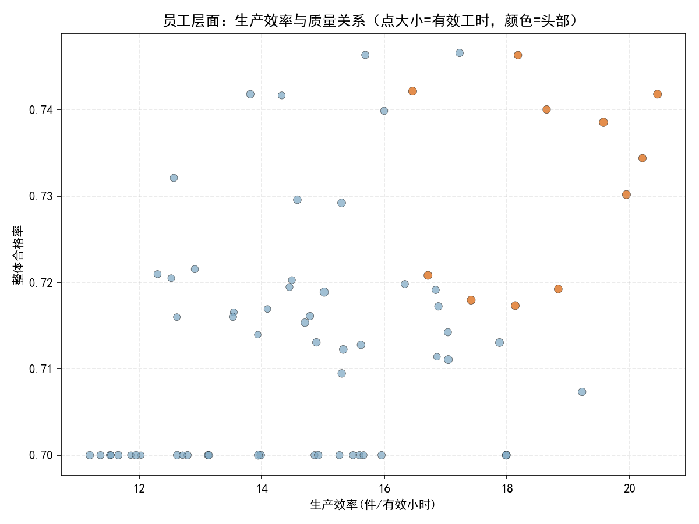
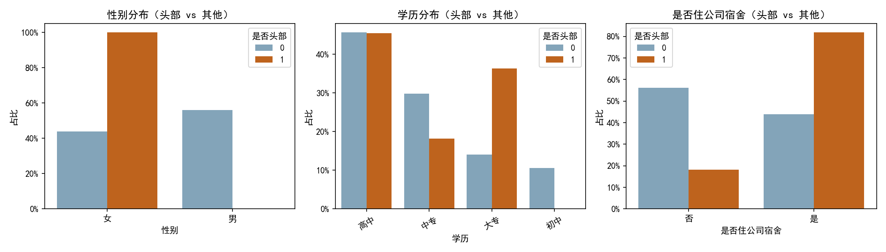
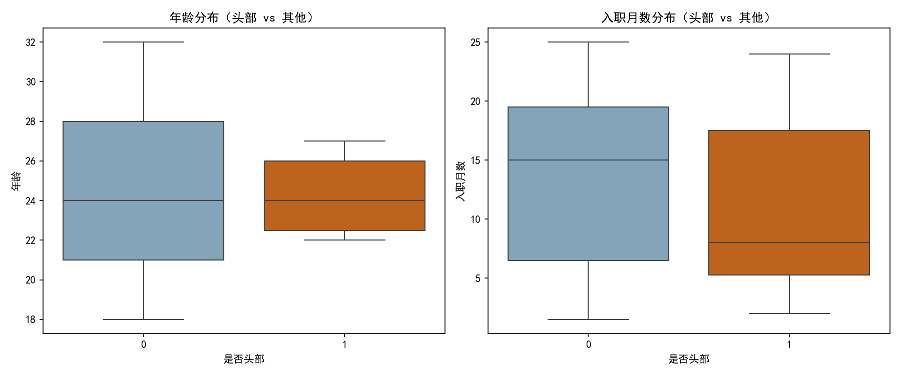
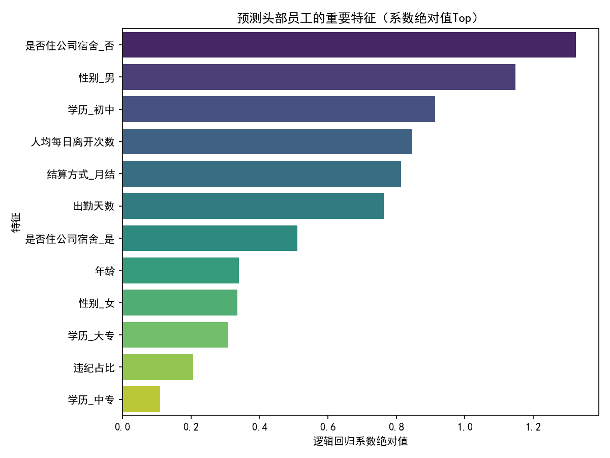

# 生产一线头部员工画像分析与招聘建议

本文基于 SQLite 数据库（6张同构“工作表”）的数据，围绕“有效工作时长、整体生产数量、生产质量”等维度构建综合评分，识别头部员工，并从多维特征中提炼可复制的人才画像，给出招聘与用工策略建议。

一、分析方法与口径
- 数据范围：工作表1—工作表6 合并后的全量记录（68名员工）。
- 指标解析与派生：
  - 出勤小时：由“法定出勤工时（如 8小时）”解析为小时数。
  - 离开分钟：由“总计离开时长（如 47min4s）”解析为分钟。
  - 有效工时＝出勤小时 − 离开分钟/60，且下限为0。
  - 良品数＝生产件数 × 合格率（将“73%”解析为0.73）。
  - 生产效率＝生产件数合计 ÷ 有效工时合计。
  - 违纪占比＝违纪天数 ÷ 出勤天数；人均每日离开次数＝离开次数合计 ÷ 出勤天数。
- 综合评分（拉通排名）：更重良品和质量，兼顾有效投入
  - 综合得分＝0.45×良品数分位 + 0.35×整体合格率分位 + 0.20×有效工时分位
  - 头部员工定义：综合得分位于前15%（85分位阈值≈0.793）者。
- 提示：未对原始数据进行清洗，仅在分析层面进行字段解析与派生。

为了保证中文显示，绘图代码中加入了：
```python
plt.rcParams['font.sans-serif'] = ['SimHei']
plt.rcParams['axes.unicode_minus'] = False
```

二、核心结论（头部 vs 其他）
- 样本规模：员工总数 68；头部人数 11；头部占比 16.2%。
- 产能与质量
  - 生产效率中位数：头部 18.65 件/有效小时 vs 其他 14.58 件/有效小时（+28.0%）。
  - 整体合格率中位数：头部 73.4% vs 其他 71.2%（+2.2 个百分点）。
- 投入与纪律
  - 有效工时合计中位数：头部 348.4 小时 vs 其他 298.8 小时（+49.6 小时）。
  - 人均每日离开次数中位数：头部 5.11 次/天 vs 其他 6.20 次/天（−17.7%）。
- 人口与属性分布（占比为各组内占比）
  - 性别：头部女性占比 100%（其他为 43.9%）。提示：可能与岗位分工/线体工序特性相关，避免简单性别偏见。
  - 学历：头部高中 45.5%、大专 36.4%、中专 18.2%、初中 0%；相比其他组，头部“高中及以上”更集中。
  - 住宿：头部住公司宿舍占比 81.8%（其他仅 43.9%），暗示通勤便利与稳定出勤有正相关。
  - 结算方式：样本中均为月结。

三、可视化洞察
1) 整体效率-质量分布
- 点大小=有效工时；颜色=是否为头部。头部人群在效率与质量维度同时具备相对优势。


2) 头部与非头部在人口属性的差异
- 头部组在“女性、高中及以上学历、住公司宿舍”的占比更高。


3) 年龄与入职月数分布（箱线图）
- 从形态上看，头部员工在入职月数上略偏更高（熟练度可能更强），年龄分布中位数较为集中在青年段。


4) 重要特征（模型权重/相关性）
- 以逻辑回归为参考，影响成为头部的正向因素往往包括：更低的人均离开次数、更低的违纪占比、较高的出勤天数、住公司宿舍、较高学历等；负向因素多与离开频次高、违纪占比高相关。此图仅用于洞察，不代表因果。


四、诊断性分析：为什么他们是“头部”
- 过程纪律性强：头部员工的人均离开次数更低、违纪占比更低，说明其在岗位连续作业与流程遵守上更稳定，从而带来更高的有效工时利用率与更稳定的质量表现。
- 学历与学习吸收：头部的“高中及以上”占比更高，可能更快吸收SOP、工艺规范与质量标准，减少返工与不良。
- 住宿便利与出勤稳定：住公司宿舍显著更高，减少通勤波动，提升持续出勤与工时连续性。
- 熟练度与经验：入职月数略高，意味着熟悉工艺、节拍与质量要点，效率与良率更佳。

五、规范性建议：招聘画像与用工策略
A. 招聘画像（可操作要点）
- 能力与行为特征
  - 稳定出勤、低离开频次：强调岗位纪律与专注度；在面试中设置“专注力/持续作业模拟”情景题。
  - 质量意识与细致程度：设置“来料缺陷识别+装配SOP理解”小测，观察对工艺细节的敏感度。
- 教育与背景
  - 学历建议：优先高中及以上；对大专（含中高职）优先；但不做硬性卡死，结合实操测试结果。
  - 经验偏好：有电子装配/品控/精益生产经历者优先（若无，需通过模拟装配测试达到标准）。
- 生活与通勤
  - 鼓励入住公司宿舍或距离工厂通勤≤30分钟；提供宿舍位/通勤补助，以降低迟到与早退风险。
- 个人特征（与岗位匹配而非性别筛选）
  - 细致、耐心、抗干扰、可适应节拍化工作；年龄建议 18—30 岁区间，但以功能适配为准。

B. 招聘与选拔流程优化
- 加入标准化技能测试
  - 5—10分钟装配速度与错漏检测测试（度量“件/分钟”与错误率）。
  - 质量SOP判断题与“目检/手检”敏感度测试。
- 行为面试与情景模拟
  - “排队等待—专注—中断恢复”情景，评估频繁离岗的可能性与自我管理能力。
- 试用期目标与辅导
  - 设定“30/60/90天”效率与良率爬坡曲线，配以导师制；对离开频次高者给予“微休策略+班组互助”干预。

C. 用工与排班策略
- 倒班与宿舍联动：优先将宿舍员工编入关键节拍工序，以保障产线稳定性。
- 微休与工位管理：对高频离开工位员工，采用定时微休（如每60-90分钟短休2-3分钟）替代随机离岗，减少节拍扰动。
- 质量前置：在新员工上岗前进行必修的“首件确认+自检互检”训练，并在前两周加密质检频次。

D. 薪酬与激励
- 保持月结作为稳定性基石；叠加与“有效工时、良品数、合格率”挂钩的绩效奖励。
- 对“低离岗、高质量稳定”的行为给出专项激励（非一次性，按周期复核）。

六、风险与注意
- 性别差异可能是岗位分配或文化因素造成的相关性，不能作为直接筛选标准。应基于能力素质与实操表现做决策。
- 相关性非因果：特征重要性用于洞察，不代表干预某个特征即可必然提升绩效。建议通过小规模AB试点验证举措有效性。
- 数据期内结构性因素（如线体产品/工序差异）可能影响效率与合格率，建议在后续分析中加入工序/机种维度做混杂控制。

七、可落地的招聘“画像卡”
- 必备：出勤稳定、可遵守SOP、细致耐心、可适应节拍作业、质量意识强。
- 优先：高中及以上学历；有电子装配/质检相关经验；愿意住公司宿舍或通勤时间短；入职后能快速达到节拍标准。
- 预期爬坡：在3—6个月内达到头部员工的效率与良率中位水平（18.6件/时、73%+的合格率），并保持人均每日离开次数低于5.5次。

附：产出物
- 明细汇总：employee_summary.csv
- 可视化图片：
  - scatter_prod_quality.png
  - top_characteristics.png
  - box_age_tenure.png
  - feature_importance.png

如需，我可进一步细分不同小组/工位的头部画像，或构建基于入职前信息的绩效预测模型用于筛选优化。
