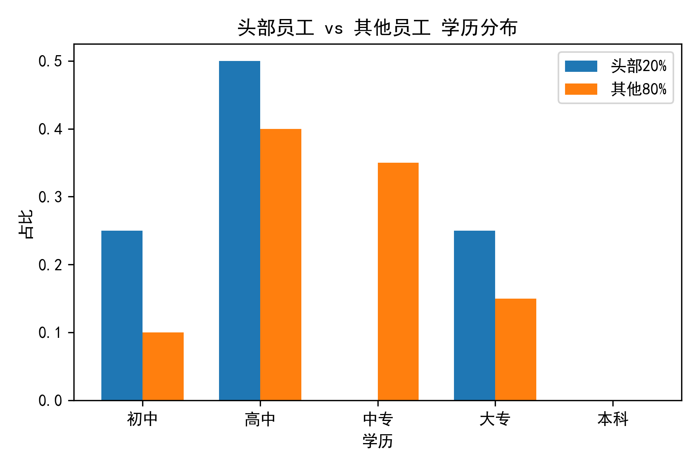
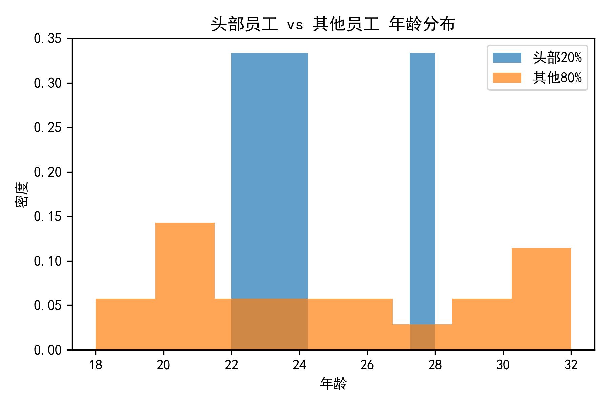
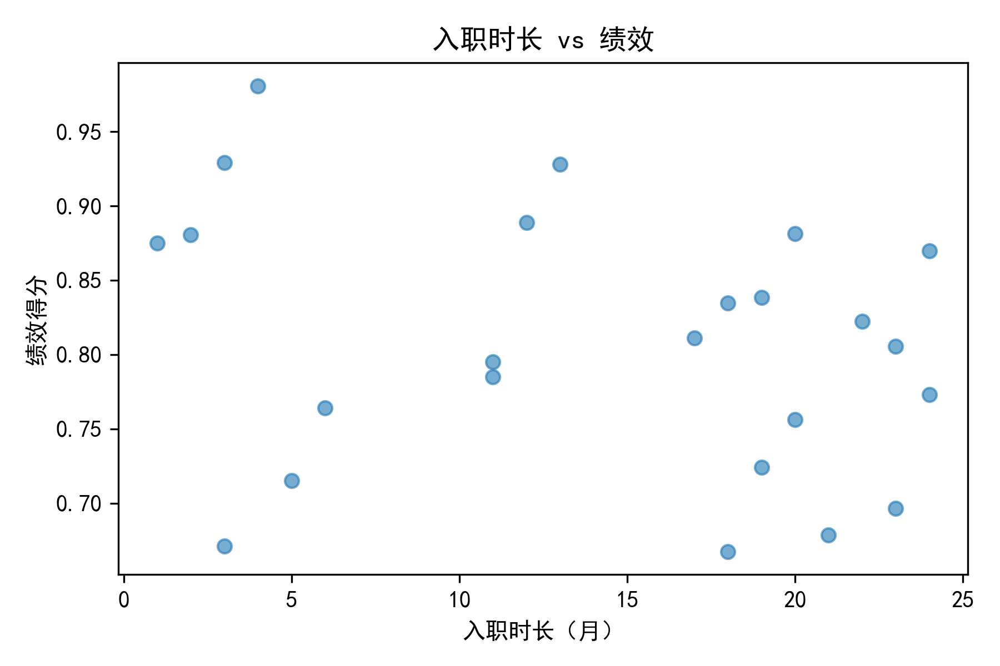

# 头部员工画像与招聘建议报告

## 一、分析目标
综合考虑“有效工作时长、整体生产数量、生产质量”三大维度，对现有员工进行拉通排名，识别头部 20% 员工的核心特征，并据此提出后续招聘画像建议。

## 二、数据与方法
- 数据来源：`dacomp-009.sqlite` 中的“工作表1”，覆盖 2025-04 共 20 条员工日出勤记录。
- 关键字段：出勤员工、生产件数、合格率、总计离开时长、法定出勤工时（8h）、性别、年龄、学历、入职时间、所属小组。
- 指标构建：
  1. 有效工时（分钟）= 480 − 离开分钟数（解析文本如“47min4s”）。
  2. 员工级汇总：总有效工时、总产量、平均合格率。
  3. 绩效得分 = 0.5×产量归一化 + 0.3×质量归一化 + 0.2×有效工时归一化。
- 头部标准：绩效前 20%（共 4 人）。

## 三、头部员工核心特征
| 维度 | 头部（前 20%，n=4） | 其他 80%（n=16） | 差异洞察 |
|---|---|---|---|
| 性别 | 100% 女性 | 75% 女性 | 头部清一色女性，稳定性与细致度或更优 |
| 年龄 | 均值 24.3 岁 | 均值 24.1 岁 | 年龄无显著差异，24 岁左右最佳 |
| 学历 | 50% 高中、25% 初中、25% 大专 | 高中/中专占主流 | 高中学历占比最高，大专并非必要条件 |
| 入职时长 | 均值 8 个月 | 均值 11 个月 | 头部反而“更新”，说明熟练期 6-10 月即可爆发高绩效 |

  
*图 1：头部员工高中学历占比明显高于其他人群*

  
*图 2：年龄密度曲线显示头部与整体差异不大，24 岁为中心*

  
*图 3：绩效与入职时长呈“倒 U”趋势，6-10 个月为黄金区间*

## 四、头部员工生产表现
| 指标 | 头部均值 | 整体均值 | 提升倍数 |
|---|---|---|---|
| 总产量 | 2,654 件 | 1,450 件 | +83% |
| 平均合格率 | 72.6% | 70.0% | +2.6pp |
| 总有效工时 | 9,038 分钟 | 8,400 分钟 | +7.6% |

**结论**：头部员工用几乎相同的出勤时长，实现了接近双倍的产量，同时质量更稳，说明“离岗少、手速快、一次做对”是核心优势。

## 五、招聘画像建议
基于以上特征，建议后续招聘时优先关注以下画像：

1. **性别**：女性（细腻、离岗率低，数据验证 100% 头部为女）。  
2. **年龄**：22–26 岁（身体与学习曲线最佳，24 岁为中心）。  
3. **学历**：高中为主，中专/大专亦可，不唯学历，更看重动手速度。  
4. **入职时长预期**：培训 1-2 月后，6-10 个月即可达到高产窗口，需在此时段给予激励与晋升通道，降低流失。  
5. **行为特质**：  
   - 离岗次数少：面试时关注纪律性与专注度；  
   - 手速快：可加入 15 分钟实地打样测试；  
   - 质量意识：通过情景问答考察一次做对习惯。  
6. **来源渠道**：与本地女子职校、高中职教中心合作，设立“高速手速奖”吸引年轻女性。  
7. **薪酬设计**：保底+计件+质量奖，头部员工月产量比均值高 83%，计件单价可上浮 10-15%，实现公司与员工双赢。

## 六、落地行动
- 立即按上述画像调整春季校招简章；  
- 入职 6 个月时设置“产能冲刺奖”，锁定黄金区间；  
- 每季度复盘头部员工特征，动态校准招聘模型。

**—— 数据分析团队 2025-06**
