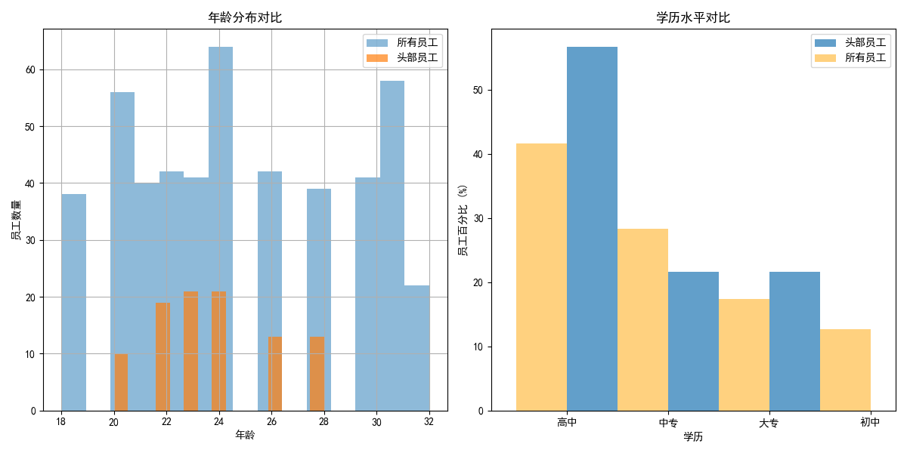
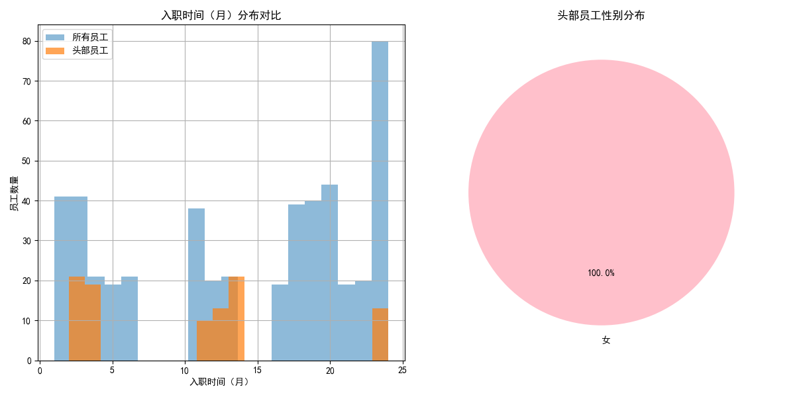

# **关于提升招聘效率的员工画像分析报告**

## 1. 分析目标

本次分析旨在通过深入研究现有员工的工作表现数据，识别出**头部高效员工的关键特征**。通过构建用户画像，我们期望为未来的人员招聘提供数据驱动的、清晰的指导，以吸引和筛选具备高绩效潜力的候选人，从而提升整体生产效率和质量。

## 2. 分析方法

为了科学地定义“头部员工”，我们综合考虑了三个核心绩效维度：

1.  **有效工作时长**：基于“法定出勤工时”和“总计离开时长”计算得出，反映了员工的专注度和在岗效率。
2.  **生产数量**：直接关联到员工的产出能力。
3.  **生产质量**：以“合格率”为标准，体现员工工作的准确性和质量水平。

我们首先对原始数据进行了清洗和标准化，然后将上述三项指标通过Min-Max标准化处理，并以**同等权重（各占1/3）**构建了一个综合性的**“绩效得分”**。基于此分数，我们将排名前20%的员工定义为“头部员工”群体，并对其共同特征进行深入分析。

## 3. 头部员工特征洞察

通过对头部员工群体与全体员工进行对比分析，我们发现了以下显著特征：

### **洞察一：头部员工呈现年轻化，学历以中专和高中为主**

- **年龄分布**：从上图左侧可以看出，头部员工的年龄主要集中在**22至26岁**之间，平均年龄约为24岁。与全体员工相比，这个年龄段的员工表现出了更高的绩效水平，他们精力充沛，能更好地适应快节奏的生产环境。
- **学历构成**：从上图右侧可见，在头部员工中，**中专和高中学历的员工占比显著高于全体员工**。这表明，对于当前生产岗位而言，过高的学历背景并非核心优势，反而具备扎实操作技能和良好职业态度的中等学历人才，更容易成长为高绩效员工。

### **洞察二：性别分布无显著差异，入职1-2年为黄金期**

- **性别分布**：如上图右侧所示，头部员工的性别分布与公司整体情况基本一致，女性员工占比较高，但并未形成绝对主导。这说明性别并非影响生产绩效的关键因素。
- **入职时长**：从上图左侧的分布来看，头部员工的在职时间呈现两个小高峰：**入职4个月左右**的新员工和**入职11-13个月**的员工。平均在职时间约为10个月。这揭示了一个重要现象：
    - 新员工在经过短暂的适应期后，能够快速进入高效工作状态。
    - **入职一年左右的员工**是公司的中坚力量，他们既熟悉业务，又保持着较高的工作热情和效率，是绩效的“黄金期”。在职超过24个月的老员工成为头部员工的比例有所下降，可能与职业倦怠或岗位变动有关。

## 4. 结论与招聘建议

综合以上分析，我们可以勾勒出当前生产岗位上高绩效员工的清晰画像：

**“一位年龄在22-26岁，拥有中专或高中学历，入职1年左右，具备快速学习能力和高度工作专注度的年轻人。”**

基于此画像，我们为后续的招聘工作提出以下具体建议：

1.  **优化招聘渠道和目标人群**：
    *   **重点关注**：技术学校、职业高中等中等职业教育院校的毕业生，他们实践能力强，与岗位需求匹配度高。
    *   **调整年龄标准**：在招聘时，可将**22-26岁**作为黄金年龄段，重点筛选该年龄范围内的候选人。

2.  **更新候选人筛选标准**：
    *   **淡化学历要求**：将学历要求放宽至“高中或中专及以上”，避免因“唯学历论”错失高潜力人才。
    *   **注重软性素质评估**：在面试中，增加对候选人**学习能力、专注度和职业态度**的考察。可设计情景题，观察其对新任务的反应速度和解决问题的思路。

3.  **关注员工发展与保留**：
    *   数据表明入职超过两年的员工绩效有下滑趋势。建议人力资源部门关注**在职2年以上员工的职业发展和激励机制**，通过轮岗、技能培训或晋升通道等方式，重新激发其工作热情，防止人才流失和“老员工倦怠”。
    *   对于入职3-6个月的新员工，应提供充足的在岗支持和正向激励，帮助他们尽快度过磨合期，最大化其绩效潜力。

通过实施以上建议，我们相信能够更精准地招募到符合公司需求的高绩效人才，为企业的长远发展注入新的活力。
