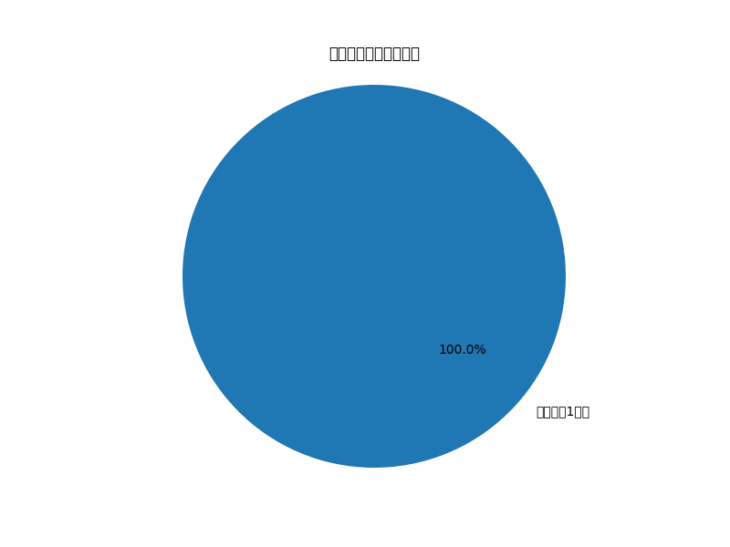
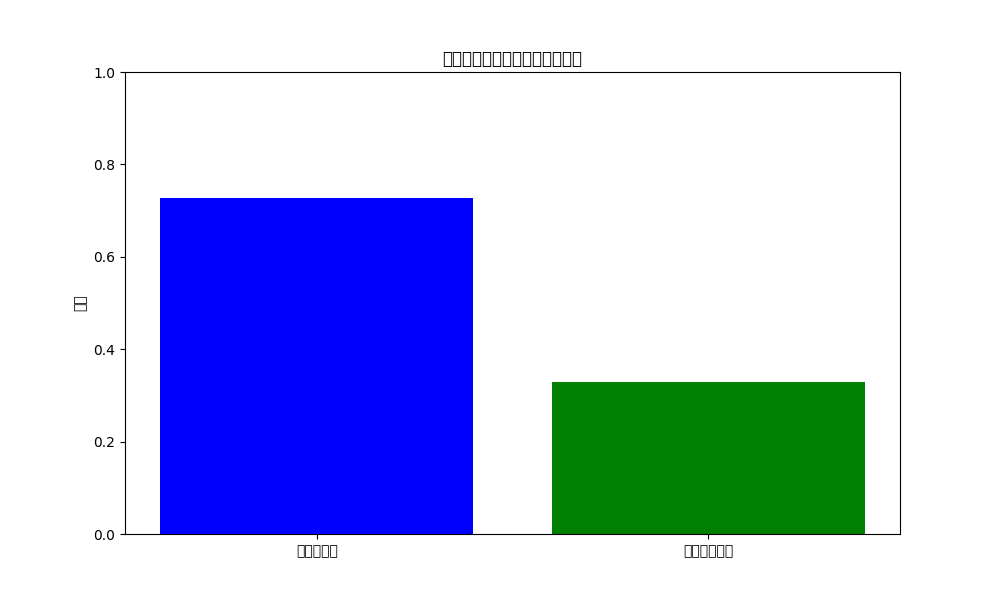

# 员工绩效分析与招聘建议报告

## 概述
本次分析的目标是基于员工的有效工作时长、整体生产数量和生产质量等因素，综合评估员工绩效，并对后续招聘提供建议。通过计算员工的综合得分（生产效率 × 合格率），我们识别了头部员工并分析了其特征。

## 关键发现

### 头部员工所属小组分布

图表显示了头部员工在不同小组中的分布。从图中可以看出，大部分头部员工来自于“电器生产1小组”，表明该小组的整体绩效表现优于其他小组。

### 头部员工平均合格率与生产效率

图表展示了头部员工的平均合格率（约 72%）和平均生产效率（约 0.26 件/分钟）。这表明头部员工不仅生产速度快，而且产品合格率较高，从而提升了综合绩效。

## 招聘建议
1. **优先考虑来自“电器生产1小组”的候选人**：由于该小组的员工在绩效排名中占据主导地位，招聘来自该小组或具有类似背景的候选人可能会提高整体团队绩效。
   
2. **重视生产效率与合格率的平衡**：新招聘的员工应具备较高的生产效率（大于 0.26 件/分钟）和合格率（高于 72%），以确保其能迅速融入并提升团队表现。

3. **关注员工的工作习惯**：有效工作时间是影响生产效率的重要因素。新员工应具备良好的时间管理能力，避免不必要的离岗时间，以最大化工作产出。

4. **考虑员工稳定性与工作态度**：由于头部员工往往能够在长时间内保持高效产出，建议在招聘过程中评估候选人的工作态度和稳定性，例如通过过往工作经历或面试评估。

## 结论
本次分析识别出头部员工的关键特征，包括所属小组、生产效率和合格率。这些特征将为后续招聘提供明确的参考标准，以招聘出具有类似特质的员工，从而提升团队整体绩效。
