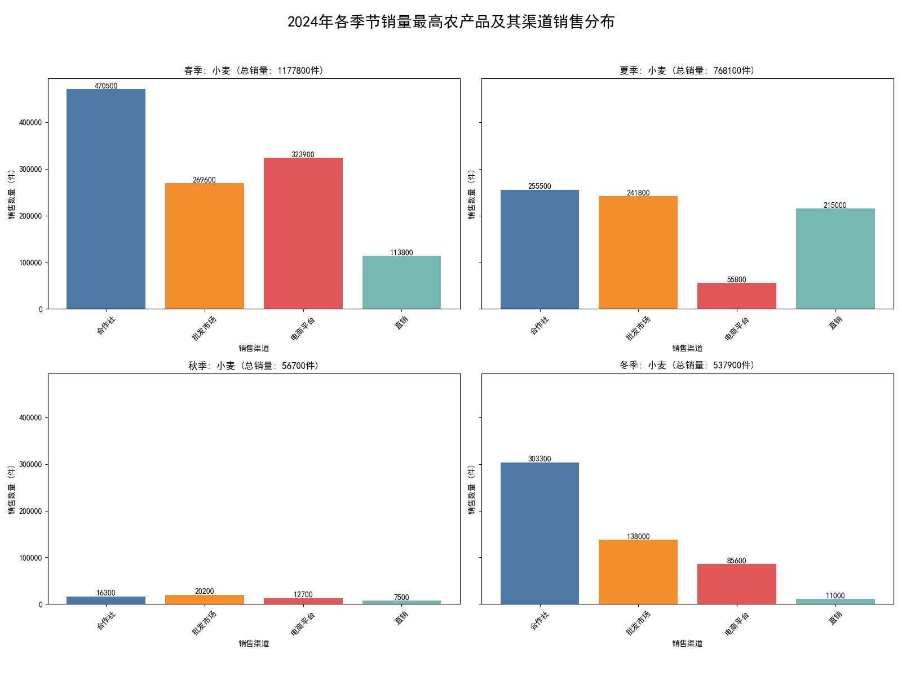

# 2024年农产品销售数据分析报告：季节性趋势、渠道表现与优化策略

## 一、引言

本报告旨在通过对2024年农产品销售数据的深入分析，揭示不同季节下各类农产品的销售趋势，并找出各季节的“销售冠军”。同时，我们将重点探究冠军产品在不同销售渠道下的表现差异，并基于此提出切实可行的渠道优化策略，以期提升整体销售效益。

---

## 二、核心发现：小麦的全年销售霸主地位

经过数据分析，我们发现一个显著的现象：在2024年的春、夏、秋、冬四个季节中，**小麦**均是销售数量最高的农产品，但其销售表现在不同季节和渠道下呈现出巨大差异。

- **春季**: 销售顶峰，总销量达 **1,177,800** 件。
- **夏季**: 销量次之，总销量为 **768,100** 件。
- **冬季**: 销量平稳，总销量为 **537,900** 件。
- **秋季**: 销售低谷，总销量仅 **56,700** 件。

下图直观地展示了小麦作为各季节销售冠军，在四个主要销售渠道（合作社、批发市场、电商平台、直销）下的具体销售数量分布。

---

## 三、诊断分析与原因探究

### 1. 为什么小麦是全年销售冠军？
小麦作为全球性的主粮作物，其需求具有**刚性强、基数大**的特点。无论是用于口粮消费还是工业加工（如面粉、饲料），都保证了其拥有稳定且庞大的市场需求，这使其在销量上容易超越其他季节性强、消费群体小的农产品。

### 2. 为什么季节性销量差异如此巨大？
- **春季（销售高峰）**: 春季通常是农业生产和交易的活跃期。对于小麦而言，这可能是陈麦去库存、为新一季种植做准备、以及国家和企业进行战略储备的关键时期，多重需求叠加导致销量激增。
- **秋季（销售低谷）**: 秋季并非我国冬小麦的主要收获和交易季节，市场供应可能以存货为主，交易活跃度自然下降，导致销量锐减。

### 3. 各渠道表现为何随季节波动？
- **春季三足鼎立**: 在销量高峰期，各大渠道全面发力。`合作社`作为传统优势渠道，体量巨大；`电商平台`可能通过大型促销活动（如春耕节、线上农产品展销会）吸引了大量订单；`批发市场`则承接了大量的线下流通需求。
- **夏季直销崛起**: 夏季新麦可能开始少量上市，`直销`渠道的增长（相比春季翻倍）表明部分买家（如食品加工厂）倾向于直接向产地采购，以获取最新鲜的原料。
- **冬季合作社主导**: 冬季临近春节，是传统的消费旺季。`合作社`作为连接农户和大型采购商的核心纽带，在备货需求下表现突出。而电商和直销渠道可能因物流、假期等因素影响，表现相对平淡。

---

## 四、渠道优化策略建议

基于以上分析，针对小麦这一核心产品，我们提出以下以“顺势而为、补齐短板”为核心的渠道优化策略：

### 1. **春季（高峰期）：巩固优势，最大化收益**
- **策略**: 乘胜追击，巩固`合作社`、`电商平台`和`批发市场`三大主力渠道。
- **行动点**:
    - **稳定合作社**: 确保与合作社的订单履行能力，保障供应链稳定。
    - **加码电商**: 在电商平台策划专题营销活动，利用高流量冲击更高销售记录。
    - **深耕批发市场**: 优化物流配送效率，服务好批发市场的各类经销商。

### 2. **夏季（变化期）：拥抱直销，开拓新增长点**
- **策略**: 重点发掘`直销`渠道的增长潜力。
- **行动点**:
    - **建立大客户关系**: 主动接洽大型食品加工企业、连锁餐饮和大型零售商超，探索建立长期直供合作，减少中间环节，提升利润空间。
    - **提升产品附加值**: 针对直销客户提供定制化服务，如不同规格、等级的小麦产品。

### 3. **冬季（稳定期）：维稳核心，激活潜力渠道**
- **策略**: 稳定`合作社`这一基本盘，同时激活`电商`和`直销`渠道。
- **行动点**:
    - **主题营销**: 在电商平台开展“年货节”、“冬季滋补”等主题活动，捆绑销售，刺激消费。
    - **激活直销**: 针对冬季市场需求，向餐饮企业等提供适用于冬季菜品的原料。

### 4. **秋季（低谷期）：维持运营，蓄力未来**
- **策略**: 维持`批发市场`等关键渠道的基本运营，进行市场调研和客户关系维护。
- **行动点**:
    - **清理库存**: 可通过小幅度的促销活动，在批发市场清理剩余库存。
    - **市场预热**: 开始为来年的春季销售旺季进行市场预热和客户沟通，锁定早期订单。

---

## 五、结论

综上所述，2024年小麦是贯穿全年的核心销售产品，其销量呈现出明显的季节性波动。未来的销售策略应**摒弃一成不变的渠道模式，转向精细化的季节性运营**。通过在不同季节动态调整渠道重心，在优势期最大化战果，在平稳期挖掘潜力，在低谷期维持运营，才能有效提升整体销售效益，实现农产品销售的持续增长。
