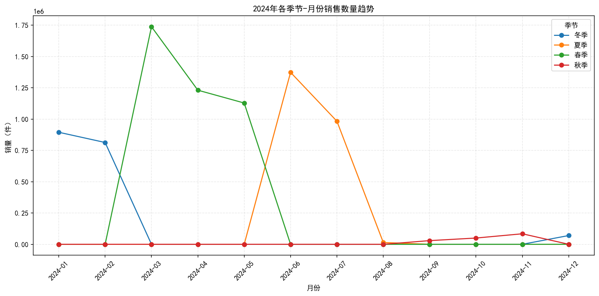
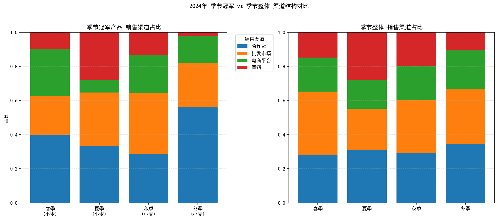

# 2024年各季节农产品销量趋势与渠道优化分析报告

> 数据源：SQLite（交易核心信息、产品基础信息、市场与质量反馈信息）。分析范围：2024年。无需数据清洗，直接基于原始聚合结果。

## 核心发现摘要

- 季节销量趋势：
  - 春季销量最高，3月达峰，随后4-5月逐步回落。
  - 夏季6-7月保持高位，但8月出现显著断崖式下降。
  - 冬季（1-2月）稳定在中高位。
  - 秋季（9-10月）销量显著偏低。
- 每个季节的销量冠军农产品均为“小麦”，表现稳定但各季的渠道结构存在显著差异：
  - 冬季与春季：冠军产品对合作社依赖更强，电商与直销占比偏低。
  - 夏季：冠军产品在批发市场与直销较强，但电商占比较低（明显低于该季整体电商水平）。
  - 秋季：冠军产品更偏向批发市场，直销占比显著低于整体。

图片引用：
- 季节-月份销量趋势图：
- 冠军产品 vs 季节整体渠道结构对比：

## 数据要点与量化证据

- 2024年各季节-月份的销售数量（节选）：
  - 冬季：1月 895,000；2月 813,300
  - 春季：3月 1,738,200；4月 1,231,100；5月 1,128,600
  - 夏季：6月 1,373,700；7月 983,200；8月 14,400（显著下滑）
  - 秋季：9月 29,300；10月 49,900

- 每季销量冠军农产品（总销量）：
  - 冬季：小麦 537,900
  - 春季：小麦 1,177,800
  - 夏季：小麦 768,100
  - 秋季：小麦 56,700

- 冠军产品与季节整体的渠道占比对比（百分比点差，冠军-整体；正值表示冠军更偏好该渠道）：
  - 冬季：合作社 +21.7pp；批发市场 -6.2pp；电商 -6.9pp；直销 -8.6pp
  - 春季：合作社 +11.6pp；电商 +7.5pp；批发市场 -14.0pp；直销 -5.1pp
  - 夏季：批发市场 +7.5pp；合作社 +2.0pp；直销 +0.1pp；电商 -9.6pp
  - 秋季：批发市场 +4.7pp；电商 +2.3pp；合作社 -0.4pp；直销 -6.6pp

这些差异表明：同样是季节销量冠军，其最有效的渠道随季节而变，且与该季整体渠道结构并不总是对齐，存在优化空间。

## 诊断分析（为什么）

- 春季高峰（3月）：可能受春耕备货影响，B端（合作社）集中采购推动。电商在春季冠军产品上也较强，说明C端消费在春季具有一定活跃度。
- 夏季8月断崖式下滑：可能受供给端（农事周期、库存状态）或需求端（淡季）的影响；也可能是渠道侧促销活动缺位。冠军产品电商占比明显弱于该季整体，暗示线上触达不足未能对冲线下需求波动。
- 冬季：冠军产品高度依赖合作社，说明B端合约式供给表现良好，但直销与电商占比偏低，存在触达终端客户的不足。
- 秋季：销量整体偏低，更依赖批发市场出货，直销较弱，可能与品类在秋季的终端消费需求较弱有关，需要用批发清货与跨季策略。

备注：本分析未进行数据清洗，直接基于聚合数据。关于“库存状态”“质量检测结果”“客户满意度”等字段可在后续扩展分析中进一步联动，以增强因果解释。

## 预测性判断（将会发生什么）

- 若不优化渠道结构，春季仍将维持以合作社为主的高峰，但批发市场的相对弱势将持续。
- 夏季若继续保持当前线上策略，电商占比偏低可能导致在8月淡季无法拉动销量，重复出现类似下滑。
- 秋季销量偏低的结构性问题可能延续，需要依赖批发市场出货以稳定规模。

## 规范性建议（我们应该做什么）

围绕每季冠军“小麦”，制定差异化渠道策略：

- 冬季（合作社占比显著偏高）：
  - 扩展批发市场与电商占比：在冬季开展联合促销（批发+电商跨渠道优惠），丰富B2B之外的B2C触点。
  - 建立直销试点：在重点城市开设短期直销活动或团购，验证直销可行性，目标直销占比提高2-3pp。

- 春季（合作社与电商双强）：
  - 深化合作社合约购：锁定3月峰值，提前两个月做备货与预售，提高履约稳定性。
  - 放大电商增长：春季开展平台联合营销（如“春耕补贴券”），目标电商占比提升5pp；同时优化仓配以支持高峰期履约。
  - 批发市场策略调整：减少无效分销，聚焦高效批发商；以SKU打包和价格阶梯，提高批发效率，补齐冠军在批发的短板。

- 夏季（批发与直销强、电商弱）：
  - 强化电商：制定“避暑季线上秒杀+直播带货”，集中在6-7月拉升线上，避免8月断崖。目标电商占比提升8-10pp。
  - 稳固批发：与核心批发商签订保量协议，结合价格浮动率设定动态折扣，稳定冲量。
  - 直销用户运营：针对高温季采购需求，推团购套餐与冷链配送补贴，扩大社区团购覆盖。

- 秋季（批发偏强、直销弱）：
  - 以批发去库存：统一制定秋季批发“清仓周”，提高动销速度。
  - 补齐直销：在秋季面向终端用户做“跨季囤粮”促销，提高直销占比3-5pp。
  - 电商内容化：强调储存与营养场景，配合内容电商做科普，提升转化。

- 跨季运营与风险对冲：
  - 产销协同：基于趋势图的峰谷，春季提前备货，夏季增强线上弹性，秋季以批发清库存。
  - 渠道结构目标：将冠军产品的渠道结构向该季整体的“优势渠道”对齐，同时在弱势渠道设定明确提升目标（如电商提升X pp、直销提升Y pp），并按月跟踪达成。

## 可视化说明

- 季节-月份销量趋势图展示了2024年不同季节的月度销量变化，春季峰值明显，夏季8月显著下滑。
  - 请见：
- 渠道结构对比图左侧为各季节冠军产品渠道占比，右侧为该季整体渠道占比。差异用于指导渠道策略优化。
  - 请见：

## 方法与实现简述

- SQL聚合：联结交易核心信息（销量、渠道、日期）、产品基础信息（农产品名称）、市场与质量反馈信息（季节标识），过滤2024年：
  - 计算季节-月份销量；
  - 识别每季销量冠军（按总销量排序取Top1）；
  - 统计冠军产品及季节整体的渠道销量与占比。
- Python绘图：生成折线图与堆叠柱状图，图片保存在当前目录。
- 为确保中文显示，绘图脚本包含如下配置：
```python
plt.rcParams['font.sans-serif'] = ['SimHei']
plt.rcParams['axes.unicode_minus'] = False
```

## 结论

- 小麦在2024年四季均为季节销量冠军，但其最佳渠道组合随季节变化显著。
- 春季建议“合作社+电商双轮驱动”，夏季要“补齐电商短板”，冬季需“加速分散渠道依赖”，秋季以“批发去库存+直销补齐”。
- 依据趋势与渠道差异设定明确的占比提升目标与促销排期，有望提升季节性波动中的整体销售效益。
