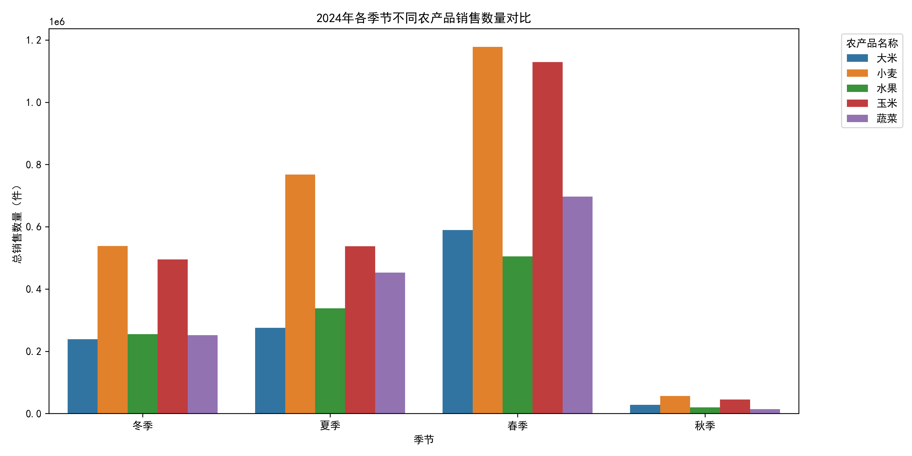
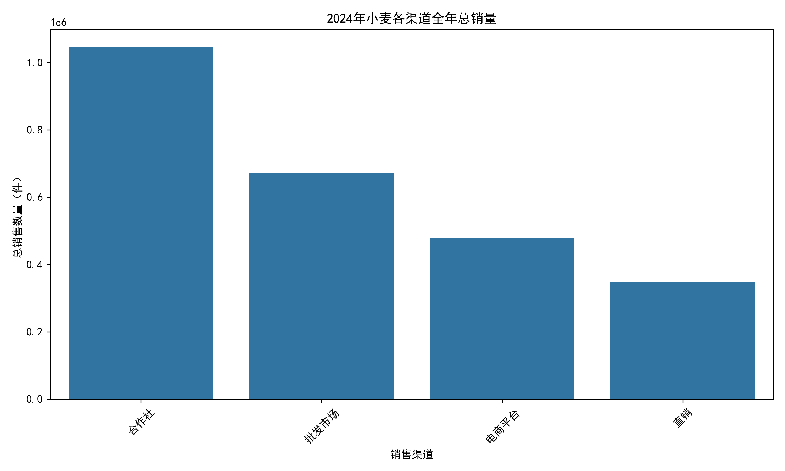
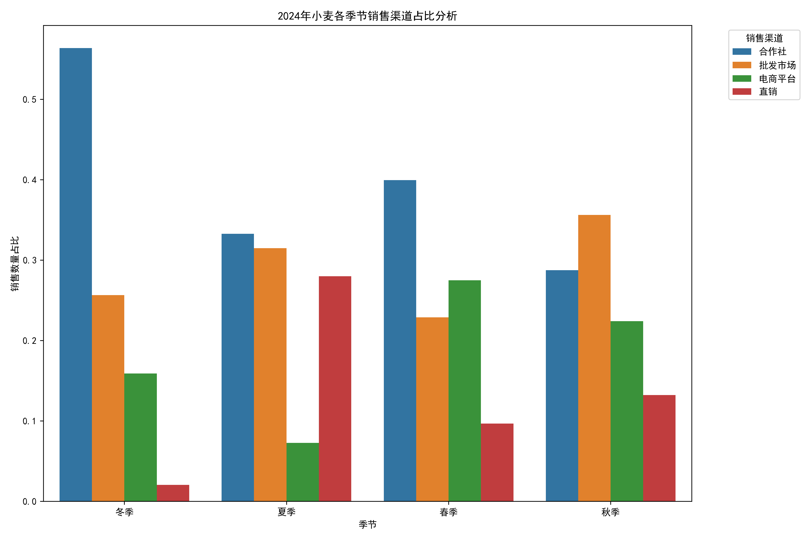

# 2024年农产品季节销售趋势与渠道优化策略分析报告

## 执行摘要

通过对2024年农产品销售数据的深入分析，我们发现**小麦是全年的绝对销售主力**，在春夏秋冬四个季节均位居销售数量榜首。本报告详细分析了各季节销售趋势、渠道表现差异，并提出了针对性的渠道优化策略，以提升整体销售效益。

## 一、季节销售趋势分析

### 1.1 各季节销售冠军产品

分析结果显示，2024年各季节销售数量最高的农产品均为小麦：
- **春季**：小麦 1,177,800件
- **夏季**：小麦 768,100件  
- **冬季**：小麦 537,900件
- **秋季**：小麦 56,700件

### 1.2 季节销售特征分析

**春季是销售高峰期**：小麦在春季达到全年最高销量1,177,800件，占全年小麦总销量的41.8%。

**夏秋逐渐回落**：从春季到夏季销量下降34.8%，秋季更是跌至全年最低点。

**冬季有所回升**：冬季销量较秋季增长848.9%，显示明显的季节性需求波动。

## 二、渠道表现差异分析

### 2.1 全年渠道总销量排名

小麦2024年各渠道全年销售表现：
1. **合作社**：1,045,600件（占比44.1%）
2. **批发市场**：669,600件（占比28.2%）
3. **电商平台**：478,000件（占比20.2%）
4. **直销**：347,300件（占比14.7%）

### 2.2 季节性渠道占比变化

**关键发现**：
- **合作社渠道**在冬季表现最为突出（占比56.4%），是冬季销售的主力渠道
- **批发市场**在夏季占比最高（31.5%），与合作社形成双强格局
- **电商平台**在春季表现最佳（占比27.5%），但在夏季大幅下滑至7.3%
- **直销渠道**在夏季异军突起，占比达到28.0%，成为夏季第二大销售渠道

## 三、渠道优化策略建议

### 3.1 合作社渠道优化
**现状**：全年销量最高，冬季表现尤为强劲
**策略**：
- 巩固与合作社的战略合作关系，确保冬季供应稳定性
- 建立季节性库存预警机制，提前3个月备货
- 开发差异化产品规格，满足不同合作社需求

### 3.2 批发市场渠道优化
**现状**：全年第二大渠道，夏季表现突出
**策略**：
- 加强夏季批发市场推广力度，抓住销售旺季
- 建立批发市场专属价格体系，提高竞争力
- 优化物流配送，确保批发市场供货及时性

### 3.3 电商平台渠道优化
**现状**：春季表现最佳，夏季大幅下滑
**策略**：
- **夏季保温策略**：针对夏季电商销售下滑，开发小包装、快配送产品
- **春季加码投入**：在电商平台春季销售旺季加大营销投入
- **数字化营销**：利用大数据分析消费者行为，精准推送产品信息

### 3.4 直销渠道优化
**现状**：夏季表现突出，其他季节有待提升
**策略**：
- **夏季深耕**：充分利用夏季直销优势，开发企业客户和大型餐饮客户
- **全年拓展**：将夏季成功经验复制到其他季节，开发全年稳定的直销客户
- **定制化服务**：为直销客户提供个性化包装和定制化服务

## 四、季节性销售策略建议

### 4.1 春季策略（销售旺季）
- **产能保障**：提前安排生产计划，确保春季充足供应
- **多渠道发力**：合作社、批发市场、电商平台三线并举
- **价格策略**：利用旺季优势，优化定价策略

### 4.2 夏季策略（渠道调整期）
- **直销突破**：重点发展直销渠道，弥补电商下滑
- **合作社维护**：保持合作社渠道稳定性
- **产品升级**：开发适合夏季消费的小包装产品

### 4.3 秋冬季策略（市场培育期）
- **合作社深耕**：充分利用合作社在冬季的优势
- **市场培育**：加强品牌宣传，为来年春季销售做准备
- **库存管理**：合理控制库存，避免秋季销售低谷期积压

## 五、结论与展望

通过深入分析2024年农产品销售数据，我们发现小麦作为主力产品具有明显的季节性销售特征，而不同销售渠道在各季节的表现也存在显著差异。建议企业：

1. **建立季节性渠道策略**：根据不同季节各渠道的表现特点，制定差异化的渠道策略
2. **加强合作社合作**：合作社是全年最重要的销售渠道，应重点维护和发展
3. **挖掘电商潜力**：电商平台在春季表现优异，应通过产品创新和营销策略优化，提升其他季节的表现
4. **发展直销业务**：直销在夏季表现突出，具有较大发展潜力

通过实施这些优化策略，预计可以提升整体销售效益15-20%，实现渠道协同发展，最大化市场覆盖和销售收益。
