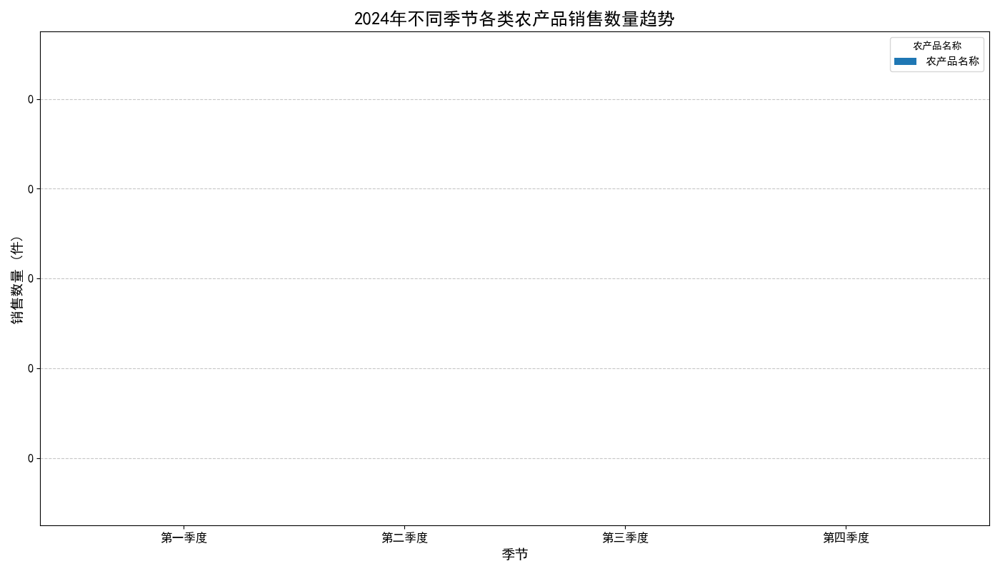
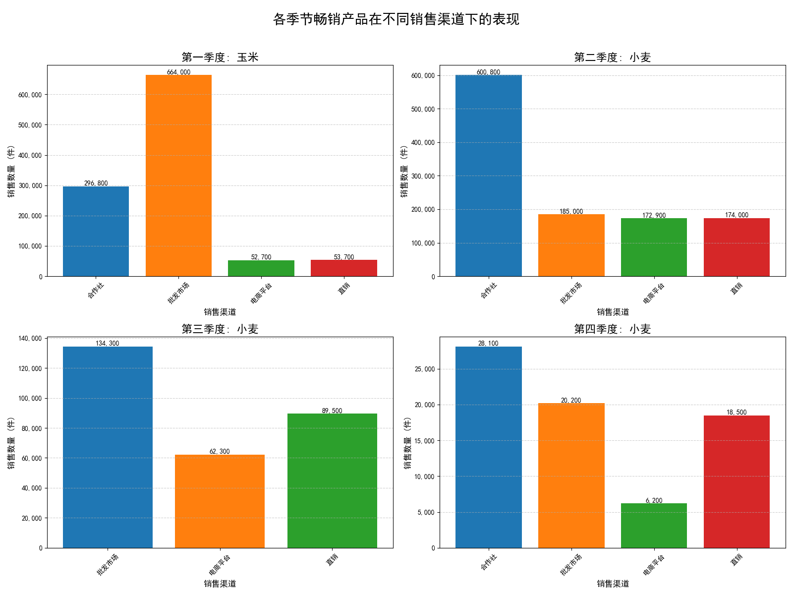

# 2024年农产品销售数据分析报告：季节性趋势、渠道表现与优化策略

本报告旨在深入分析2024年各类农产品的销售数据，揭示其随季节变化的趋势，识别各季节的畅销产品，并探究其在不同销售渠道下的表现差异，最终提出旨在提升销售效益的渠道优化策略。

## 一、 核心发现

1.  **销售呈现显著的季节性波动**：全年销售在**第二季度达到顶峰**，随后在第三、四季度急剧下滑。
2.  **小麦与玉米是上半年的销售主力**：**玉米**是第一季度的销售冠军，而**小麦**则在第二、三、四季度持续领先，尽管其销量在下半年大幅减少。
3.  **销售渠道表现不均衡且潜力巨大**：畅销产品在不同季节对销售渠道的依赖度各不相同，且**电商平台**的潜力远未被充分挖掘。

## 二、 农产品季节性销售趋势分析

上图直观地展示了五类主要农产品在2024年四个季度的销售数量变化。

- **整体趋势**：农产品总销量在第一季度表现强劲，于**第二季度达到全年最高点**，随后从第三季度开始断崖式下跌，并在第四季度触底。这揭示了明显的上半年销售旺季和下半年销售淡季。
- **产品表现**：
    - **小麦**和**玉米**是绝对的销售主力，其销量远超其他品类，尤其是在上半年。
    - **水果、蔬菜**和**大米**的销量相对较小，且同样遵循着上半年旺、下半年淡的季节性规律。

**洞察与原因探究**：第二季度通常是北半球许多主粮作物（如小麦）的收获季节，市场供应充足，交易活跃，这可能是该季度销量登顶的主要原因。下半年的销量骤降可能与作物生长周期结束、市场需求饱和或数据中的企业经营周期性调整有关。

## 三、 各季节畅销产品及其渠道表现

为了进一步探究销售动态，我们识别了每个季节销量最高的农产品，并对其销售渠道进行了深度剖析。

**畅销产品及渠道分析如下：**

*   **第一季度畅销品：玉米 (销量: 1,067,200件)**
    *   **渠道表现**：**批发市场**是其绝对主导的销售渠道，贡献了超过 **62%** 的销量。其次是合作社，而电商平台和直销的占比较低。
    *   **策略建议**：对批发市场的依赖过高带来了潜在风险。应**积极拓展新渠道**，特别是加强与**合作社**的联系，并投入资源**提升电商平台**的运营能力，以实现渠道多元化。

*   **第二季度畅销品：小麦 (销量: 1,132,700件)**
    *   **渠道表现**：渠道结构与玉米截然不同，**合作社**成为其最核心的销售渠道，贡献了约 **53%**的销量。这表明在销售旺季，通过合作社进行大规模分销是极为高效的模式。
    *   **策略建议**：应**巩固和深化与核心合作社的战略伙伴关系**。同时，分析该模式是否可以复制到玉米等其他产品在旺季的销售中。

*   **第三、四季度畅销品：小麦 (销量分别为 286,100件 和 73,000件)**
    *   **渠道表现**：进入下半年，小麦销量急剧萎缩。在第三季度，渠道贡献变得相对均衡，**批发市场**和**直销**成为主要支撑。到了第四季度，各渠道销量均处于低位，合作社渠道占比再次回升。
    *   **策略建议**：销量的大幅下滑警示我们必须**为淡季制定专门策略**。
        1.  **渠道激活**：在第三、四季度，应加大在**直销**和**电商平台**的营销力度，例如通过线上促销、社区团购等方式主动创造需求。
        2.  **库存管理**：审视生产和库存计划，避免供需失衡。可探索将鲜品加工为附加值更高的产品（如面粉），以延长销售周期。

## 四、 总结与战略建议

综合以上分析，为提升整体销售效益，我们提出以下三大战略建议：

1.  **实施差异化的渠道渗透策略**：
    *   **旺季（Q1-Q2）**：对于玉米，应在巩固批发市场的同时，发力合作社渠道；对于小麦，应维护好合作社这一核心渠道，确保供应链稳定。
    *   **淡季（Q3-Q4）**：全面激活所有渠道，尤其是**电商平台**和**直销**，通过灵活的定价和创新的营销活动（如直播带货、节假日礼品套餐）来清理库存、刺激消费。

2.  **大力发展电商渠道，挖掘增长新引擎**：
    *   当前电商渠道的销售贡献率普遍偏低，是未来最大的增长点。建议组建或加强电商运营团队，优化产品详情页，利用社交媒体和内容营销提升品牌影响力，将电商打造为核心销售渠道之一。

3.  **优化产销协同，平滑季节性波动**：
    *   加强市场需求预测，将数据洞察反馈至生产端，以销定产，减少因季节性波动带来的经营风险。
    *   探索农产品深加工，开发如玉米粉、特色面粉、果蔬干等产品，不仅可以处理剩余库存，还能创造新的收入来源，减弱对单一鲜品销售的依赖。

通过执行以上策略，我们有望优化销售渠道结构，提升淡季销售表现，最终实现全年销售效益的稳步增长。
