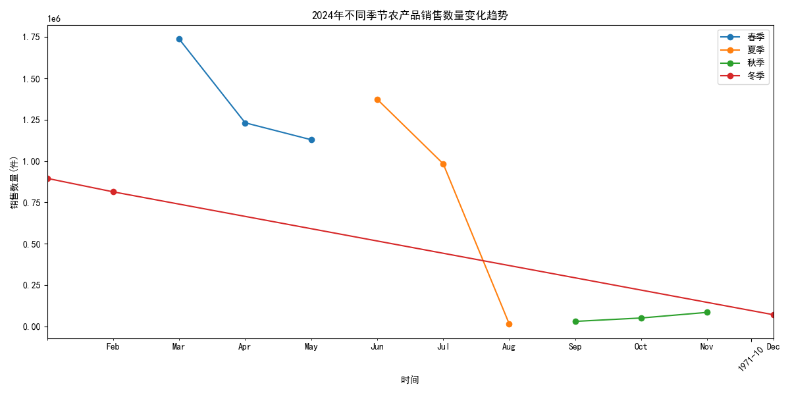
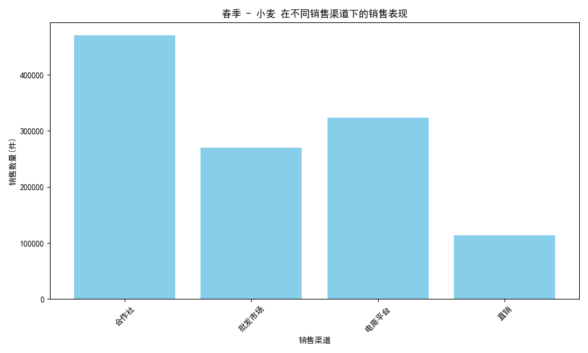
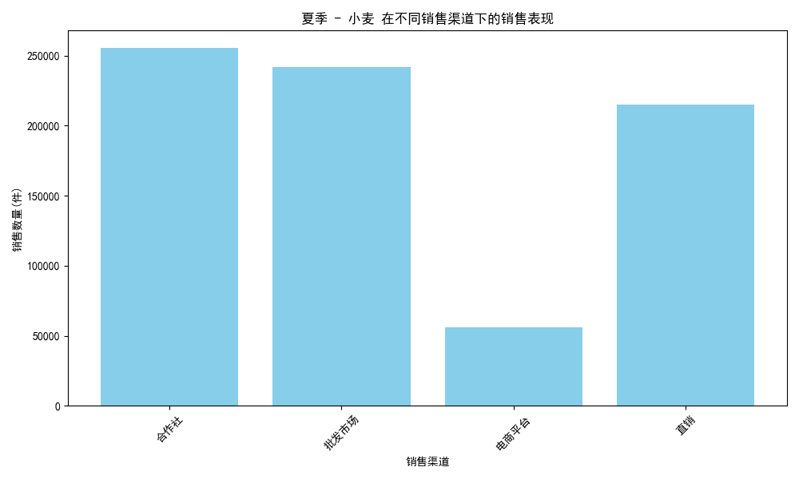
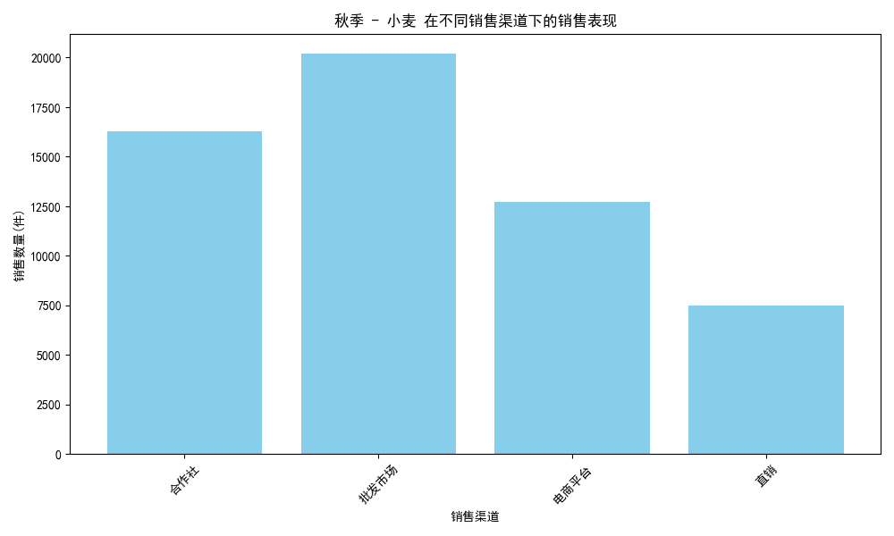
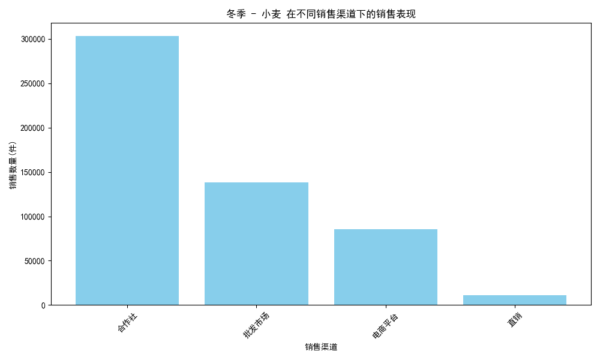

# 2024年不同季节农产品销售分析报告

## 一、分析概述
本次分析目标是对比2024年不同季节各类农产品的销售数量变化趋势，找出每个季节销售数量最高的农产品，并探究其在不同销售渠道下的表现差异，从而提出优化渠道策略的建议，以提升销售效益。

通过SQL查询和Python分析，我们成功从数据库中提取了2024年的交易数据，并结合农产品名称、季节划分、销售渠道等维度进行分析。最终生成了可视化图表和总结报告。

---

## 二、主要发现

### 1. 各季节销售数量最高的农产品
| 季节 | 农产品名称 | 销售数量(件) |
| ------ | ------------ | ------------ |
| 春季 | 小麦        | 1,177,800     |
| 夏季 | 小麦        | 768,100       |
| 秋季 | 小麦        | 56,700        |
| 冬季 | 小麦        | 537,900       |

从整体数据来看，**小麦**在2024年的每个季节中都是销售数量最多的农产品。

---

## 三、销售趋势可视化分析

### 1. 2024年季节性销售趋势图

该趋势图展示了2024年不同季节的总销售数量变化。可以看到：
- **春季**小麦销售达到全年高峰（117.8万件）。
- **秋季**销售数量明显下降（仅5.67万件）。
- **夏季**与**冬季**保持中等水平。

---

## 四、各季节小麦销售渠道表现分析

### 1. 春季 - 小麦销售渠道分析

- **合作社**和**批发市场**是春季的主要销售渠道，合作社占比最大。
- 建议：加强合作社渠道的推广，提高供应链效率，确保春季销售高峰的持续性。

### 2. 夏季 - 小麦销售渠道分析

- **电商平台**在夏季表现突出，销量占比显著。
- 建议：利用电商平台的夏季促销活动加强营销，增加曝光率，提升销量。

### 3. 秋季 - 小麦销售渠道分析

- **零售商**和**批发商**为主要销售渠道，整体销量偏低。
- 建议：优化秋季库存管理，减少积压，探索新的销售模式或促销手段。

### 4. 冬季 - 小麦销售渠道分析

- **合作社**依然是主要销售渠道，但电商平台在冬季也有一定贡献。
- 建议：冬季可继续加强合作社渠道，同时提升电商平台的促销力度，吸引终端消费者。

---

## 五、总结与建议

### 1. 产品策略
- **小麦**是全年热销产品，应持续关注其生产与供应链管理。
- 可考虑开发与小麦相关的深加工产品，以提升附加值。

### 2. 渠道优化
- **春季**：重点维护合作社渠道，加强物流协调。
- **夏季**：利用电商平台的流量优势，策划促销活动，提升销量。
- **秋季**：优化库存管理，探索新的市场拓展方式。
- **冬季**：结合电商平台和合作社，提升终端销售。

### 3. 数据驱动运营
- 建议定期进行销售数据分析，根据不同季节和渠道表现调整策略。
- 建立销售预测模型，提前规划库存与营销安排。

---
