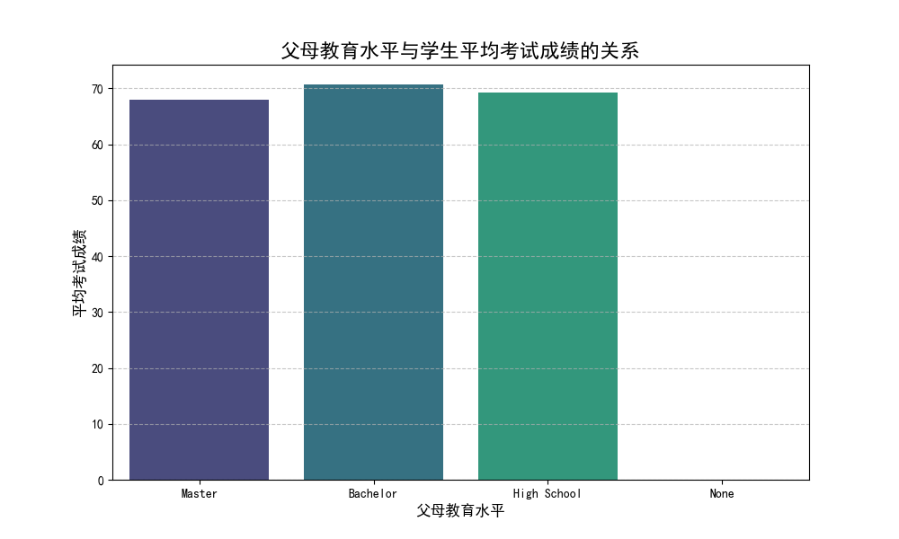
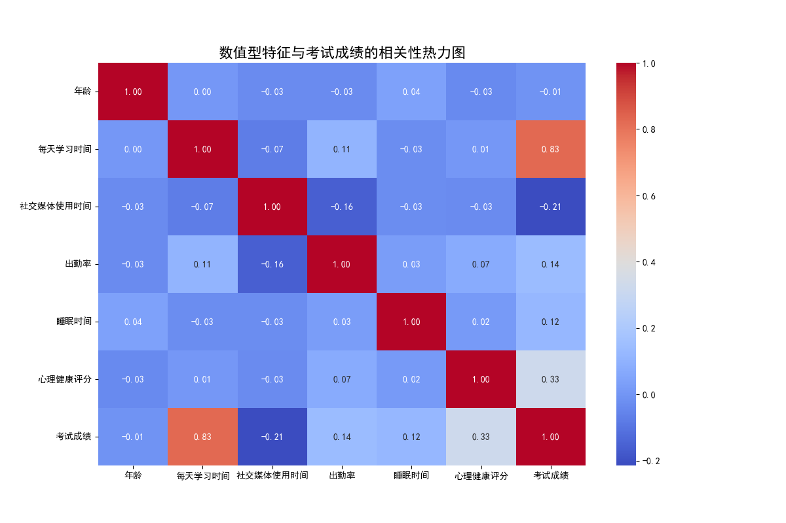

# 数据分析报告：学生学习成绩影响因素探究

本次分析旨在探讨影响学生学习成绩的各项因素，并特别检验了“父母受教育程度越高，子女学习成绩越好”这一假设。通过对学生调研数据的深入分析，我们得出以下结论。

## 一、父母教育水平与子女学习成绩的关系

许多人认为，父母的教育背景是影响子女学业成就的关键因素。然而，本次数据显示的结果却与这一传统观念有所不同。

**分析结果：**
我们根据父母的教育水平（硕士、学士、高中、无）对学生的平均考试成绩进行了分组统计。结果如下图所示：

从上图可以看出，父母教育水平与学生成绩之间并未呈现出简单的正相关关系。具体来看：
- **学士学位 (Bachelor)** 父母的子女平均成绩最高，约为 **70.69分**。
- **高中 (High School)** 学历的父母，其子女平均成绩次之，为 **69.26分**。
- **硕士 (Master)** 学位的父母，其子女平均成绩反而最低，为 **67.90分**。

**结论：**
**当前数据不支持“父母受教育程度越高，子女学习成绩越好”的观点。** 这一发现提示我们，家庭背景对学生成绩的影响是复杂的，单纯的学历水平并不能完全决定子女的学业表现。家庭的学习氛围、教育方式等其他“软性”因素可能更为重要。

## 二、影响学习成绩的关键因素分析

为了找出对学生成绩影响更大的因素，我们对多个变量与考试成绩的相关性进行了分析。

**分析结果：**
我们构建了各数值型变量之间的相关性热力图，以直观地展示它们之间的关联强度。

热力图中的颜色深浅和数值代表了变量之间的相关程度（-1到1之间）。通过分析“考试成绩”这一行，我们可以清晰地看到：

- **每天学习时间 (0.83)**：与考试成绩存在极强的正相关关系。这是所有因素中影响力最大的一个。学习时间越长，学生的考试成绩显著越高。
- **心理健康评分 (0.33)**：与考试成绩呈中度正相关。一个积极、健康的心理状态对学业表现有明显的促进作用。
- **社交媒体使用时间 (-0.21)**：与考试成绩呈负相关。这表明，在社交媒体上花费过多时间可能会对学生的学习产生不利影响。
- **出勤率 (0.14)** 和 **睡眠时间 (0.12)**：也与成绩有轻微的正相关，说明保持规律的作息和出勤是取得好成绩的基础。

## 三、核心结论与可行性建议

综合以上分析，我们可以得出以下核心结论并提出相应建议：

**核心结论：**
1.  **个人努力是决定性因素**：在所有考察的因素中，**每天的学习时间** 是预测学生考试成绩的最强指标。
2.  **身心健康不容忽视**：学生的 **心理健康状况** 对成绩有重要影响，同时，过度的 **社交媒体使用** 会对学业产生负面作用。
3.  **家庭背景影响复杂**：**父母的教育水平** 与子女成绩不成简单的线性关系，高学历不直接等于高分数。

**可行性建议：**
*   **对学生而言**：
    *   **优先保障学习投入**：要想提高成绩，最直接有效的方法是制定并执行合理的学习计划，确保每天有充足的学习时间。
    *   **管理数字生活**：有意识地控制刷社交媒体的时间，避免其侵占学习和休息时间。
    *   **关注自我关怀**：重视心理健康，遇到压力和困难时及时寻求帮助。

*   **对教育者和学校而言**：
    *   **推广高效学习方法**：开设时间管理、学习策略等相关讲座，帮助学生提高学习效率。
    *   **加强心理健康支持**：建立完善的心理辅导体系，为学生提供及时的心理支持和干预。
    *   **引导学生健康上网**：通过主题班会等形式，教育学生认识到过度使用社交媒体的潜在危害，并引导他们建立健康的网络使用习惯。
