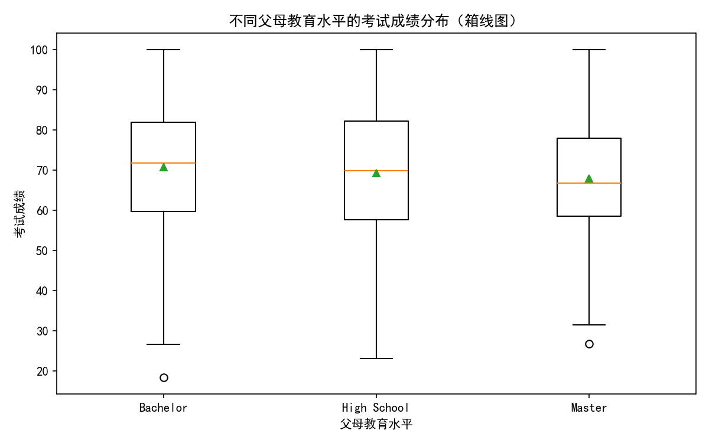
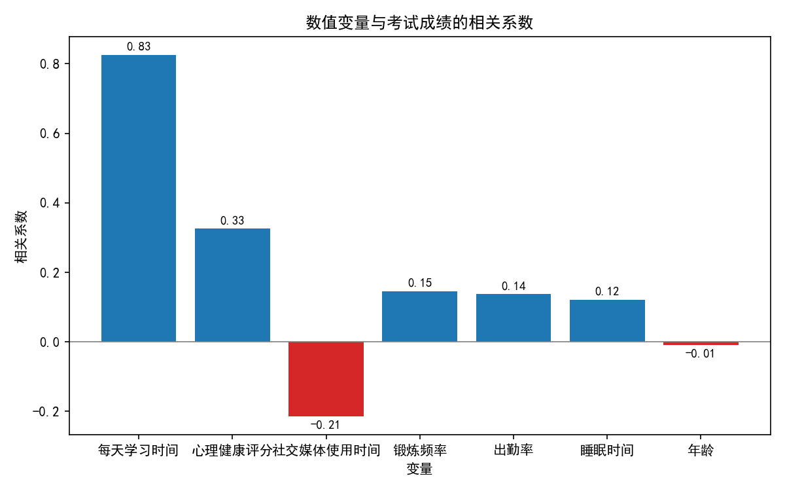
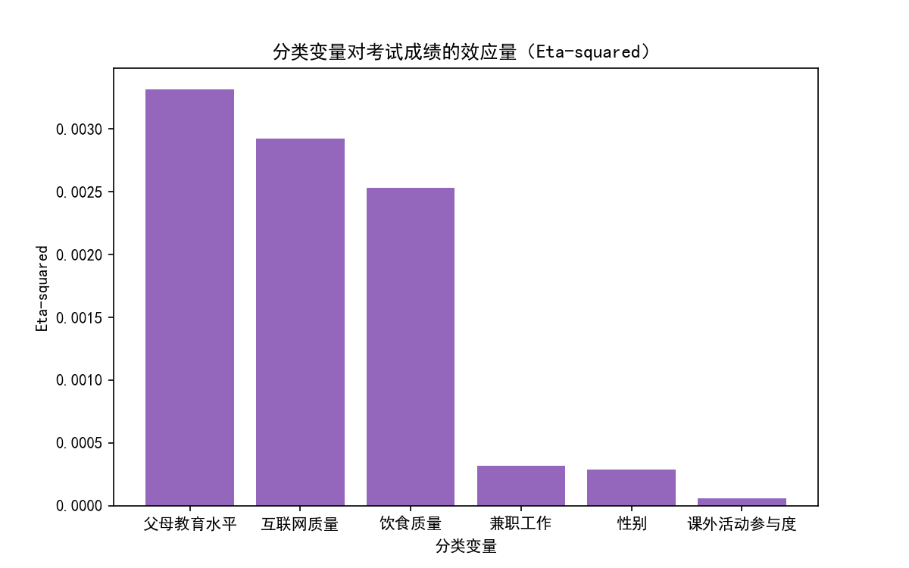
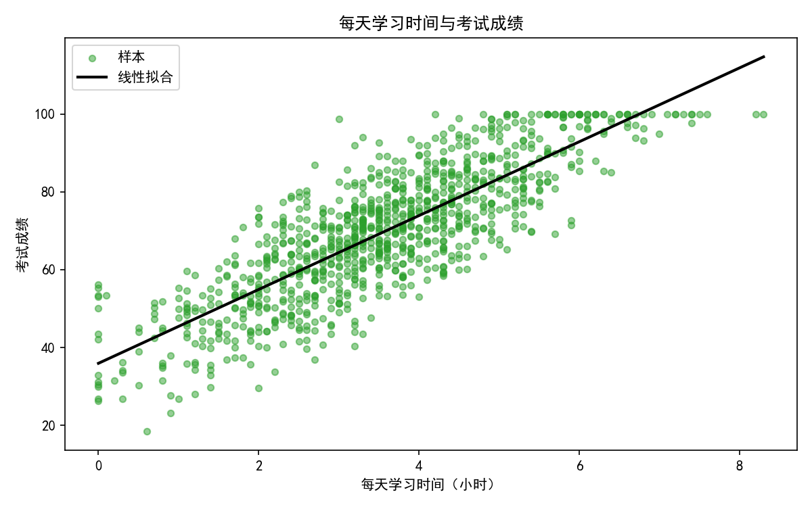

# 学生成绩影响因素分析与洞察报告

## 关键结论
- 该数据并不强支持“父母受教育程度越高，子女成绩越好”的观点。父母教育水平对考试成绩的效应量非常小（eta-squared≈0.0033），一元方差分析F≈1.818，组间差异相对组内波动较弱，通常意味着统计显著性不足。
- 学生成绩的主要驱动因素是“每天学习时间”（与成绩的皮尔逊相关系数r≈0.825，为强正相关），其次是“心理健康评分”（r≈0.326，正相关）。
- “社交媒体使用时间”与成绩呈负相关（r≈−0.214），说明过多的社媒使用可能损害成绩。
- 其他因素（锻炼频率、出勤率、睡眠时间）与成绩存在弱正相关（r≈0.12–0.15），年龄几乎无关（r≈−0.009）。
- 分类变量整体效应都较弱：互联网质量、饮食质量、兼职工作、性别、课外活动参与度的效应量都很小（eta-squared均<0.01）。

---

## 数据概览
- 样本量：1000
- 考试成绩统计：均值≈69.6，最小≈18.4，最大=100.0

SQL分组显示父母教育水平与成绩均值：
- High School：N=391，均分≈69.26
- Bachelor：N=355，均分≈70.69
- Master：N=165，均分≈67.90
- None：N=89，均分≈69.90（Python分组未显示该类别，可能因“None”被当作缺失；但我们不对数据进行清洗，保留原统计见SQL。）

从均值看，Bachelor略高，但Master反而更低，且总体效应很弱，难以支持“教育水平越高，子女成绩越好”的单调提升假设。

---

## 可视化与证据

1) 父母教育水平与成绩的分布（箱线图）：



说明：从三类（High School、Bachelor、Master）的箱线图可见，组间均值差异小、分布重叠大。一元方差分析F≈1.818、eta-squared≈0.0033，父母教育水平对成绩的解释力很弱。

2) 数值变量与考试成绩的相关系数：



重点：
- 每天学习时间 r≈0.825（强正相关，最关键的线索）。
- 心理健康评分 r≈0.326（中等正相关）。
- 社交媒体使用时间 r≈−0.214（负相关）。
- 锻炼频率 r≈0.146、出勤率 r≈0.138、睡眠时间 r≈0.122（弱正相关）。
- 年龄 r≈−0.009（几乎无关）。

3) 分类变量的效应量（Eta-squared）：



解读：
- 父母教育水平≈0.0033、互联网质量≈0.0029、饮食质量≈0.0025，效应量都很小，说明这些分类因素对成绩的解释度很有限。
- 兼职工作≈0.0003、性别≈0.0003、课外活动参与度≈0.00006，影响更弱。
- 有趣的是，SQL显示“互联网质量”平均分为Average>Good>Poor（70.64>68.65>69.72），提示过好的互联网可能带来更多分心或非学习用途；但总体效应量仍很小。

4) 学习时间与成绩散点图：



说明：学习时间与成绩呈明显线性正相关趋势，拟合线斜率为正，表明增加有效学习时长与成绩提升高度相关。结合相关系数r≈0.825，这是最具行动意义的发现。

---

## 诊断性分析（为什么会这样）
- 学习投入与产出关系最为直接：在控制有限的情况下，更多且持续的学习时长与更好的成绩显著相关。
- 心理健康可能通过注意力、动机与执行控制影响学习效率，进而影响成绩。
- 社交媒体占用时间可能挤压学习时长与睡眠，或带来注意力碎片化，导致成绩降低。
- 父母教育水平的影响弱，可能因为其作用更多体现在长期资源与环境，而在当前样本中，直接可测的学习行为与心理状态更能解释成绩差异。
- “互联网质量为Average时更高分”的现象，可能是“适度可用但不至于过度分心”的平衡；但需谨慎对待，这类观察并非因果结论。

---

## 规范性建议（我们应该做什么）
- 把提升“每天学习时间”的质量与持续性作为核心策略：
  - 设定明确的学习计划与时间块管理（如番茄钟）。
  - 课堂之外安排固定自习时段，并减少多任务切换。
- 加强心理健康支持：开展压力管理、心理辅导，提升积极情绪与自我效能感。
- 管理社交媒体使用：
  - 在学习时段启用应用限制或断网模式；
  - 引导学生进行“数字减负”，减少无效浏览。
- 优化睡眠与出勤：
  - 保持充足且稳定的睡眠；
  - 保证高出勤率，减少缺课带来的理解断层。
- 适度运动：每周规律锻炼有助于认知与情绪调节，对成绩虽为弱影响，但具叠加效益。
- 家长侧策略：与其关注学历背景，不如聚焦营造规律的学习环境、情绪支持与数字使用规范，协同学校促进学习时间与质量。

---

## 方法说明与代码片段
本分析基于SQLite表“工作表1”，使用SQL计算分布与均值，使用Python进行相关分析与可视化（未进行数据清洗）。绘图前设置中文字体如下：

```python
plt.rcParams['font.sans-serif'] = ['SimHei']
plt.rcParams['axes.unicode_minus'] = False
```

---

## 结论
- 本数据下，“父母受教育程度越高，子女成绩越好”的断言缺乏有力证据支持；父母教育水平的组间差异很小且统计效应弱。
- 最重要的成绩影响因素是“每天学习时间”，其次是“心理健康评分”，而“社交媒体使用时间”是负面因素。其他因素影响较弱但方向上与良好习惯一致。
- 因此，教学与家庭支持策略应围绕“提升学习时间与质量、心理健康支持、社媒使用管理、保障睡眠与出勤、适度运动”展开，以获得更实质的成绩提升。
