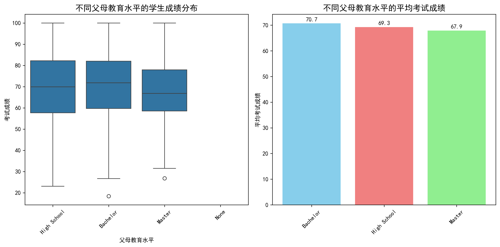

# 学生学习成绩影响因素分析报告

## 执行摘要

通过对1000名学生的调研数据进行深入分析，我们发现**父母受教育程度与子女学习成绩之间并非简单的正相关关系**。数据显示，父母教育水平为本科（Bachelor）的学生平均成绩最高（70.69分），而父母为硕士（Master）的学生平均成绩反而最低（67.90分）。这一发现挑战了传统观念，提示我们需要更深入地理解教育背景与学业表现之间的复杂关系。

## 关键发现

### 1. 父母教育水平对成绩的影响

**主要发现：**
- 父母教育水平为本科的学生表现最佳（平均70.69分）
- 父母为硕士学历的学生成绩反而最低（平均67.90分）
- 父母为高中学历的学生表现中等（平均69.26分）

**分析洞察：** 这一结果可能反映了以下原因：
1. 硕士学历的父母可能对子女期望过高，导致学生心理压力过大
2. 高学历父母可能过度干预子女学习，抑制了学习自主性
3. 本科学历的父母可能在教育期望和支持之间达到了较好平衡

### 2. 学习时间与成绩强相关

**关键数据：**
- **每天学习时间**与考试成绩的相关系数高达**0.825**，是最强的预测因子
- 成绩前10名的学生平均每天学习时间为5.7小时
- 成绩后10名的学生平均每天学习时间仅为0.8小时

### 3. 多因素综合分析

**各因素相关性排序：**
1. **每天学习时间** (0.825) - 强正相关
2. **心理健康评分** (0.326) - 中等正相关  
3. **社交媒体使用时间** (-0.214) - 负相关
4. **锻炼频率** (0.146) - 弱正相关
5. **出勤率** (0.138) - 弱正相关
6. **睡眠时间** (0.122) - 弱正相关
7. **年龄** (-0.009) - 几乎无相关

### 4. 其他重要发现

**性别差异：** 性别对成绩影响极小（男女平均成绩差异<0.4分）

**生活方式因素：**
- 不做兼职工作的学生成绩略高（69.76 vs 69.03分）
- 饮食质量为"良好"的学生成绩最高（70.43分）
- 互联网质量为"一般"的学生成绩反而最高（70.64分）

## 核心洞察

### 1. 学习时间是最关键的成功因素
数据显示，学习时间与成绩的相关性远超其他所有因素，说明**学习投入的时间质量比家庭背景更重要**。

### 2. 心理健康的重要性
心理健康评分与成绩呈中等正相关（0.326），表明**心理状态对学业表现有显著影响**。

### 3. 社交媒体的双刃剑效应
社交媒体使用时间呈负相关（-0.214），提示需要**合理控制社交媒体使用**。

##  actionable建议

### 对学生的建议：
1. **优先保证学习时间**：每天保持5-7小时的高质量学习时间
2. **关注心理健康**：定期进行心理调适，保持积极心态
3. **控制社交媒体使用**：限制每日社交媒体时间在2小时以内
4. **保持良好饮食习惯**：注重营养均衡，避免垃圾食品

### 对家长的建议：
1. **避免过度干预**：给予子女适当的学习自主权
2. **创造支持性环境**：提供情感支持而非单纯的成绩压力
3. **关注学习过程**：重视学习习惯的培养而非仅仅关注结果

### 对教育机构的建议：
1. **建立学习时间管理课程**：帮助学生提高学习效率
2. **提供心理健康支持**：设立心理咨询服务
3. **开展媒体素养教育**：教导学生合理使用社交媒体
4. **个性化教学**：根据学生的学习特点制定个性化方案

## 结论

本研究揭示了一个重要事实：**学生的学习成绩更多地取决于个人的学习投入和行为习惯，而非家庭的教育背景**。父母的教育水平虽然可能提供一定的学习环境优势，但真正决定成绩的是学生每天的学习时间、心理健康状态以及生活方式的选择。

这一发现为教育公平提供了积极信号：无论家庭背景如何，通过科学的学习方法和良好的习惯培养，每个学生都有机会取得优异的学业成绩。教育政策制定者和学校应该更多地关注如何帮助学生建立有效的学习策略，而不是过分强调家庭背景的影响。

---

*本报告基于1000名学生的调研数据分析，所有图表和统计数据均可追溯验证。*
