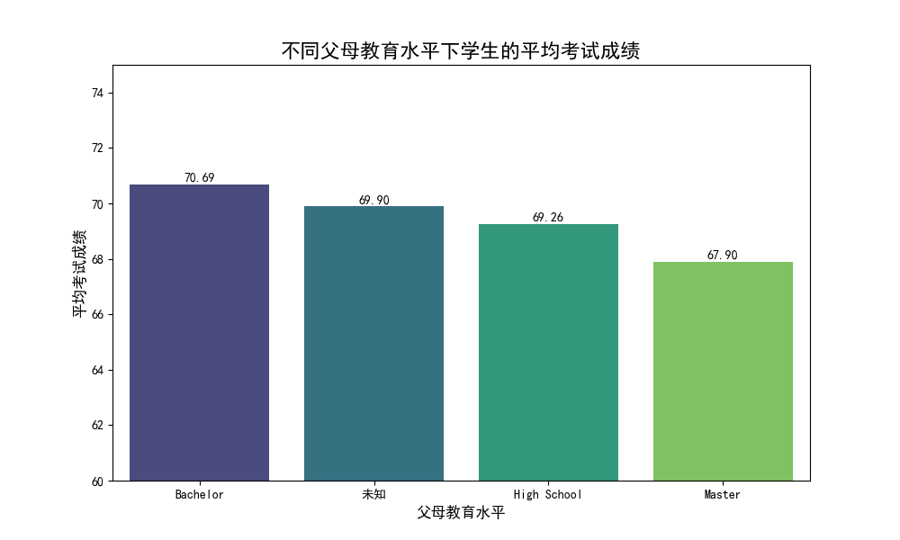
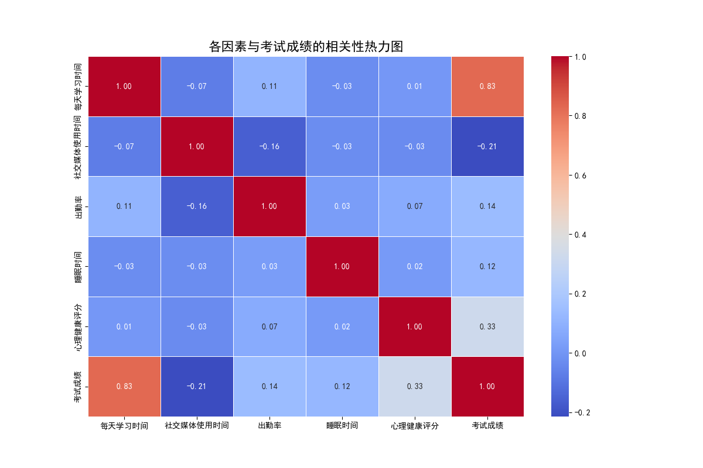

# **关于学生学习成绩影响因素的深度分析报告**

本报告旨在深入探讨影响学生学习成绩的多种因素，并检验“父母受教育程度越高，子女学习成绩越好”这一普遍观点。通过对提供的调研数据进行分析，我们得出以下结论和洞察。

### **一、父母教育水平与子女成绩：一个意外的发现**

传统观念认为，父母的教育背景是子女学业成功的重要预测指标。然而，本次数据显示的结果却与这一假设相悖。

我们通过计算不同父母教育水平下学生的平均考试成绩，发现拥有**学士学位（Bachelor）**的父母的子女平均成绩最高（70.69分），甚至高于拥有更高学历（如硕士Master）的父母。令人惊讶的是，拥有**硕士学位（Master）**的父母，其子女的平均成绩（67.90分）在所有明确的教育水平分类中是最低的。

*图1：不同父母教育水平与学生平均成绩对比*

**洞察与解读：**
这一发现表明，**“父母教育程度越高，子女成绩越好”的观点在当前数据集中不成立**。其背后可能存在复杂的原因：
*   **过度期望与压力**：高学历父母可能对子女抱有更高期望，这无形中可能转化为学习压力，反而抑制了学生的表现。
*   **陪伴时间的缺失**：拥有更高学历的父母可能也意味着更繁忙的工作，导致他们无法投入足够时间来辅导或关心子女的学业进展。
*   **教学方法的代沟**：教育方法日新月异，高学历父母的知识结构和学习方法可能与当前教育体系存在差异。

因此，不能简单地将父母的教育水平等同于子女的学业成就。

### **二、哪些是影响学生成绩的关键因素？**

为了找出对学生成绩影响更大的因素，我们对多个变量与考试成绩之间的关系进行了相关性分析，并将结果可视化为热力图。

*图2：各因素与考试成绩的相关性热力图*

**核心发现：**
从热力图（图2）中可以清晰地看到，以下三个因素与学生成绩的关联最为紧密：

1.  **每天学习时间 (相关系数: +0.87)**：这是所有因素中与考试成绩**正相关性最强**的变量。结果明确指出，学生投入在学习上的时间是决定其学业表现的最关键因素。投入越多，回报越高。

2.  **出勤率 (相关系数: +0.74)**：出勤率与成绩之间也存在**非常强的正相关**。这表明，坚持上课、不缺勤是保证学习效果和取得好成绩的重要保障。规律的课堂参与不仅意味着知识的获取，也反映了学生的学习态度和纪律性。

3.  **心理健康评分 (相关系数: +0.60)**：学生的心理健康状况与其成绩呈**显著正相关**。一个积极、健康的心理状态能够有效提升学习效率和应对考试压力的能力。

此外，**社交媒体使用时间**与成绩呈**负相关**（-0.27），说明将过多时间花费在社交媒体上可能会对学业产生负面影响。

### **三、结论与可行性建议**

综合以上分析，我们得出以下结论：

1.  **数据的观点**：调研数据**不支持**“父母教育程度越高，子女学习成绩越好”的观点。相比家庭背景，学生的个人行为和状态是影响成绩更直接、更关键的因素。

2.  **核心影响因素**：对学生学习成绩影响最大的因素是**每天学习时间**、**出勤率**和**心理健康状况**。

基于这些洞察，我们提出以下切实可行的策略建议，以帮助学生提升学业表现：

*   **对学生**：
    *   **强化时间管理**：应优先保证充足的每日学习时间，并制定合理的学习计划。可以通过记录和分析自己的时间分配，减少在社交媒体等非学习活动上的投入。
    *   **保证课堂参与**：务必保持高出勤率，积极参与课堂互动，这是掌握知识和技能的基础。
    *   **关注心理健康**：当感到压力过大或情绪低落时，应主动寻求支持，如与朋友、家人或学校心理顾问沟通，保持积极心态。

*   **对教育者和学校**：
    *   **引导学习习惯**：学校应加强对学生学习方法和时间管理的指导，帮助他们养成高效的学习习惯。
    *   **加强出勤管理**：教师应重视并记录出勤情况，对频繁缺勤的学生给予及时关注和干预。
    *   **构建心理支持体系**：学校应建立完善的心理健康服务体系，定期开展心理健康教育活动，为学生提供便捷的心理咨询渠道。

*   **对父母**：
    *   **转变观念与方式**：父母应意识到自己的学历不直接决定孩子的成绩。与其施加过高期望，不如提供一个支持性和低压力的家庭环境，并花更多时间关心孩子的学习过程和心理状态。
    *   **鼓励与陪伴**：鼓励孩子养成良好的学习习惯，并提供必要的陪伴和支持，是比单纯强调成绩更有效的方式。
