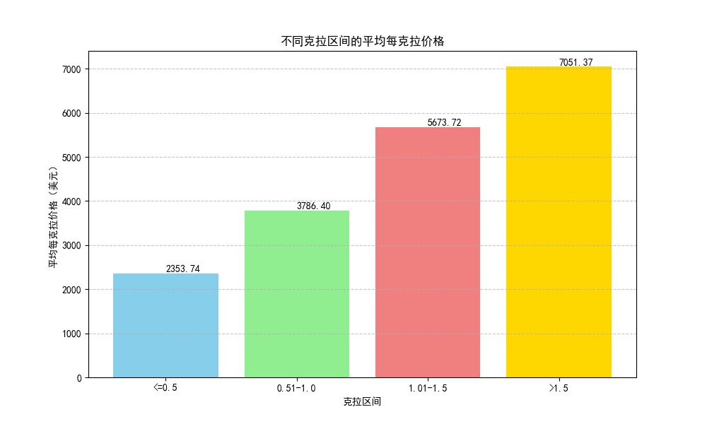
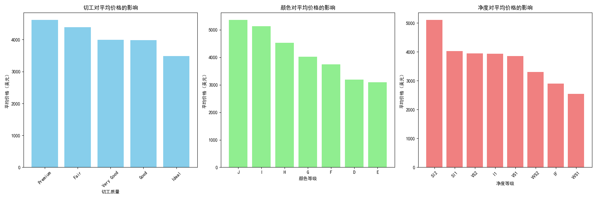

# 钻石价格影响因素分析报告

## 摘要

本报告旨在分析影响钻石价格的关键因素。我们主要关注两个方面：**克拉重量**对每克拉单价的影响趋势，以及**切工、颜色、净度**等其他因素对钻石总价的影响程度。通过对数据的深入分析，我们旨在为消费者购买和商家定价提供数据驱动的洞察和建议。

---

## 1. 每克拉价格随克拉区间的变化趋势

通常观点认为，钻石越大，每克拉的单价也越贵。我们的分析验证并量化了这一趋势。我们将钻石按照克拉重量分为四个区间，并计算了每个区间的平均每克拉价格。

**分析与洞察:**

*   **价格增长显著**: 从上图可以看出，随着克拉区间的增加，钻石的每克拉平均价格呈现出明显的阶梯式上涨。
    *   `<=0.5克拉` 区间的钻石，平均每克拉价格约为 **2354美元**。
    *   当重量增加到 `0.51-1.0克拉` 区间时，每克拉单价跃升至约 **3786美元**。
    *   在 `1.01-1.5克拉` 区间，单价进一步攀升至约 **5674美元**。
    *   对于 `>1.5克拉` 的大钻石，每克拉单价更是高达 **7051美元**。

*   **稀有性驱动价值**: 这种价格的非线性增长主要是由钻石的稀有性决定的。大克拉的高品质钻石在自然界中更为罕见，因此其价值远高于小克拉钻石的简单叠加。

**业务建议:**

*   **消费者**: 对于预算有限但追求更大钻石的消费者，可以考虑购买略低于整数克拉（如0.9克拉而非1.0克拉）的钻石，因为这可能带来显著的价格优势，而视觉差异却很小。
*   **商家**: 商家可以利用这一趋势制定定价策略，对超过关键重量阈值（如1.0克拉、1.5克拉）的钻石设置更高的溢价。同时，可以向消费者强调大克拉钻石的投资和保值属性。

---

## 2. 其他因素对钻石价格的影响

除了克拉重量，钻石的4C标准中的另外三个C——切工（Cut）、颜色（Color）和净度（Clarity）——同样对价格有至关重要的影响。我们分别探究了这三个因素不同等级对应的平均价格。

**分析与洞察:**

*   **切工 (Cut)**:
    *   有趣的是，在我们的数据中，切工等级最高的 "理想切工" (Ideal) 平均价格并非最高，反而是 "极好" (Premium) 和 "非常好" ( Very Good) 等级的钻石均价更高。这可能是因为高价的大克拉钻石，由于原石的限制，更多地被加工为 "Premium" 或 "Very Good" 切工以最大化保留重量，而 "Ideal" 切工更多出现在中小克拉的钻石中。**这表明切工对价格的影响需要结合克拉重量一起考虑。**

*   **颜色 (Color)**:
    *   颜色等级对价格的影响非常直观。从等级最低的 `J` (微黄) 到最高的 `D` (无色)，平均价格呈现出稳步上升的趋势。颜色等级越接近无色，钻石越稀有，价格也越高。

*   **净度 (Clarity)**:
    *   净度等级的影响与颜色类似。从 `I1` (有瑕疵) 到 `IF` (内部无瑕)，钻石的平均价格逐步攀升。净度越高，内部的包裹体和外部的瑕疵越少，钻石的价值也越高。值得注意的是，最高等级的 `IF` 钻石平均价格显著高于其他等级，凸显了其极高的稀有性和价值。

**综合结论与策略:**

1.  **克拉是首要驱动因素**: 克拉重量是影响钻石价格的最主要因素，其对单价的影响是指数级的。
2.  **颜色和净度是关键价值指标**: 在确定了大致的克拉范围后，颜色和净度成为决定钻石最终价格的关键。对于追求品质的消费者，提升这两个指标是投资的重点。
3.  **切工的权衡**: 虽然切工决定了钻石的火彩，但其对价格的影响似乎与其他因素（尤其是克拉）相互交织。消费者可以在切工上做出适当权衡，例如选择 "非常好" (Very Good) 等级以在预算内获得更大或颜色/净度更好的钻石。

**最终建议**:
对商家而言，应向客户清晰地传达4C中每个因素如何影响价格，并根据客户的预算和偏好，推荐不同组合的产品。例如，对于追求视觉大小的客户，可以推荐克拉较大但颜色/净度稍低的钻石；对于追求品质和火彩的客户，则推荐切工和颜色等级更高的钻石。
