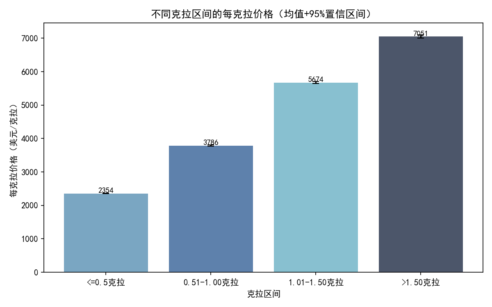
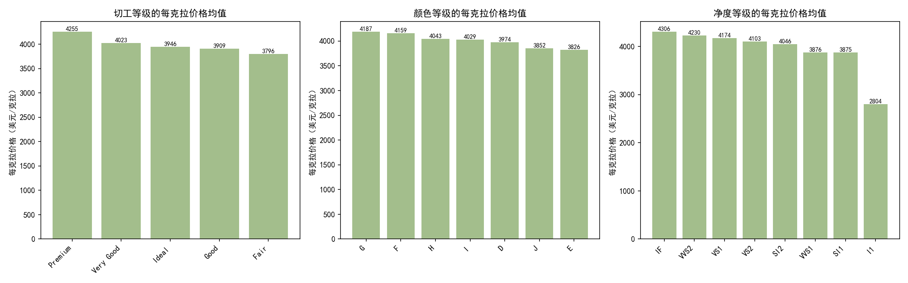

# 钻石每克拉价格与影响因素分析报告

## 一、结论概览
- 每克拉价格随克拉区间显著上升：相较于≤0.5克拉，0.51–1.00克拉区间的每克拉价格提升约61%，1.01–1.50克拉再提升约50%，>1.50克拉再提升约24%。存在明显的“门槛溢价”（如接近/跨越1克拉、1.5克拉等关键节点）。
- 其它因素（切工、颜色、净度）对“总价”和“每克拉价格”的解释力有限：对总价的eta²仅在1.3%–3.1%之间，对每克拉价格更低（0.4%–0.9%）。相比之下，“大小（克拉/尺寸）”是决定价格的首要因素。
- 几何尺寸（X/Y/Z）与价格、每克拉价格也高度相关，深度比例与每克拉价格存在轻微负相关，提示“面宽显大、不过深”的切工比例更受市场青睐。
- 价格波动随克拉增加而加大：大克拉钻石的每克拉价格分布更分散，意味着更高的价格不确定性与库存风险。

## 二、数据与方法
- 数据来源：SQLite 数据库 dacomp-012.sqlite，表：工作表1。
- 样本量与范围：
  - 样本量：53,595
  - 克拉范围：0.20–5.01
  - 价格范围（美元）：326–52,951
  - 平均克拉：0.797
  - 平均价格（美元）：3,958
  - 平均每克拉价格（美元/克拉）：4,034
- 指标定义：每克拉价格 = 价格（美元） / 克拉（钻石重量）。为避免除零，仅在计算时剔除了克拉为0的样本（未做额外清洗）。
- 分箱：克拉区间定义为 ≤0.5、0.51–1.00、1.01–1.50、>1.50。

用于绘图的关键代码（片段）：
```python
import matplotlib.pyplot as plt
plt.rcParams['font.sans-serif'] = ['SimHei']
plt.rcParams['axes.unicode_minus'] = False
```

## 三、每克拉价格在不同克拉区间的趋势
- 结果图：不同克拉区间的每克拉价格（均值+95%置信区间）


- 数值要点（均值，美元/克拉；括号内为相邻区间提升幅度）：
  - ≤0.5克拉：2,353.7
  - 0.51–1.00克拉：3,786.4（+61%）
  - 1.01–1.50克拉：5,673.7（+50%）
  - >1.50克拉：7,051.4（+24%）
- 中位数同样随克拉区间上升：
  - ≤0.5：2,279；0.51–1.00：3,610；1.01–1.50：5,148；>1.50：6,964
- 诊断性解释：
  - 稀缺性溢价：较大克拉的裸石更稀缺，单位重量价格更高。
  - 门槛效应：市场对1.0ct、1.5ct等整数/里程碑克拉特别敏感（证书、心理价位），跨越门槛带来显著溢价。
  - 品质结构差异：较大克拉往往叠加更高的品质配置，进一步推升每克拉价格（尽管本文发现品质变量的单独效应不算大）。
- 分布与波动：箱线图显示大克拉区间分布更宽，异常值更多，表明价格波动与风险加大。


## 四、其他因素对价格的影响程度
1) 分类因素（切工/颜色/净度）对价格与每克拉价格的效应量（eta²）
- 对总价（价格）：
  - 颜色：0.031（解释约3.1%的方差）
  - 净度：0.027（约2.7%）
  - 切工：0.013（约1.3%）
- 对每克拉价格：
  - 净度：0.009（约0.9%）
  - 颜色：0.004（约0.4%）
  - 切工：0.004（约0.4%）

可视化（不同等级的每克拉价格均值）：


解释：
- 与“大小”相比，切工/颜色/净度对价格的解释力较弱；其对每克拉价格的影响也更小。这意味着在总体市场层面上，重量与尺寸驱动的“体量效应”更强。
- 即便如此，净度与颜色仍有稳定、可观测但相对有限的贡献，尤其在高端客群的购买决策中不可忽视。

2) 数值变量与价格/每克拉价格的相关性
- 相关性热力图：

- 关键相关系数（Pearson）：
  - 价格 与 克拉：0.915（极强）
  - 价格 与 X/Y/Z 尺寸：0.878/0.858/0.855（极强）
  - 每克拉价格 与 克拉：0.762（很强）
  - 每克拉价格 与 X/Y/Z：0.778/0.762/0.757（很强）
  - 每克拉价格 与 深度比例：-0.034（弱负相关）
  - 每克拉价格 与 台面比例：0.084（弱正相关）
- 诊断性解释：
  - 即便以“每克拉价格”衡量，面宽（X/Y）更大的钻石仍更受欢迎，可能与“显大”面盘带来更佳视觉效果相关。
  - 深度过大可能降低视觉表现（显小/漏光），对每克拉价格略有负面影响；台面比例的正相关也较弱。
  - X/Y/Z 彼此高度相关、且与克拉强相关，提示几何尺寸变量存在多重共线性；在做建模时应谨慎处理。

## 五、预测性洞察
- 在当前结构下，随着克拉上升，预计每克拉价格仍呈上升趋势，但边际增幅在超过1.5ct后趋于放缓（由+50%降至+24%）。
- 库存结构偏向大克拉将显著抬升客单价与GMV，同时带来更高的价格波动与周转风险。

## 六、规范性建议（可操作）
- 定价与门槛管理
  - 关注1.0ct等门槛附近的定价阶梯。0.90–0.99ct与1.00–1.09ct之间的每克拉溢价显著；可围绕门槛精细定价，抓住愿意为“整数克拉/证书标签”付溢价的客群。
  - 对>1.5ct的大克拉产品，边际溢价增速放缓但基数高；高库存时通过小幅促销也能释放较大GMV。
- 选品与备货
  - 组合结构建议：常规走量以0.5–1.0ct为核心；利润拉升可增加1.0–1.5ct与>1.5ct占比，但要设置合理的安全库存和资金周转预案。
  - 面宽优先：在同克拉中优先选择“面宽显大”的款式（X/Y较优、深度不过深），符合市场偏好且对每克拉价格更友好。
- 营销沟通与教育
  - 对预算敏感客群，推荐“略低于门槛”的高性价比（如0.9ct高切工/净度），以显著低于1.0ct的总价获得相近视觉观感。
  - 对追求标签与保值的客群，强调整数克拉与证书背书的溢价逻辑及稀缺性。
- 运营风控
  - 对大克拉库存建立更严格的定价区间与打折策略，结合需求淡旺季灵活调整。
  - 按克拉区间设置不同的周转与补货阈值，提升资金使用效率。

## 七、局限与后续工作
- 本分析未进行数据清洗（仅为避免除零在计算每克拉价格时剔除克拉=0的样本），可能存在异常值影响均值与相关性。
- 未进行分层/多变量控制，切工/颜色/净度在不同克拉段的交互作用尚未展开；可在后续做分层对比或匹配分析。
- 仅基于历史数据的静态分析，未纳入市场季节性和渠道差异等因素；后续可引入时间维度与渠道特征。

## 八、附：克拉区间样本量与每克拉价格（参考）
- ≤0.5克拉：n=18,793，均值=2,353.74，中位数=2,279.41
- 0.51–1.00克拉：n=17,431，均值=3,786.40，中位数=3,610.26
- 1.01–1.50克拉：n=11,985，均值=5,673.72，中位数=5,148.04
- >1.50克拉：n=5,386，均值=7,051.37，中位数=6,964.11

以上分析与结论由Python与SQL驱动，配套图表文件为：
- carat_per_carat_trend.png
- carat_per_carat_box.png
- category_effects_per_carat.png
- numeric_corr_heatmap.png

如需进一步拆解某一品质维度在不同克拉段内的边际贡献，我可继续提供分层/交互分析方案。
