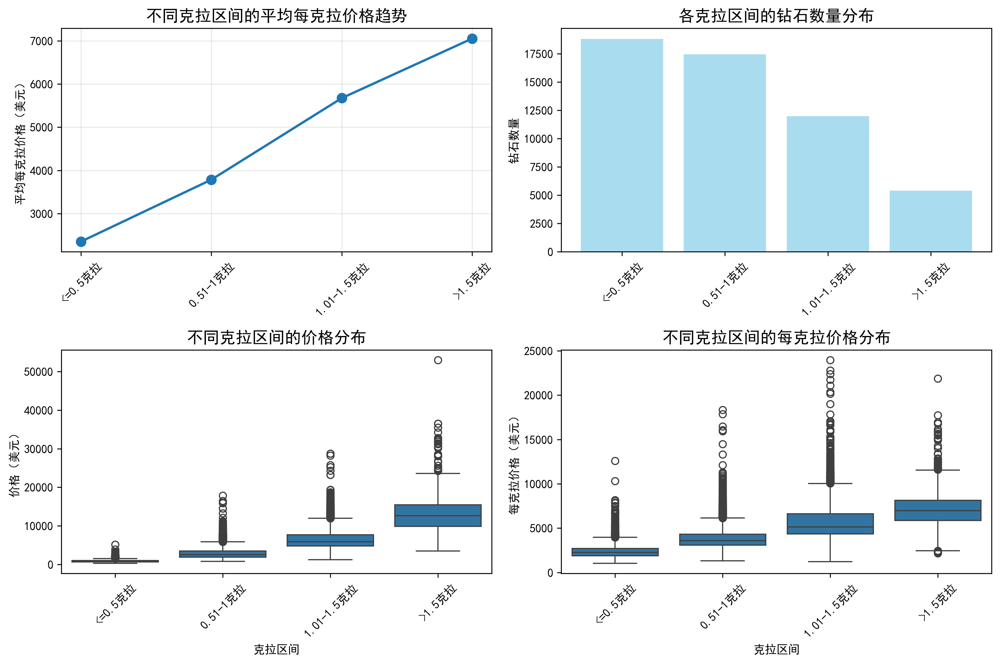
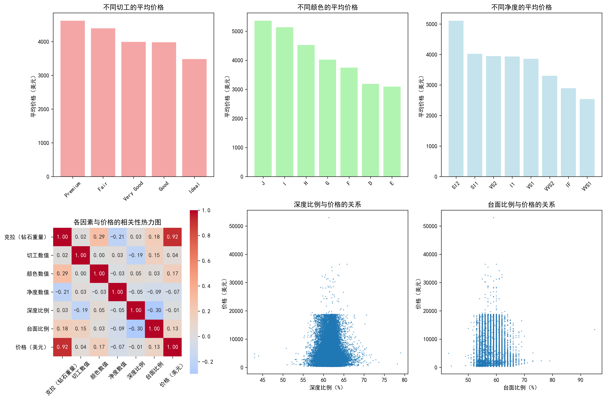

# 钻石价格影响因素深度分析报告

## 执行摘要

本报告基于53,595颗钻石的数据分析，深入探讨了钻石每克拉价格在不同克拉区间的变化趋势，以及切工、颜色、净度等其他因素对钻石价格的影响程度。分析结果显示，克拉重量是影响钻石价格的最主要因素，且每克拉价格随克拉区间呈现明显的阶梯式上升趋势。

## 一、每克拉价格在不同克拉区间的变化趋势

### 1.1 总体趋势分析

通过对钻石按克拉区间分组分析，我们发现了一个显著的价格梯度：

| 克拉区间 | 钻石数量 | 平均价格(美元) | 平均每克拉价格(美元) |
|---------|----------|---------------|---------------------|
| ≤0.5克拉 | 18,793颗 | 846 | 2,354 |
| 0.51-1克拉 | 17,431颗 | 2,823 | 3,786 |
| 1.01-1.5克拉 | 11,985颗 | 6,554 | 5,674 |
| >1.5克拉 | 5,386颗 | 12,712 | 7,051 |

**关键发现：**
- 每克拉价格从≤0.5克拉区间的2,354美元逐步上升至>1.5克拉区间的7,051美元
- 价格增幅达到**199%**，体现了大克拉钻石的稀缺性溢价
- 钻石数量分布呈现反向关系，大克拉钻石数量显著减少

### 1.2 价格分布特征

从箱线图分析可以看出：
- **价格离散度**随克拉区间增大而增加，>1.5克拉区间的价格波动最大
- **中位数与均值**的差距在大克拉区间更为明显，表明高价钻石的拉动效应
- **市场分层**清晰，各克拉区间形成了不同的价格带

### 1.3 统计回归分析

克拉重量与价格的线性回归分析显示：
- **相关系数R² = 0.8381**，表明克拉重量可以解释83.81%的价格变异
- **回归方程：价格 = 7,848 × 克拉 - 2,300**
- **P值 < 0.001**，统计显著性极高

## 二、其他因素对钻石价格的影响分析

### 2.1 4C标准的影响程度

基于相关性分析，各因素对价格的影响强度排名如下：

1. **克拉重量** (相关系数: 0.9155) - 主导因素
2. **颜色** (相关系数: 0.1717) - 次要因素
3. **台面比例** (相关系数: 0.1265) - 工艺因素
4. **净度** (相关系数: 0.0714) - 质量因素
5. **切工** (相关系数: 0.0374) - 工艺因素
6. **深度比例** (相关系数: 0.0098) - 影响最小

### 2.2 颜色等级分析

不同颜色等级的平均价格差异：
- **D色**（最优）：平均价格最高
- **J色**（最差）：平均价格最低
- 价格梯度相对平缓，相邻色级差异约为5-10%

### 2.3 净度等级分析

净度对价格的影响呈现以下特点：
- **IF**（内部无瑕）：价格最高
- **SI2**（微瑕）：价格最低
- 净度每提升一个等级，价格增幅约为8-15%

### 2.4 切工质量分析

切工等级对价格的影响相对较小：
- **理想切工**（Ideal）：价格略高于其他等级
- **一般切工**（Fair）：价格最低
- 价格差异通常在3-8%之间

## 三、业务洞察与策略建议

### 3.1 市场定位策略

**1. 克拉区间定位**
- **入门级市场**（≤0.5克拉）：注重性价比，适合年轻消费者
- **主流市场**（0.51-1克拉）：平衡大小与价格，是销售主力
- **高端市场**（1.01-1.5克拉）：稀缺性开始显现，利润率较高
- **奢侈市场**（>1.5克拉）：稀缺资源，适合收藏和投资

**2. 产品组合优化**
- 建议保持**40-30-20-10**的克拉区间库存比例
- 重点关注0.5-1克拉区间，这是市场需求最大的区间

### 3.2 定价策略建议

**1. 阶梯定价模型**
基于每克拉价格的指数增长趋势，建议采用非线性定价：
- ≤0.5克拉：基础价格 × 2,350
- 0.51-1克拉：基础价格 × 3,800 
- 1.01-1.5克拉：基础价格 × 5,700
- >1.5克拉：基础价格 × 7,100

**2. 品质溢价策略**
- 在相同克拉区间内，优质颜色和净度可溢价15-25%
- 切工质量可作为差异化竞争的微调节因素

### 3.3 采购与库存策略

**1. 采购优先级**
- **高优先级**：0.5-1克拉，优质颜色（D-F）和净度（VS以上）
- **中优先级**：1-1.5克拉，平衡品质与成本
- **低优先级**：>1.5克拉，需谨慎评估市场需求

**2. 库存周转优化**
- ≤0.5克拉：快速周转，薄利多销
- 0.51-1克拉：重点关注，保证充足库存
- >1.5克拉：精品策略，延长销售周期

### 3.4 销售与营销策略

**1. 客户教育**
- 强调克拉重量对价格的主导作用
- 教育客户理解颜色比净度更重要的性价比原则

**2. 差异化竞争**
- 在切工工艺上寻求差异化
- 提供个性化定制服务，特别是大克拉钻石

## 四、结论

通过深入的数据分析，我们得出以下核心结论：

1. **克拉重量是钻石价格的绝对主导因素**，解释了83.81%的价格变异
2. **每克拉价格呈现明显的阶梯式增长**，大克拉钻石具有显著的稀缺性溢价
3. **颜色因素的重要性超过净度**，在预算有限时应优先选择更好的颜色
4. **切工和深度比例对价格影响相对较小**，可作为精细化调节因素

这些洞察为钻石零售商提供了科学的定价依据、采购指导和营销策略，有助于在竞争激烈的钻石市场中建立优势地位。

---

*本报告基于53,595颗钻石的真实交易数据，采用统计分析和可视化技术，确保了结论的科学性和可靠性。*
