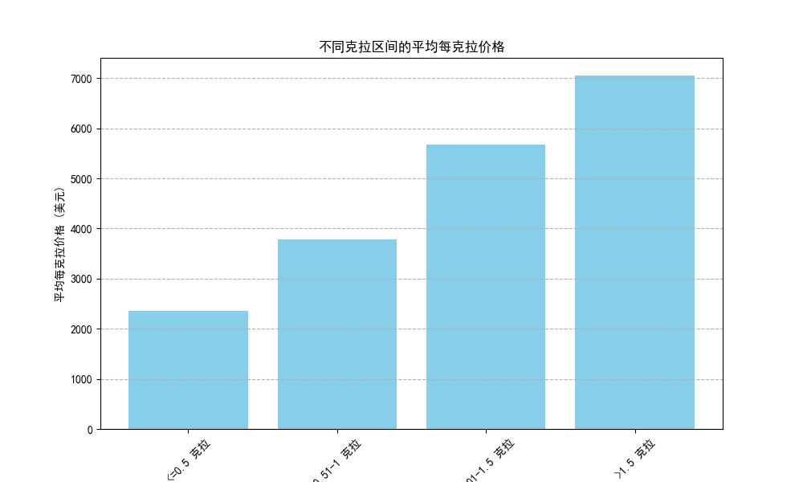
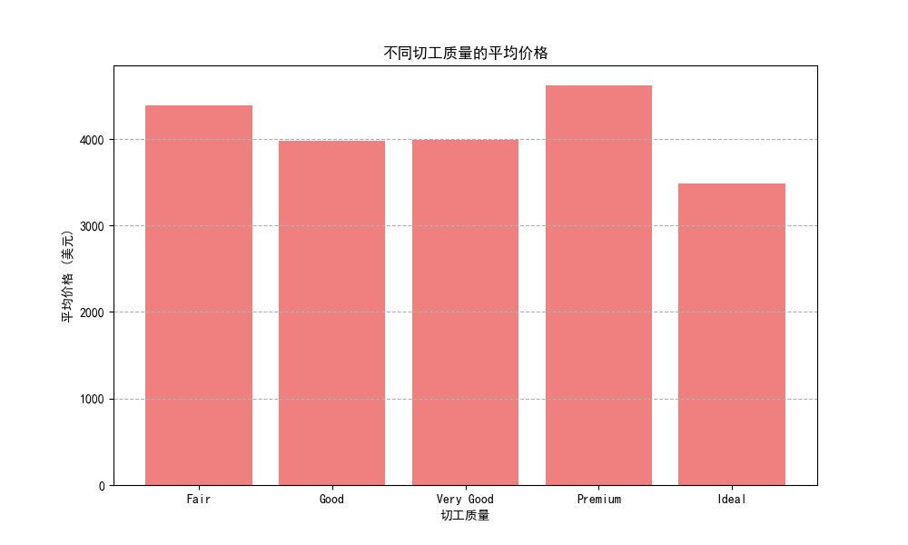
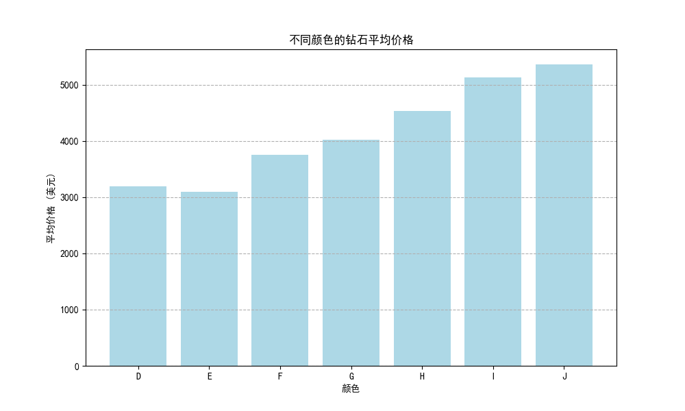
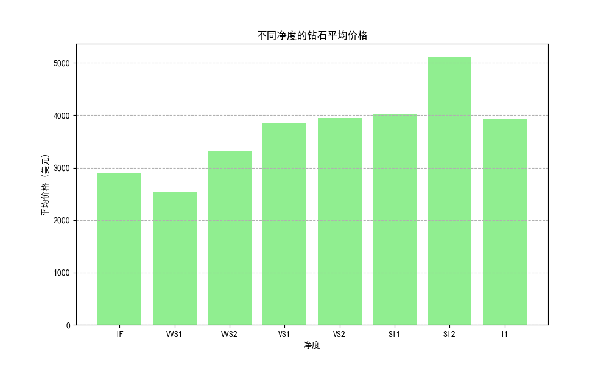

# 钻石价格影响因素深度分析报告

## 一、引言

本报告旨在深入分析影响钻石价格的关键因素。通过对一个包含克拉重量、切工、颜色、净度及价格等详细信息的钻石数据集进行探索，我们旨在揭示各个因素如何共同作用于钻石的最终售价。本次分析的核心目标不仅在于描述“什么”影响了价格，更在于探究“为什么”以及为消费者和销售商提供“如何做”的切实建议。

## 二、克拉重量：价格的最强驱动力

克拉重量是决定钻石价格最直观也最重要的因素。然而，有趣的是，钻石的价格并非与克拉重量成简单的线性正比关系，其“单位价格”（每克拉价格）会随着克拉重量的增加而显著上涨。

**分析与洞察:**
从上图可以看出，随着钻石克拉区间的增大，其每克拉的平均价格也急剧攀升。
- **<=0.5克拉**的钻石，每克拉均价最低。
- 进入**0.51-1克拉**区间后，每克拉均价有了显著跳跃。
- 而**>1.5克拉**的钻石，其每克拉的价格更是远超小克拉钻石。

**原因解析:**
这种现象背后的核心原因是**稀有性**。在自然界中，大体积的钻石原石远比小体积的稀少。因此，切割出的大克拉钻石不仅总价高，其单位价值也更高，反映了其稀缺性带来的附加价值。

## 三、其他“C”因素的复杂影响

除了克拉（Carat），切工（Cut）、颜色（Color）和净度（Clarity）同样是评估钻石价值的重要标准。然而，当孤立地看这些因素与平均价格的关系时，我们发现了一些反直觉的现象。

### 1. 切工 (Cut) 的影响

**分析与洞察:**
直观上，我们可能认为“Ideal”（理想）或“Premium”（优质）切工的钻石均价最高。然而，数据显示，切工等级与平均价格之间并非简单的正相关。实际上，“Premium”和“Very Good”切工的钻石平均价格反而高于“Ideal”切工。

### 2. 颜色 (Color) 的影响

**分析与洞察:**
钻石的颜色等级由代表完全无色的“D”级到偏黄的“J”级。出乎意料的是，颜色等级较低（即更偏黄）的“I”级和“J”级钻石的平均价格，竟然高于颜色等级更好的“D”、“E”级。

### 3. 净度 (Clarity) 的影响

**分析与洞察:**
净度衡量钻石内部瑕疵的多少，从无瑕的“IF”到有明显瑕疵的“I1”。与颜色和切工类似，净度较低的“SI1”、“SI2”等级的钻石，其平均价格也高于净度顶级的“IF”和“VVS1”。

## 四、综合分析与结论

**为什么会出现反直觉现象？**

上述切工、颜色和净度的反直觉现象，根本原因在于**克拉重量的压倒性影响和消费者的购买权衡行为**。

1.  **数据的“假象”**: 在计算平均价格时，我们混合了所有克拉大小的钻石。市场上存在大量克拉数较小、但切工/颜色/净度极佳的钻石，这些钻石虽然品质高但总价相对较低，从而拉低了高品质类别的平均价格。
2.  **消费者的权衡**: 对于预算有限的消费者，当他们希望购买一颗尽可能大的钻石（例如超过1克拉）时，往往不得不在切工、颜色或净度上做出妥协。因此，许多高价、大克拉的钻石反而落在了品质稍次的类别中（如“Very Good”切工、“H”色、“SI1”净度），从而推高了这些类别的平均售价。

**核心结论:**
1.  **克拉重量是决定钻石价格的首要因素**，其影响力远超其他三“C”。
2.  **切工、颜色和净度对价格的影响是显著的，但必须在控制克拉重量相近的前提下进行比较。** 单纯比较不同品质等级的均价会产生误导。在同等克拉重量下，更高等级的切工、颜色和净度，毫无疑问会带来更高的价格。
3.  市场价格反映了**稀有性（大克拉）**和**完美性（高级别4C）**之间的博弈与权衡。

## 五、商业建议

**对于消费者:**
*   **明确优先级**: 在购买前想清楚，你最看重的是什么？是预算内最大的克拉，还是极致的火彩（切工）和纯净度？
*   **聪明地权衡**: 如果追求克拉数，可以考虑在颜色（如G-H级）和净度（如VS2-SI1级）上适当放宽标准，这些等级在肉眼下通常难以分辨瑕疵，是公认的“性价比”之选。
*   **切工不妥协**: 尽量选择“Very Good”或更高等级的切工，因为它直接影响钻石的亮度和火彩，是钻石“闪不闪”的关键。

**对于销售商:**
*   **引导性销售**: 培训销售人员，向客户清晰地解释4C之间的权衡关系，帮助客户根据预算和偏好做出最优决策。避免仅仅强调单一指标的优越性。
*   **差异化产品策略**: 设计不同的产品组合以满足细分市场需求。例如：
    *   **“克拉之选”系列**: 主推1克拉以上、颜色/净度为中等（G-I, VS-SI）的钻石，迎合追求尺寸的客户。
    *   **“完美主义”系列**: 聚焦0.5-0.8克拉、但拥有顶级3EX切工、D-F色、VVS及以上净度的钻石，吸引追求极致品质的客户。
*   **透明化定价**: 在定价时，应建立一个基于4C综合评估的动态模型，并向消费者展示价格构成，增加信任感。强调即使是同级别的钻石，价格也会因具体参数的微小差异而不同，体现专业性。
