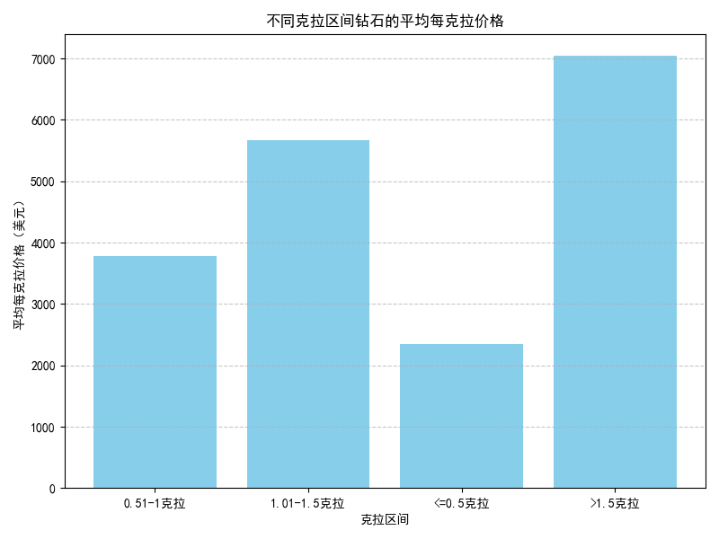
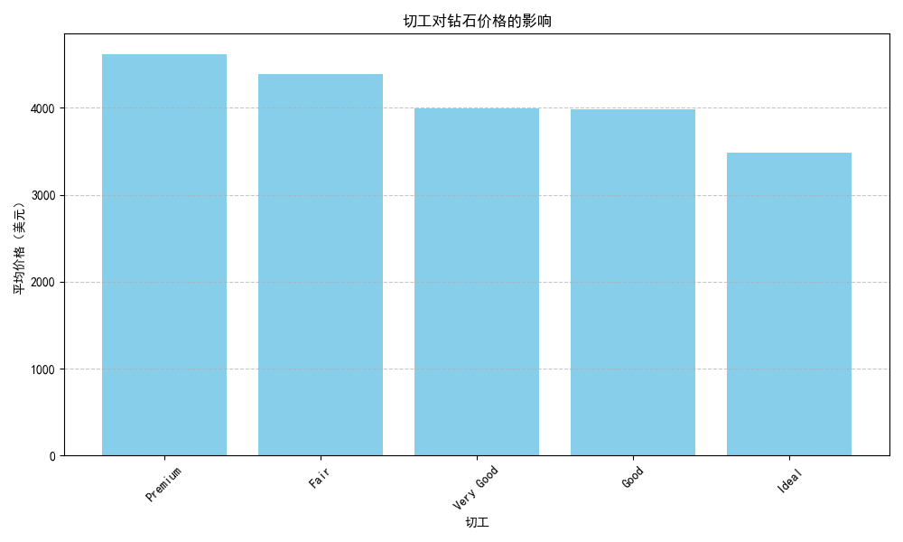
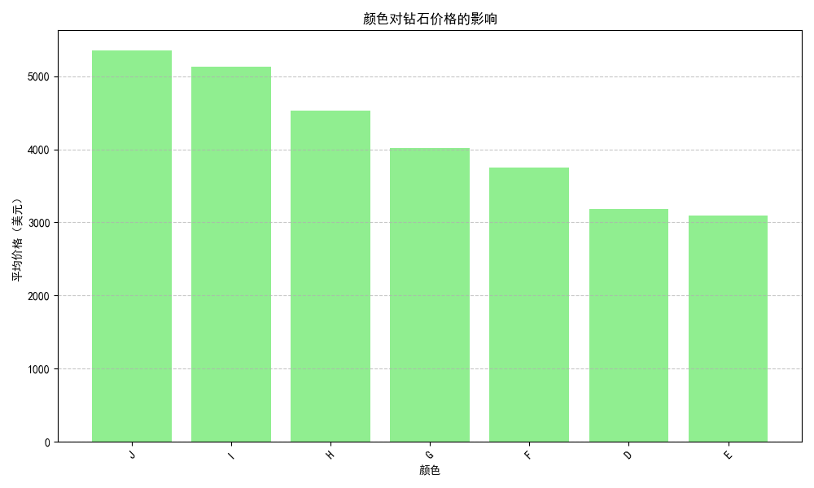

# 钻石价格影响因素分析报告

## 1. 不同克拉区间钻石的每克拉价格变化趋势

我们首先分析了钻石的每克拉价格在不同克拉区间的变化趋势，结果如下：

从图中可以看出，随着钻石克拉数的增加，每克拉的平均价格呈上升趋势。这表明大克拉钻石的单位价值更高，可能由于其稀缺性和收藏价值。

## 2. 切工对钻石价格的影响

切工是决定钻石光学性能的重要因素。我们分析了不同切工等级的平均价格，如下图所示：

可以看到，切工等级越高，钻石的平均价格越高，这表明切工对钻石的价格具有显著影响。

## 3. 颜色对钻石价格的影响

钻石的颜色等级也是影响价格的重要因素。我们统计了不同颜色等级的钻石平均价格，结果如下：

从图中可以看出，颜色等级越高（即颜色越接近无色），钻石的价格越高，符合市场对高品质钻石的偏好。

## 4. 净度对钻石价格的影响

净度是指钻石内部包裹体的含量和可见度。我们分析了不同净度等级的钻石平均价格，如下图所示：

结果显示，净度越高，钻石价格越高，说明净度也是影响钻石价值的重要因素之一。

## 5. 综合分析与建议

从整体来看，克拉重量、切工、颜色和净度均对钻石的价格有明显影响。其中：

- **克拉重量**：每克拉价格随着克拉数增加而上升，表明大克拉钻石更具市场价值。
- **切工**：高品质切工显著提升了钻石的市场价值。
- **颜色**：越接近无色的钻石价格越高，说明颜色对消费者心理和价值评定影响较大。
- **净度**：内部越纯净的钻石价格越高，净度是衡量钻石品质的重要标准。

### 建议

1. **销售策略**：建议重点推广高克拉、高品质切工、无色、高净度的钻石，以迎合高端市场需求。
2. **采购与库存管理**：可优先采购高净度、高颜色等级、优质切工的钻石，以提升利润率。
3. **价格定价**：结合这些因素，商家可以更精准地定价，确保高价值钻石能体现其应有的市场价值。
