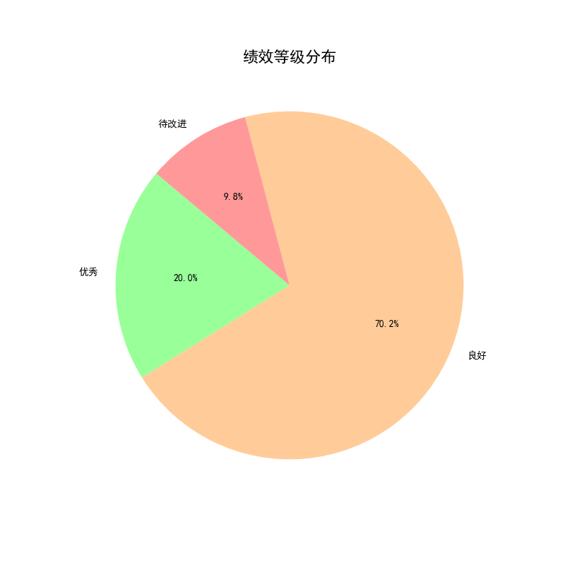
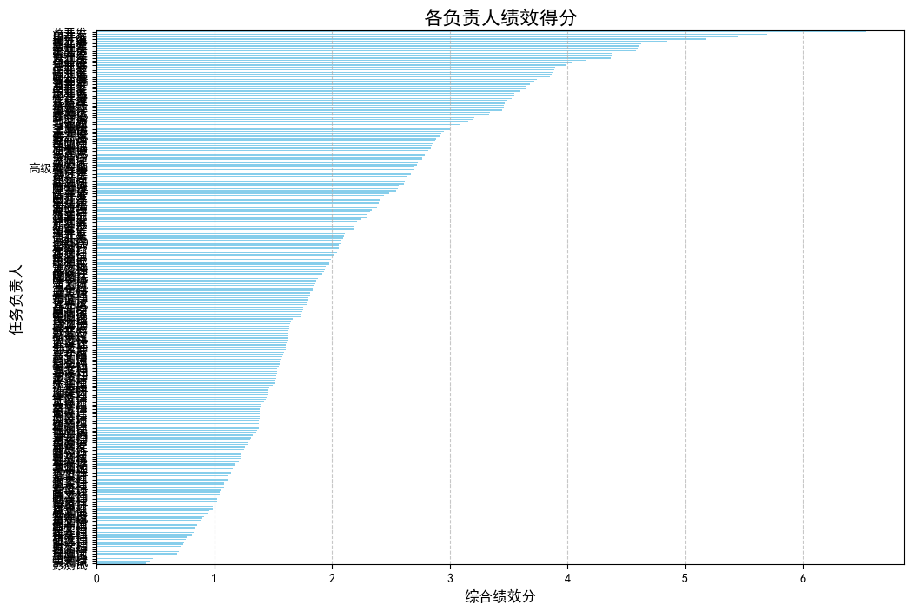

# **关于任务负责人绩效评定的分析报告与方案**

## 一、项目背景与目标

为了建立一个公平、透明、数据驱动的绩效评估体系，本次分析旨在为不同任务类型的负责人制定一个合理的绩效评定方案。方案的核心目标是：在综合考量任务完成状态、优先级、工时利用率等多个维度的基础上，对所有负责人进行客观评价，并根据预设比例（**优秀20%，良好70%，待改进10%**）进行等级划分，从而激励优秀，改进不足。

## 二、绩效评估模型设计

为确保评估的**公平性**和**全面性**，尤其是在平衡不同类型、不同难度任务的差异上，我们构建了一个多维度的加权评分模型。此模型不仅评估任务的产出，还充分考虑了任务的内在属性。

### 1. 核心评估维度

我们的评估模型基于以下四个核心指标：

*   **任务完成率**: 衡量负责人的责任心和承诺兑现能力。计算公式为：`负责人已完成任务数 / 负责人总任务数`。
*   **按时完成率 (Timeliness)**: 衡量任务交付的及时性，我们设定了 **30%** 的权重。
*   **完成质量 (Quality)**: 基于“完成质量评分”进行标准化处理，是衡量工作成果好坏的核心，我们设定了 **40%** 的权重。
*   **工时利用率 (Efficiency)**: 即 `计划工时 / 实际工时`，反映投入产出效率，我们设定了 **30%** 的权重。

### 2. 公平性校准机制

为了消除不同任务间的固有差异，我们引入了两个关键的校准因子：

*   **优先级权重**: 不同优先级的任务对业务的影响不同。我们将“紧急”、“高”、“中”、“低”分别映射为 **1.5、1.2、1.0、0.8** 的权重系数。负责人完成高优先级任务会获得更高的分数认可。
*   **任务难度系数**: 这是确保跨类型任务公平比较的关键。每项任务的得分都会乘以其对应的“任务难度系数”，这意味着完成一项高难度任务所获得的回报远高于一项简单任务。

### 3. 最终绩效分计算

负责人的最终绩效分是其所有已完成任务的加权平均得分，再乘以其总体的任务完成率，公式如下：

**最终绩效分 = [Σ(单任务得分 × 优先级权重 × 任务难度系数) / 已完成任务数] × 任务完成率**

这种设计确保了只有那些不仅工作质量高、效率好，而且能稳定交付成果（高完成率）的负责人才能获得最高评价。

## 三、绩效评定结果与分析

根据上述模型，我们对225位任务负责人进行了评定，结果如下。

### 1. 绩效等级分布

最终的绩效评级分布严格遵循了预设目标。如下图所示，**20.0%的负责人被评为“优秀”，70.2%为“良好”，而9.8%被评为“待改进”**，与20%/70%/10%的目标高度吻合，说明评级划分是成功的。

### 2. 负责人绩效得分概览

下图展示了所有任务负责人的综合绩效得分情况。可以看出，不同负责人之间的绩效表现存在显著差异。

*   **高分段**：以蒋开发、白开发为代表的优秀员工，在综合得分上遥遥领先，体现了其在任务交付、质量和效率上的卓越能力。
*   **中分段**：大部分员工集中在“良好”区间，是团队的中坚力量。
*   **低分段**：以彭测试、吴测试为代表的员工得分较低，需要在后续工作中重点关注和提升。

## 四、结论与可行性建议

本次基于数据驱动的绩效评定方案，成功地为不同任务类型的负责人提供了一个公平、合理的评价框架。模型综合考虑了产出、效率、质量、优先级和难度，确保了结果的客观与公正。

基于以上分析，我们提出以下建议：

1.  **差异化激励与辅导**：
    *   **对“优秀”员工 (Top 20%)**: 进行公开表彰和物质激励（如绩效奖金、晋升优先等），并鼓励他们分享成功经验，带动团队整体进步。
    *   **对“待改进”员工 (Bottom 10%)**: 管理层应与其进行一对一沟通，结合详细数据（例如是按时率低、质量差还是工时超支）分析绩效短板的具体原因，并制定针对性的个人发展计划（IDP），提供必要的培训和资源支持。

2.  **深入分析，发现共性问题**：
    *   建议对特定**任务类型**（如开发、测试、设计）或**项目**的绩效得分进行横向比较。例如，如果发现“测试”岗位的员工普遍得分偏低，可能并非员工个人能力问题，而是反映了测试流程、资源分配或前期需求质量存在系统性风险，需要从团队或流程层面进行优化。

3.  **绩效评估常态化**：
    *   建议将此绩效评估模型作为未来季度或年度的常规评估工具。持续追踪数据不仅可以衡量个人成长，也能帮助管理层更早地发现团队潜在问题，做出更精准的决策。

通过实施以上建议，我们可以将本次绩效评定的结果转化为驱动组织能力提升的持续动力，营造一个“奖优罚劣”、共同进步的积极工作氛围。
