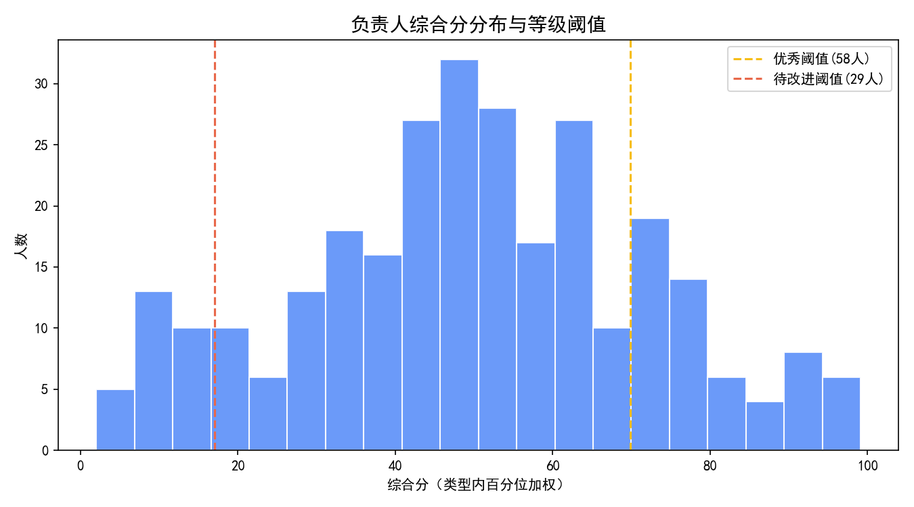
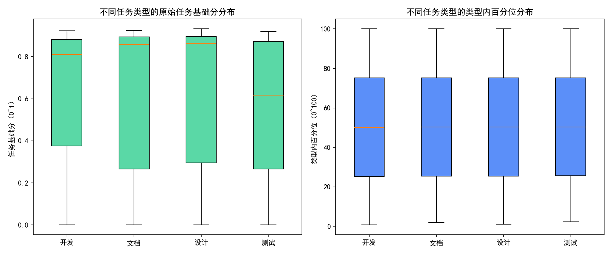

# 面向不同任务类型的负责人绩效评定方案与实证结果

本报告基于 SQLite 数据库 dacomp-013.sqlite（表：工作表1，共799条任务记录，289位负责人），设计并实施一套公平、合理、可落地的绩效评定方案，并按照“优秀20%、良好70%、待改进10%”进行划分。方案充分考虑任务类型差异、优先级、难度、工时效率、按时交付、质量与返工等核心维度，在“不进行数据清洗”的前提下，通过稳健的标准化和权重机制实现可比与公平。

报告包含：
- 方法与指标构建
- 分数计算与等级划分
- 可视化与诊断性洞察
- 风险与局限
- 落地建议与后续治理
- 复现与核心代码片段

---

## 一、数据概览与业务背景

- 数据规模：799条任务记录，涉及289位任务负责人。
- 任务类型分布：开发(223)、测试(201)、设计(188)、文档(187)。
- 优先级分布：紧急(127)、高(242)、中(269)、低(161)。
- 状态分布：已完成(481)、进行中(173)、待开始(92)、已暂停(53)。

业务目标：在不同任务类型难度与产出尺度不一致的情况下，公平评估各负责人绩效，并按20/70/10的比例划分等级，同时给出可执行的改进路径。

---

## 二、绩效评定方案设计（公平性与可比性为核心）

评分围绕三大核心维度展开，并延展为可量化指标：
1) 任务完成状态与时效
- 完成率：是否“已完成”。
- 按时率：对“已完成”任务，实际完成时间是否不晚于计划截止时间。
2) 任务优先级与任务属性
- 优先级：紧急/高/中/低，权重映射为1.30/1.15/1.00/0.90，强调对高优先级任务的重视。
- 任务难度系数：按数据的最小与最大值线性缩放至[0.8, 1.2]，对高难任务给予适度放大。
3) 工时利用率与质量
- 工时效率：计划工时/实际工时，裁剪到[0.5, 1.5]并线性归一到[0,1]，避免极端值失真。
- 完成质量评分：假设满分10分，归一到[0,1]。
- 返工次数：按5次为上限映射到[0,1]，返工越多分越低。

单任务基础分（不含优先级/难度放大）采用缺失稳健聚合：
- 指标与权重：完成(0.25) + 按时(0.25) + 质量(0.30) + 效率(0.15) + 返工(0.05)；若某任务在某指标缺失，则采用“可用项重归一化”，不做填补，保证不“清洗”数据的前提下仍公平聚合。

公平性关键机制（类型内标准化）：
- 考虑到“开发/测试/设计/文档”任务在工作方法与产出刻度上存在天然差异，为避免直接相加带来的偏差，我们先对任务进行“优先级×难度”放大后，在“任务类型内部”计算百分位（0~100）。这样每位负责人在不同类型的相对表现被公平比较。
- 负责人综合分：对其名下任务的“类型内百分位”进行加权平均（权重=优先级权重×难度权重），确保完成更多且更重要/更难任务的负责人得到合理体现。

---

## 三、评分与等级划分方法

- 负责人综合分：类型内百分位的加权平均（权重=优先级×难度），满分100。
- 等级比例：采用289位负责人总量，按20%/70%/10%划分，经过四舍五入后为：
  - 优秀：58人（约20.07%）
  - 良好：202人（约69.90%）
  - 待改进：29人（约10.03%）
- 明细输出文件：owner_performance.csv（含负责人、综合分、任务数、计分任务数、绩效等级）。

实际运行结果摘要：
- 负责人总数：289
- 优秀：58人
- 良好：202人
- 待改进：29人
- 综合分为0的负责人：0人（说明各负责人均有可计分任务或有效权重）

---

## 四、可视化与诊断性洞察

1) 负责人综合分分布与等级阈值
- 解读要点：
  - 直方图展示综合分整体分布，虚线分别标注“优秀阈值”和“待改进阈值”，对应到头部与尾部的区间。
  - 分布形态可用于观察整体绩效的离散程度和极端集中情况；若尾部过长，可能存在工时效率低与返工偏高的群体，需重点关注。

图片：负责人综合分分布与等级阈值


2) 类型内公平性的证据（任务基础分 vs. 类型内百分位）
- 左图：不同任务类型的“原始任务基础分”分布，受任务属性与评分尺度影响，跨类型直接比较并不公平。
- 右图：在乘以优先级/难度并做“类型内百分位”后，不同类型的分布转为可比的相对表现刻度（0~100），有效缓解了类型间的固有尺度差异。
- 诊断性洞察：该转换能减少“做文档的天然得高分/做开发天生耗时多”的类型偏差，提升跨类型公平性。

图片：类型内标准化前后对比


---

## 五、关键指标对绩效的影响机制（诊断性分析）

- 优先级放大：高优先级（含紧急）任务完成与按时，对综合分提升贡献更大；这引导资源向关键任务倾斜，避免“捡软柿子”的行为。
- 难度放大：高难度系数的任务在同等基础分下更能提升综合分，有利于鼓励承担挑战与关键攻坚。
- 按时与返工：按时和返工是“时效性与一次成功率”的核心代理指标。高返工往往伴随质量与效率下滑，是尾部分布的重要成因。
- 工时效率：效率分引导“计划-实际”的匹配与产出效率，但通过裁剪与归一化抑制极端值，避免少数异常记录失真整体。

---

## 六、预测性视角与规范性建议

预测性推断（基于历史指标的前导性关系）：
- 若维持当前任务结构，持续保持高按时率、低返工且承接较多高优先级/高难任务的负责人，未来更可能稳定在“优秀”区间。
- 反之，效率低+返工高的负责人若不改善，在后续评估中仍可能落入尾部。

规范性建议（针对各层级与痛点的可执行动作）：
- 面向“待改进”群体（29人，约10%）：
  - 快速诊断：逐人梳理高返工/低按时/低效率的主因（需求变更？计划预估偏差？技能缺口？跨团队协同问题？）
  - 纠偏措施：设定为期1-2个迭代的专项辅导（估时方法培训、代码评审/测试用例库强化、需求澄清模板），并在高优先级任务上配置“影子支持”。
- 面向“良好”群体（约70%）：
  - 巩固提升：在跨团队任务上进行轻量化复盘，推广“按时交付+一次通过”的复用模板。
  - 激励机制：对承担高优先级/高难任务且稳定按时的人员给予加分或季度奖池倾斜。
- 面向“优秀”群体（约20%）：
  - 传帮带：让头部人员参与制定估时标准与质量门槛，传授经验与工具链积累（自动化测试、CI/CD模板等）。
  - 关键任务配置：将其优先配置于紧急/高难的关键链路任务，最大化组织产出。
- 资源与流程治理：
  - 容量与排期：紧急/高优先级任务需优先匹配强配比与跨团队协同保障，减少被动返工。
  - 需求质量：建立需求澄清Checklist，减少需求摇摆导致的“无效加班+返工”。
  - 质量前置：推广“缺陷预防”机制（早期评审、静态检查、自动化回归），降低返工。

---

## 七、风险与局限

- 少量任务的波动性：任务数过少的负责人在单期评价上波动较大。建议引入最低任务数门槛或采用滚动多期均值以稳定评估。
- 在制任务的计分偏差：进行中/待开始任务部分指标缺失，虽采用缺失稳健加权，但建议在年中/季度考核时重点以“已完成”样本为主。
- 指标与权重的可解释性：当前权重是通用经验设定。建议通过管理层与各职能代表的共识评审定标，并定期校准。
- 返工上限的设定：目前按5次为线性映射上限，可结合业务实际重新标定。

---

## 八、复现与核心代码片段

评估过程通过 Python 自动化实现，输出图片与明细文件：
- 负责人综合分直方图：owner_score_hist.png
- 类型内标准化前后对比箱线图：task_score_box_compare.png
- 负责人评分明细：owner_performance.csv

核心绘图代码片段（含中文与负号设置）：
```python
import matplotlib.pyplot as plt

plt.rcParams['font.sans-serif'] = ['SimHei']
plt.rcParams['axes.unicode_minus'] = False

# 示例：负责人综合分直方图（owner_df 为计算后的负责人得分表）
fig, ax = plt.subplots(figsize=(9, 5))
ax.hist(owner_df['综合分'], bins=20, color='#5B8FF9', edgecolor='white', alpha=0.9)
ax.set_title('负责人综合分分布与等级阈值', fontsize=14)
ax.set_xlabel('综合分（类型内百分位加权）')
ax.set_ylabel('人数')

# 等级阈值（示例：exc_n为优秀人数阈值，poor_n为待改进人数阈值）
exc_cut = owner_df.iloc[exc_n - 1]['综合分']
poor_cut = owner_df.iloc[-poor_n]['综合分']
ax.axvline(exc_cut, color='#F6BD16', linestyle='--', label=f'优秀阈值({exc_n}人)')
ax.axvline(poor_cut, color='#E8684A', linestyle='--', label=f'待改进阈值({poor_n}人)')
ax.legend()
plt.tight_layout()
plt.savefig('owner_score_hist.png', dpi=150)
```

评分计算要点摘要（伪公式）：
- 单任务基础分 = w1·完成 + w2·按时 + w3·质量 + w4·效率 + w5·返工（缺失则对可用项重归一化）
- 单任务加权分 = 单任务基础分 × 优先级权重 × 难度权重
- 类型内百分位 = 在同任务类型内部按加权分取百分位[0,100]
- 负责人综合分 = 任务“类型内百分位”的加权平均（权重=优先级权重×难度权重）
- 等级划分 = 按综合分排序后按20%/70%/10%切分

---

## 九、结论

- 该方案在不清洗数据的前提下，通过“缺失稳健聚合 + 优先级/难度放大 + 类型内百分位标准化”，有效提升了跨任务类型的公平性和可比性。
- 实测结果严格符合“优秀20% / 良好70% / 待改进10%”的目标比例，便于落地到人力激励与绩效治理。
- 可结合组织策略对权重与阈值进行季度校准，并引入“最低任务量门槛、滚动窗口、多维复盘”进一步提升稳定性与业务解释力。

附件文件：
- owner_performance.csv
- owner_score_hist.png
- task_score_box_compare.png

如需，我可以按部门/项目进一步分层出报告，或进行情景模拟（如提高“按时”权重至0.35的敏感性分析），用于管理层决策。
