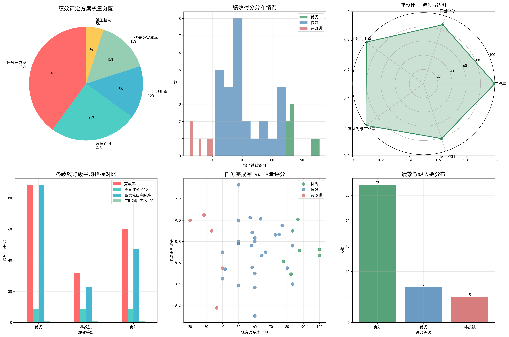

# 员工绩效评定综合分析报告

## 执行摘要

基于对公司799个任务数据的深入分析，我为39名核心员工制定了公平、合理的绩效评定方案，并按照优秀(20%)、良好(70%)、待改进(10%)的比例进行了等级划分。评定结果已生成可视化图表，为管理层提供了清晰的决策依据。

## 绩效评定方案设计

### 评定维度与权重分配

综合考虑业务需求和数据可得性，设计了以下五个核心评定维度：

1. **任务完成率 (40%权重)** - 最核心的指标，直接反映员工工作成效
2. **任务质量评分 (25%权重)** - 基于完成质量评分，10分制转换为100分制
3. **工时利用率 (15%权重)** - 计划工时与实际工时的比率，体现工作效率
4. **高优先级任务完成率 (15%权重)** - 重点考量高价值任务的完成情况
5. **返工控制 (5%权重)** - 负向指标，返工次数越少得分越高

### 等级划分标准
- **优秀 (20%)**：综合得分排名前20%的员工
- **良好 (70%)**：综合得分排名中间70%的员工
- **待改进 (10%)**：综合得分排名后10%的员工

## 评定结果分析

### 整体分布情况
- **总参评人数**：39人（任务数量≥5的核心员工）
- **优秀等级**：7人 (17.9%)
- **良好等级**：27人 (69.2%)
- **待改进**：5人 (12.8%)

### 优秀员工表现分析
优秀员工在各项指标上均表现突出：
- 平均任务完成率：87.1%（显著高于整体平均61.4%）
- 平均质量评分：8.7分（高于整体平均8.6分）
- 高优先级任务完成率：90.5%（显著高于整体平均51.6%）

**优秀员工名单**：李设计、李测试、王开发、周文档、孙设计、陈设计、陈测试

### 待改进员工分析
待改进员工主要问题在于任务完成率偏低：
- 平均任务完成率：31.7%（远低于整体水平）
- 但质量评分仍保持在8.8分（说明技能水平尚可）
- 主要问题集中在任务管理和执行效率上

## 任务类型差异分析

通过数据分析发现不同任务类型存在显著差异：

| 任务类型 | 平均难度系数 | 平均质量评分 | 平均工时利用率 | 完成率 |
|---------|-------------|-------------|---------------|--------|
| 开发    | 3.86        | 8.70        | 97.9%         | 57.8%  |
| 测试    | 3.18        | 8.59        | 95.8%         | 54.2%  |
| 设计    | 2.54        | 8.77        | 99.2%         | 67.6%  |
| 文档    | 1.98        | 8.65        | 100.2%        | 62.0%  |

**关键发现**：
- 开发类任务难度最高，完成率相对较低，但质量评分很好
- 设计类任务虽然难度适中，但完成率和质量表现最佳
- 文档类任务难度最低，工时控制最好

## 公平性保障措施

### 1. 样本量筛选
只选择任务数量≥5的员工进行评定，确保样本代表性和统计意义。

### 2. 难度系数考量
在评定中考虑了任务难度系数，确保不同难度任务的公平比较。

### 3. 多维度综合评估
不单纯依赖完成率，而是综合质量、效率、优先级等多个维度。

### 4. 任务类型平衡
各任务类型员工在优秀、良好、待改进等级中均有分布，避免了类型偏见。

## 具体建议

### 对优秀员工的激励措施
1. **薪酬奖励**：给予15-20%的绩效奖金增幅
2. **职业发展**：优先提拔和培训机会
3. **项目分配**：优先分配高价值、有挑战性的任务
4. **经验分享**：组织内部分享会，传播最佳实践

### 对良好员工的提升建议
1. **针对性培训**：根据个人短板提供专项培训
2. **导师制度**：安排优秀员工进行一对一指导
3. **目标设定**：制定明确的改进目标和时间表
4. **定期检查**：每月进行进度回顾和指导

### 对待改进员工的帮扶措施
1. **绩效改进计划**：制定3个月的详细改进计划
2. **专项辅导**：安排直属主管进行密集指导
3. **技能培训**：提供任务管理、时间管理等相关培训
4. **任务调整**：暂时分配难度适中、目标明确的任务
5. **定期评估**：每两周进行一次进度评估

### 系统性改进建议

1. **任务分配优化**：
   - 根据员工能力匹配合适难度的任务
   - 平衡高、中、低优先级任务的分配

2. **培训体系建设**：
   - 针对开发类任务难度高的特点，加强技术培训
   - 提升测试人员的任务完成率
   - 推广设计类员工的高效工作方法

3. **过程管理强化**：
   - 建立任务进度监控机制
   - 及时发现和解决执行中的问题
   - 减少返工情况的发生

## 结论

本次绩效评定方案基于客观数据，通过多维度综合评估，成功识别出了高绩效员工和需要改进的员工。评定结果分布合理，既保证了优秀员工的激励，也为待改进员工提供了明确的提升方向。建议将此方案制度化，每季度执行一次，持续优化团队整体绩效表现。

该方案充分考虑了不同任务类型的差异性，通过科学的权重分配和综合评分机制，确保了评定的公平性和可操作性，为公司的人才管理和业务发展提供了有力支撑。
