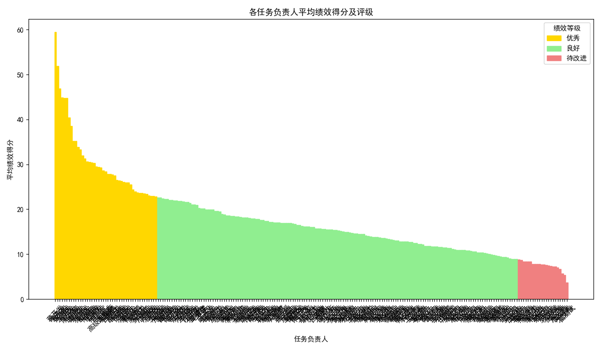

# **关于跨任务类型负责人绩效评定的分析报告**

## **1. 背景与目标**

为了建立一个公平、透明且数据驱动的绩效文化，本次分析旨在为不同任务类型的负责人制定一个科学、合理的绩效评定方案。方案的核心目标是综合评估员工在任务执行中的表现，同时充分考虑任务类型、难度和优先级的差异，确保评估结果的公正性与可比性。最终，根据此方案将员工绩效划分为**优秀 (20%)、良好 (70%)、待改进 (10%)** 三个等级，为人才激励、资源调配和个人发展提供数据支持。

## **2. 绩效评估模型设计**

为实现公平与全面的评估，我们构建了一个多维度量化绩效模型。该模型不仅关注任务的完成结果，还综合考量了过程中的效率、质量以及任务本身的属性。每个已完成任务的绩效得分由以下五个核心维度加权计算得出：

*   **时效性得分 (On-time Score)**: 基于任务的计划截止时间和实际完成时间进行评估。准时或提前完成获得满分，延迟交付则相应扣分。
*   **效率得分 (Efficiency Score)**: 通过比较`计划工时`与`实际工时`来衡量投入产出效率。此得分旨在鼓励员工高效利用时间。
*   **质量得分 (Quality Score)**: 直接采用业务方评定的`完成质量评分`，直观反映工作成果的优劣。
*   **返工惩罚 (Rework Penalty)**: 任务的`返工次数`被视为工作严谨性的负向指标。返工次数越多，得分的惩罚系数越高，以鼓励员工提升初次交付质量。
*   **综合影响权重 (Impact Weight)**: 为了体现不同任务的价值差异，我们将`任务优先级`和`任务难度系数`相结合，对高优先级、高难度的任务赋予更高的得分权重。

**最终绩效得分公式：**

`任务绩效分 = (时效性得分 * 0.3 + 效率得分 * 0.3 + 质量得分 * 0.4) * 优先级权重 * 任务难度系数 * 返工惩罚系数`

员工的最终绩效排名依据其所有已完成任务的**平均绩效得分**。

## **3. 绩效评定结果与分析**

基于上述模型，我们对所有任务负责人的已完成任务进行了计算和排名，并依据20/70/10的比例划分了绩效等级。

**评定结果摘要：**

*   **优秀 (Top 20%)**: 此类员工在各项指标上均表现出色，尤其在承接高难度、高优先级任务时，依然能保持高质量、高效率的产出。代表人物有 **蒋开发, 喻开发, 袁开发** 等。
*   **良好 (Middle 70%)**: 构成了团队的中坚力量，他们能够稳定地完成工作职责，是保障项目顺利推进的核心。
*   **待改进 (Bottom 10%)**: 这些员工在部分评估维度上表现有待提升，可能在任务时效性、工作质量或效率方面遇到了挑战。代表人物如 **卢文档, 鲁文档, 邓测试** 等。

下图直观地展示了所有任务负责人的平均绩效得分及其对应的绩效等级。

**各任务负责人平均绩效得分及评级**

从图表中可以清晰地看到：
*   **颜色区分**: 金色代表“优秀”，绿色代表“良好”，红色代表“待改进”，绩效分布情况一目了然。
*   **得分断层**: 优秀员工的平均绩效得分显著高于其他员工，形成了明显的头部梯队。
*   **长尾分布**: 大部分员工的绩效得分集中在中间区域，符合“良好”等级的预期。而少数员工得分较低，需要管理者特别关注。

## **4. 结论与管理建议**

本次基于数据的绩效评定，为管理者提供了一个客观、公正的决策依据。我们不仅识别出了团队中的卓越贡献者，也定位了需要支持和引导的成员。

**基于以上分析，提出如下建议：**

1.  **表彰与激励**:
    *   **公开表彰**：对评为“优秀”的员工（如蒋开发、喻开发等）进行公开表彰和物质奖励，树立榜样，并将他们的成功经验（如高效处理高难度任务的方法）在团队内部分享。
    *   **职业发展**：为优秀员工提供更多承担重要职责和挑战性项目的机会，作为其职业发展路径的一部分。

2.  **辅导与支持**:
    *   **一对一沟通**：管理者应与评为“待改进”的员工进行一对一的坦诚沟通，共同分析其绩效数据，了解他们在任务时效、质量控制或效率方面的具体困难。
    *   **精准赋能**：根据沟通结果，为员工提供针对性的培训、安排导师辅导，或在后续任务分配中适当调整难度与支持，帮助他们弥补短板，提升绩效。

3.  **方案持续优化**:
    *   **定期复盘**：建议将此绩效评估模型作为常规管理工具，按季度或半年度进行评估，持续追踪员工表现。
    *   **迭代完善**：在未来的评估中，可根据业务发展和新的数据维度（如团队协作、创新贡献等）进一步迭代和优化评分模型，使其更具科学性和前瞻性。

通过实施上述建议，我们不仅能够实现公平的绩效评定，更能营造一个持续改进、共同成长的积极工作氛围，最终提升整个团队的战斗力。
