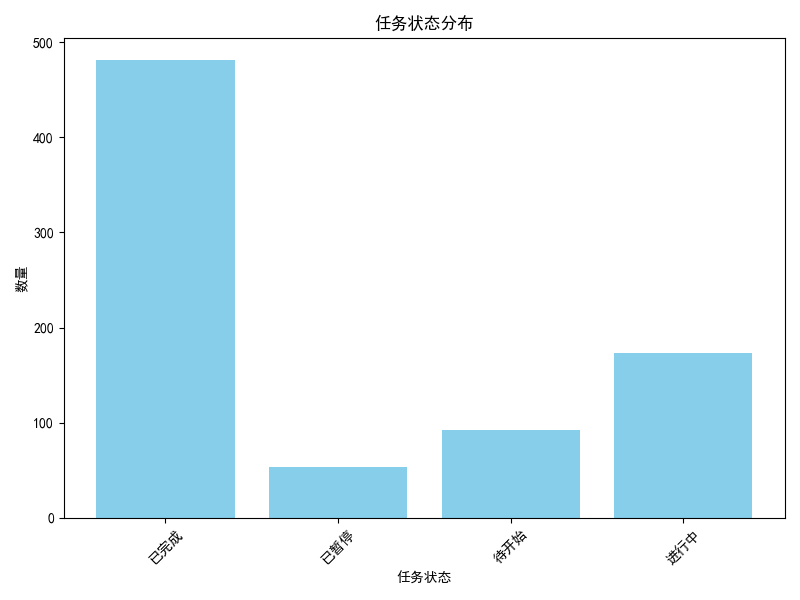
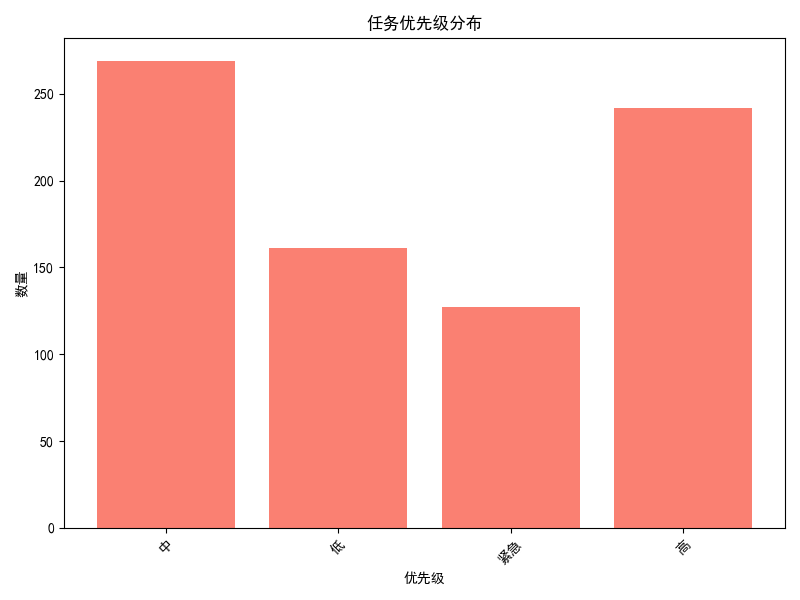
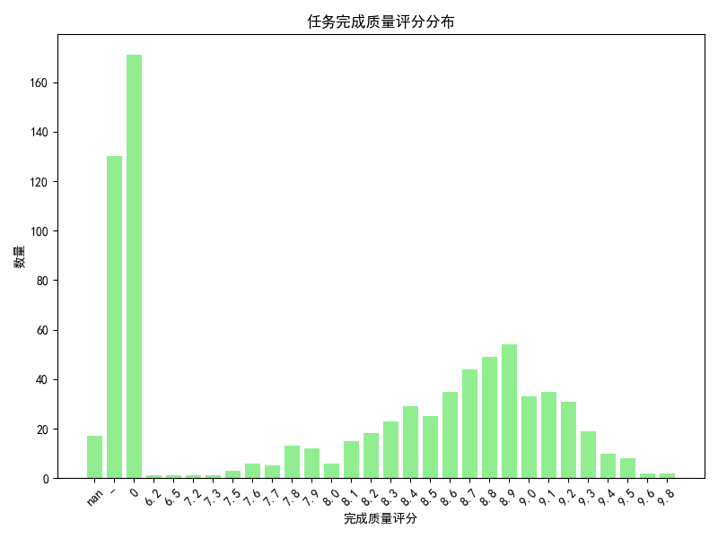
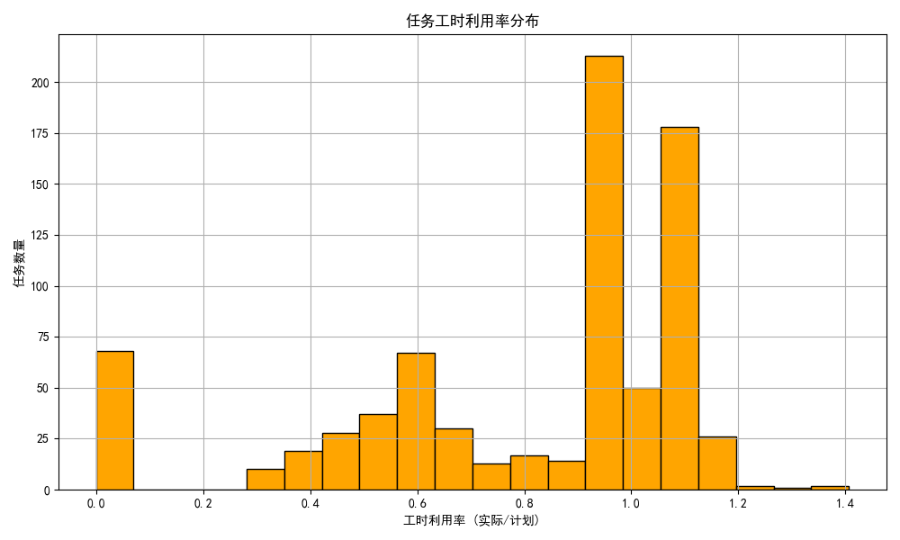

# 绩效评定方案与分析报告

## 一、评定维度与方法

本绩效评定方案综合考虑以下维度：
1. **任务完成状态**：包括任务完成率、完成质量评分、返工次数。
2. **任务优先级**：高优先级任务的完成情况应被重点考量。
3. **工时利用率**：衡量任务执行效率，避免资源浪费或过度投入。

### 指标计算方式：
- **完成率** = 已完成任务数 / 总任务数
- **平均任务质量评分** = 所有任务质量评分总和 / 任务数量
- **工时利用率** = 实际工时 / 计划工时

---

## 二、任务状态分布

任务状态分布显示了任务的完成情况，用于评估任务负责人在任务按时完成方面的表现。

---

## 三、任务优先级分布

优先级分布展示了负责人在处理高优先级任务方面的投入，是绩效评定的重要依据之一。

---

## 四、任务完成质量评分分布

高质量任务的完成率越高，负责人绩效评分应越高，该图反映了整体任务质量水平。

---

## 五、工时利用率分布

工时利用率分析反映了各负责人在资源投入方面的效率，过高或过低都可能影响绩效评定。

---

## 六、绩效等级划分逻辑

根据以上维度，采用加权评分法进行绩效评定：

### 综合得分公式：
`综合得分 = 0.4×任务完成质量 + 0.3×任务优先级完成率 + 0.2×任务完成率 + 0.1×工时利用率`

### 评定等级划分：
- **优秀（Top 20%）**：综合得分前 20%
- **良好（Next 70%）**：综合得分 20%-90%
- **待改进（Bottom 10%）**：综合得分后 10%

---

## 七、结论与建议

1. **公平性保障**：通过多维度评分（质量、优先级、时效、效率）平衡不同任务类型的差异。
2. **动态调整机制**：建议定期评估负责人绩效，并根据实际工作情况进行动态调整。
3. **提升方向**：对“待改进”级别的负责人提供专项培训，提高任务完成质量与工时利用率。
