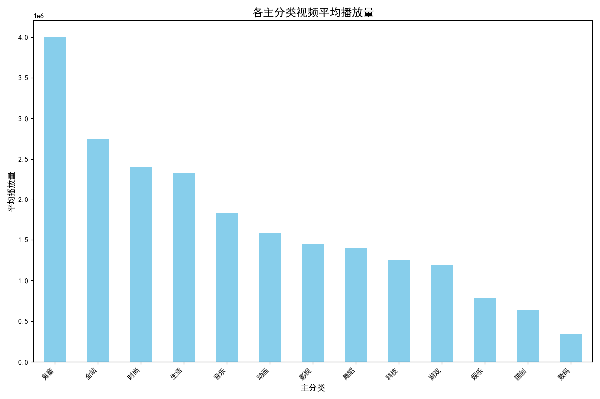
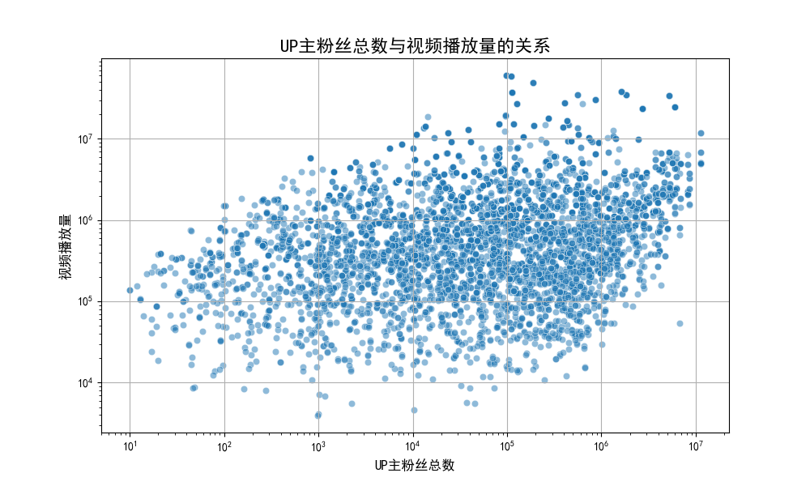
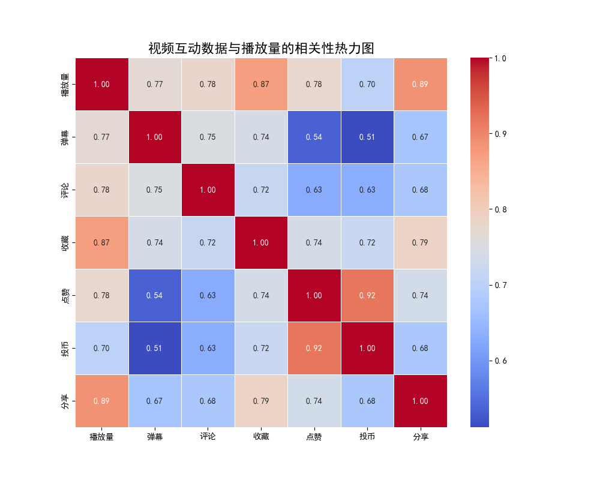

# 新手UP主如何打造爆款视频？——B站月榜数据深度分析报告

作为一名新晋UP主，你是否渴望自己的视频能够一鸣惊人，迅速在B站走红？本报告通过对B站月榜数据的深度挖掘，为你揭示爆款视频背后的秘密，并提供切实可行的创作策略。

## 核心洞察

- **内容为王**：粉丝量与播放量仅有弱相关性，优质内容是突破粉丝壁垒、实现爆款的关键。
- **赛道选择至关重要**：“知识”、“游戏”和“生活”区是热门视频的摇篮，而一些小众分区则可能隐藏着蓝海机遇。
- **互动数据是关键**：在众多互动指标中，“收藏”和“投币”与播放量的相关性最高，是衡量视频潜力的重要风向标。

---

## 1. 如何选择视频赛道？热门与机遇并存

选择一个好的赛道是成功的一半。我们对月榜上各视频主分类的平均播放量和上榜视频数量进行了分析。

**图1分析：** 从平均播放量来看，**知识区**以绝对优势高居榜首，成为最容易诞生千万级播放量爆款的领域。紧随其后的是**游戏**、**生活**和**动画**区，这些领域的头部视频也拥有巨大的流量潜力。

**图2分析：** 从上榜视频数量来看，**游戏区**内容产出最为活跃，竞争也最为激烈。**生活**、**知识**、**鬼畜**和**动画**区同样是热门赛道，拥有庞大的观众基础和创作群体。

**给新手的建议：**
- **追求爆款**：如果你具备专业知识背景或独特的创意，**知识区**是打造现象级爆款的首选。
- **稳健发展**：**生活区**和**游戏区**虽然竞争激烈，但用户基数大，需求稳定，通过差异化和高质量内容仍能脱颖而出。
- **寻找蓝海**：对于像“舞蹈”、“影视”、“音乐”等分区，虽然平均播放量和上榜数量不占优，但这可能意味着竞争压力较小，新UP主更容易在垂直领域建立自己的影响力。

---

## 2. 粉丝少就不能火吗？内容质量才是硬道理

很多新人UP主担心自己粉丝少，视频没人看。我们的数据显示，这种担心是不必要的。

**图3分析：** 散点图显示，UP主的粉丝总数与视频播放量之间存在正相关，但关系较弱（相关系数仅为0.14）。许多粉丝数不高的UP主同样创作出了播放量惊人的热门视频。

**给新手的建议：**
- **专注内容创作**：不要过分焦虑于初期的粉丝增长。将所有精力投入到打磨视频的创意、脚本、画面和剪辑上。只要你的内容足够出色，平台算法和观众的口碑会帮助你实现传播。
- **从“小而美”做起**：在粉丝基础薄弱时，专注于服务好一小部分核心观众，通过高质量内容建立起最初的口碑和社区氛围。

---

## 3. 哪些互动数据最“值钱”？

播放、点赞、投币、收藏... 哪些数据更能代表一个视频的潜力？我们通过相关性分析找到了答案。

**图4分析：** 热力图清晰地显示，在所有互动指标中，**收藏数**（与播放量相关性0.81）和**投币数**（相关性0.79）是与播放量关系最紧密的两个指标。其次是**点赞**（0.76）和**分享**（0.74）。

**给新手的建议：**
- **引导收藏和投币**：在视频中（例如片尾或简介区），可以更明确地引导观众进行“一键三连”，并着重强调“收藏”和“投币”的重要性。例如，“如果觉得内容对你有帮助，一定要收藏起来慢慢看哦！”
- **创作“值得收藏”的内容**：制作知识干货、实用教程、深度盘点、精彩集锦等具有高信息密度和复看价值的内容，天然更容易获得观众的收藏。
- **关注核心指标**：在分析自己的视频数据时，要重点关注“播放-收藏率”和“播放-投币率”，这些指标更能反映你的内容是否真正打动了观众。

## 总结

对于新手UP主而言，打造爆款视频并非遥不可及。成功的关键在于：

1.  **精心选择赛道**：在热门领域中寻找差异化，或在潜力领域中深耕细作。
2.  **坚持内容为王**：相信优质创意的力量，它能超越粉丝数的限制。
3.  **重视核心互动**：创作有价值、值得反复观看的内容，并有效引导观众进行收藏和投币。

希望这份报告能为你提供有价值的参考，祝你在B站的创作之路上一帆风顺，早日做出属于自己的爆款！
