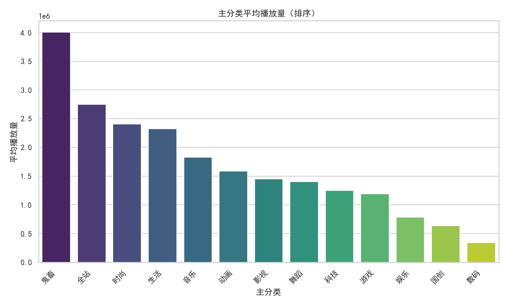
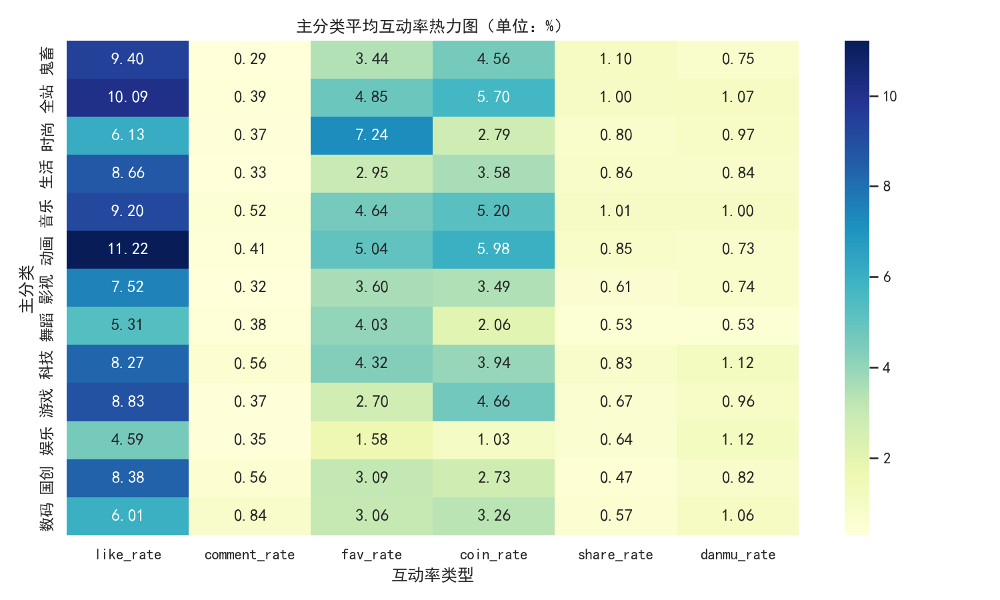
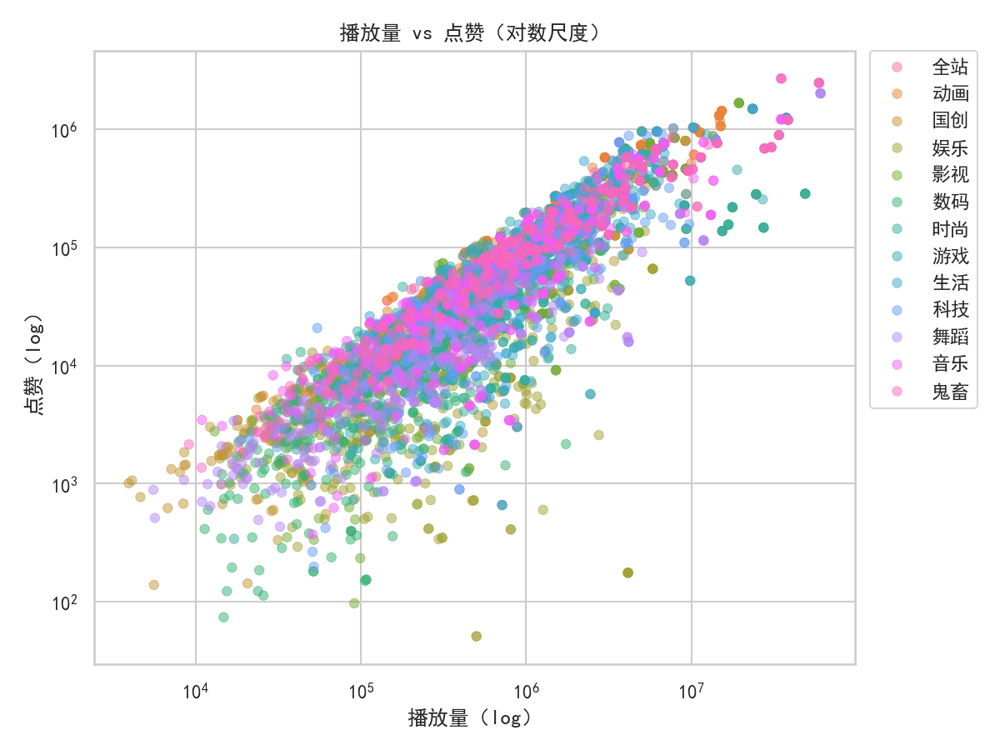
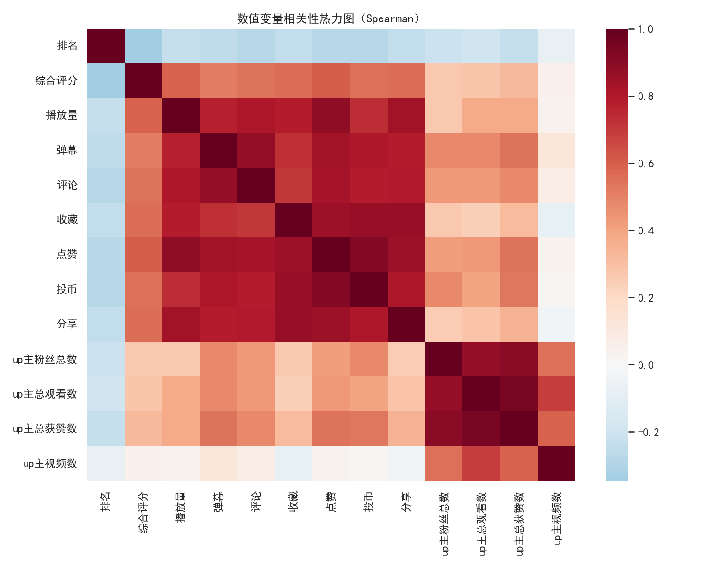
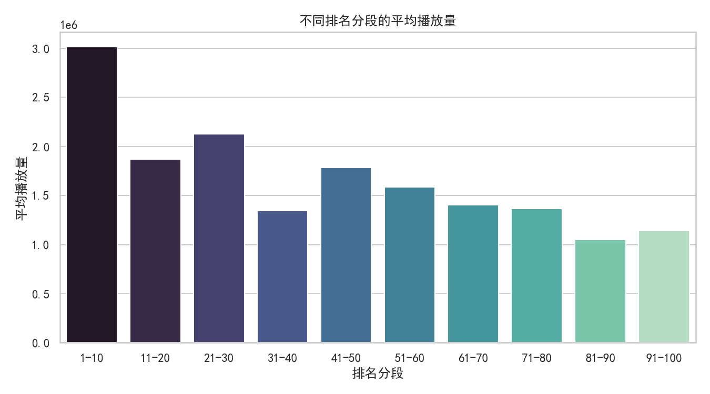
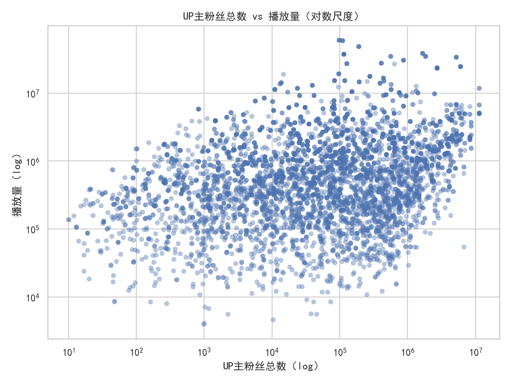

# B站月榜单数据洞察：新UP主怎样做视频更容易火

以下分析基于数据库 dacomp-014.sqlite（5200条月榜样本，主表“工作表1”）。报告聚焦于“什么内容更容易上榜并取得更高播放/互动”，并提出可执行的创作与运营策略。

为确保可视化中文字显示正常，绘图时使用了如下设置（已在代码中应用）：
```python
plt.rcParams['font.sans-serif'] = ['SimHei']
plt.rcParams['axes.unicode_minus'] = False
```

一、核心发现（用一句话版）
- 想更容易火：抓住高分享与高点赞的赛道与结构。类别上“鬼畜”拥有最高平均播放量；“动画/全站/音乐”在点赞、投币与分享率上表现突出；“时尚”在收藏率上显著。比起粉丝体量，视频层面的点赞、分享、评论等互动信号与播放量的相关性更高，应优先设计驱动互动的内容结构与话术。

二、总体规模与上限
- 样本总量：5200
- 平均播放量：1.69百万
- 最高播放量：6057万+
- 人均点赞：109,309；人均投币：65,187；人均分享：19,701

三、哪些主分类更容易高播放/高互动
- 结论1：从平均播放量看，“鬼畜”>“全站”>“时尚”>“生活”>“音乐”。这意味着抓住“强节奏、强梗、易二创扩散”的内容更容易做大播放。
- 结论2：从互动率看，“动画”在点赞率、投币率名列前茅，“鬼畜/音乐/全站”在分享率靠前，“时尚”在收藏率显著高。这些差异体现了不同品类的“用户动机”——例如，时尚类偏“收藏回看”，动画/全站偏“点赞投币”，鬼畜/音乐偏“转发传播”。

配图：
- 主分类平均播放量（更容易做大播放的赛道）见图：主分类_平均播放量.png
- 主分类互动率热力图（点赞/投币/分享/收藏等）见图：主分类_互动率热力图.png

图片：



四、什么指标最能推动播放量（诊断性）
- 播放量与关键指标的Spearman相关性（由高到低）：
  - 点赞 0.88、分享 0.84、评论 0.81、收藏 0.79、弹幕 0.78、投币 0.74
  - 综合评分 0.59
  - up主粉丝总数 0.27（显著低于互动信号）
  - 排名 -0.23（排名越前播放越高，负相关）
- 解读：平台放大机制更青睐“内容层面的互动反馈”（尤其点赞与分享），粉丝体量当然有帮助，但不是决定性因素。对新手UP主而言，优先设计能高效触发点赞、分享、评论的话术和镜头语言，比一味追求涨粉更快拿到播放增量。

配图：
- 播放量 vs 点赞（对数散点）：呈近线性关系（log-log），互动越强，播放越高
- 数值变量相关性热力图：互动指标整体与播放呈强相关，高于“粉丝体量”

图片：



五、排名与“滚雪球效应”
- 将榜单排名划分为1–10、11–20……91–100分段，平均播放量呈阶梯式下降。头部区间播放显著更高，说明早期互动表现越好，越容易被算法和用户进一步放大，形成“滚雪球”。
- 启示：发布初期的“互动爆发”（前3–24小时）至关重要，需集中火力做首发动员。

图片：


六、粉丝体量与播放量：相关但不是“生死线”
- up主粉丝总数与播放量的相关性仅约0.27；log-log散点显示虽然正相关，但离散度大。
- 启示：新UP主同样有机会凭“高互动结构”打穿冷启动壁垒；内容质量与互动设计是更高杠杆。

图片：


七、细分维度的可操作洞察（按互动动机设计内容）
- 为了“扩散”（提升分享率 share_rate）：
  - 高分享率类别：鬼畜、音乐、全站、生活、动画
  - 策略：热点二创/混剪、强反差/强节奏、梗图/神曲钩子、结尾留转发理由（比如“转给XX看”“收藏这段神操作”）
- 为了“点赞/投币”（提升like_rate/coin_rate）：
  - 高点赞/投币类别：动画、全站、音乐、游戏、鬼畜
  - 策略：叙事递进+情绪峰值（上扬点就卡点），埋设“爽点”“戳点”，中段/结尾用一句明确CTA引导点赞/投币
- 为了“收藏”（提升fav_rate）：
  - 高收藏类别：时尚最高（7.24%），其次动画、全站、音乐、科技
  - 策略：制作“可复用/可回看”的干货，如清单、技巧大全、穿搭模板、参数表、软件预设；配图文总结/时间戳，降低二次回看成本
- 为了“讨论”（提升comment_rate）：
  - 高评论类别：数码、国创、科技、音乐、动画
  - 策略：在内容里抛出争议点/选择题（A/B）、征集观点、FAQ答疑；评论区置顶引导补充资料或投票

八、针对新UP主的“爆款打法”清单（规范性建议）
1) 选题与赛道
- 优先进高传播赛道：鬼畜/全站/动画/音乐
- 若擅长干货：时尚（追求收藏）、科技/数码（追求评论与收藏）
- 结合热点与垂类：全站热点+本垂类视角（“全站”二创）能借势放大

2) 结构与节奏（提升互动的内容工程）
- 开头3–5秒必须建立“钩子”：强反差、金句、爆点预告
- 中段每20–40秒设置一个“高潮点/信息浓度峰值”，并与音乐节拍或镜头运动卡点
- 结尾给出明确CTA（不同赛道用不同话术）：
  - 扩散向：如果有被XX困扰/喜欢XX就分享给他
  - 收藏向：本视频含完整参数表/模板，收藏随时复用
  - 点赞/投币向：下期做XX/开源工程/放出素材包，点赞达X解锁

3) 首发运营（放大早期互动，冲榜关键）
- 预热：封面+标题两版A/B测试，小样本先投放再定版
- 首发后2小时内积极互动：置顶评论引导、及时回复高赞评论、补充材料
- 合作/互推：与同赛道UP互换片尾卡/合集，提高冷启动基础流量
- 选时：用户在线高峰发布（结合你账号历史数据观察）以放大早期权重

4) 包装与分发
- 标题：关键词+价值点+题眼（如“3分钟掌握XX”“XX最强模板”）
- 封面：强对比/强主体/少字大字；避免信息拥堵
- 标签与主分类：与你的视频实际内容强匹配，选择在该维度互动率高的类别；减少“错配”导致的推荐损耗

5) 追踪与迭代（数据驱动）
- 每条视频至少追踪：like_rate、share_rate、fav_rate、comment_rate、coin_rate、前24小时互动曲线
- 基准线（从本数据集提炼）：
  - 分享率：鬼畜/音乐/全站约1%量级属于优良；若低于0.5%需优化传播钩子
  - 点赞率：动画/全站/鬼畜≈9–11%是高水平；若不足5%需调整内容节奏与情绪峰值
  - 收藏率：时尚≈7%极具优势；若你做干货类但<3%，说明可复用价值呈现不足
- 做“模板化”复盘：把爆款结构拆成模板，不断重复迭代

九、关注人群与身份要素
- up主性别分组上，平均播放差异不及内容互动强度重要；“认证”样本中虽能看到若干头部账号播放极高，但整体证据仍指向：高互动结构比身份标签更能推动扩散（对新手尤为如此）。

十、避坑与边界
- 切勿过度追求单一指标（例如只要投币/只要收藏），要兼顾“点赞+分享”的扩散引擎与“收藏/评论”的深度粘性
- 不要“错配分类/标签”，会削弱推荐效果
- 保持信息密度与节奏；低密度长视频在冷启动期劣势明显

附：本次分析的关键可视化
- 主分类_平均播放量.png
- 主分类_互动率热力图.png
- 播放量_vs_点赞_散点.png
- 相关性热力图.png
- 排名分段_平均播放量.png
- 粉丝数_vs_播放量.png

最后的行动建议小结
- 如果你能做强节奏、强梗的内容：优先鬼畜/全站/音乐；核心是“可转发性”和卡点结构
- 如果你做知识/技巧类：优先时尚/科技/数码；核心是“可复用性”和收藏理由
- 所有视频：在开头布局“钩子”，在中段设置“峰值”，在结尾给出明确CTA，并把首发2–24小时的互动做满。只要你的点赞率、分享率显著高于基准，就更有机会在月榜上冲高并破圈。
