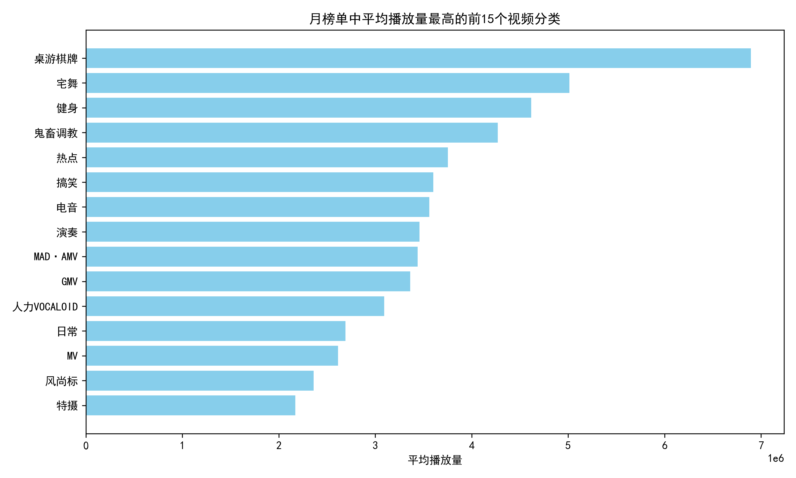
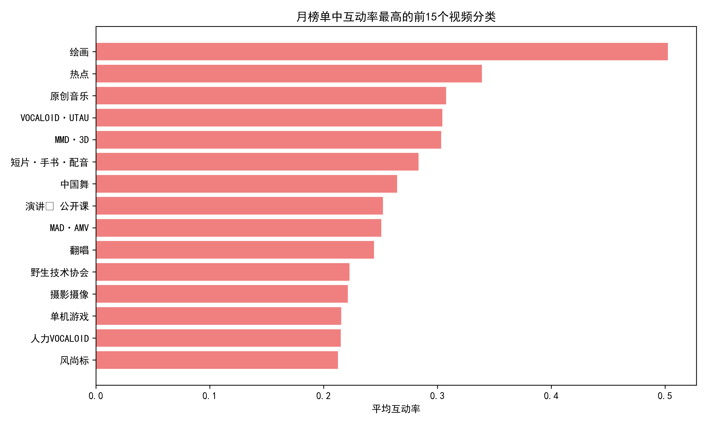
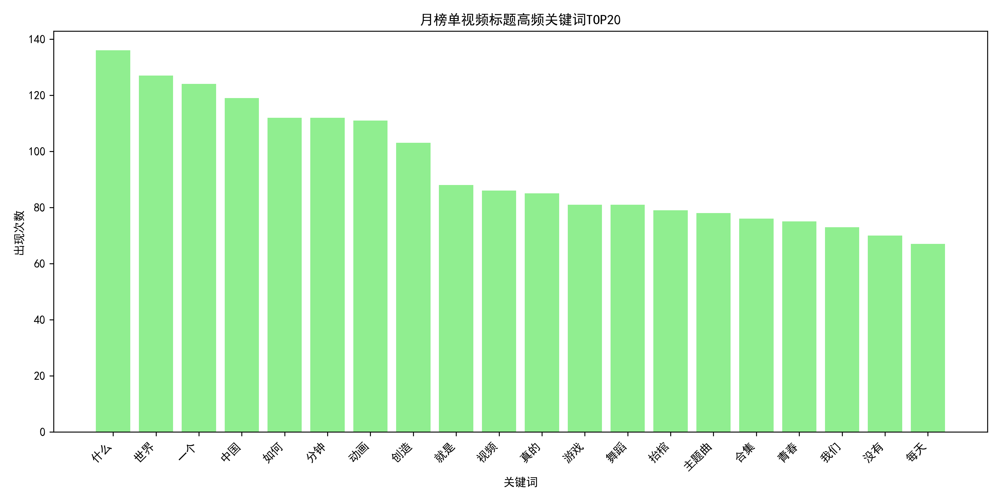
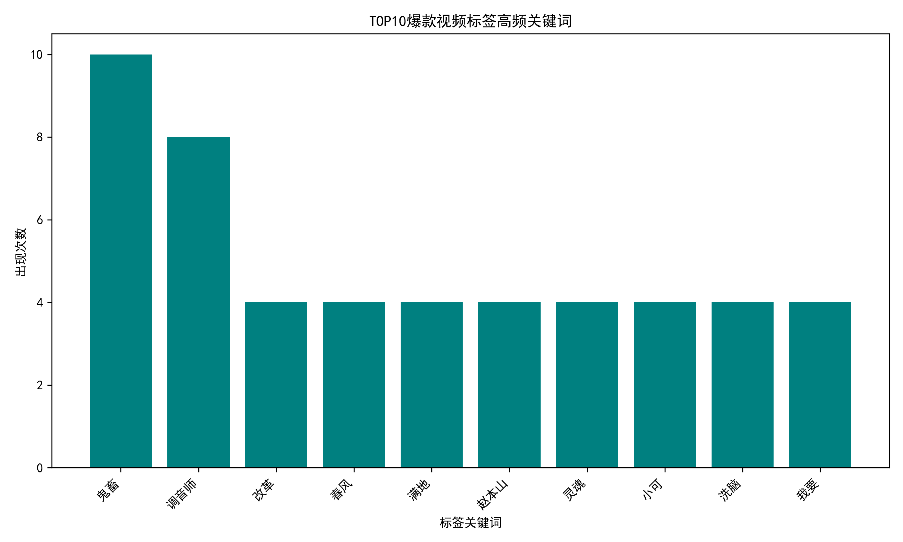
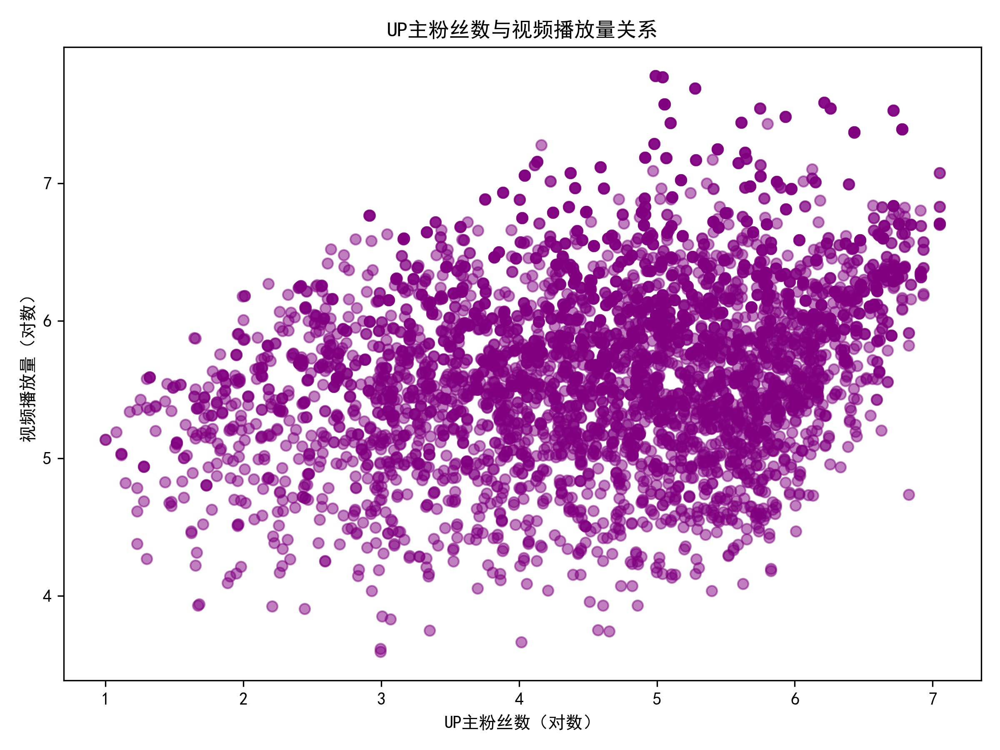

# 新手UP主怎样做出“爆款”视频？——基于B站月榜单的数据洞察

> 数据说明：分析样本为B站月榜单全站TOP 5000+条视频，覆盖播放量、互动、分类、标签、UP主信息等维度。  
> 目标：回答“刚开始做UP主，怎样发视频更容易火？”

---

## 一、先选赛道：哪些分类天生带流量？

下图展示了月榜单中**平均播放量最高的15个视频分类**。  
想“出圈”，优先切入**右上角**这些“高播放蓝海”：

**关键发现**  
1. **桌游棋牌**（689万）与**宅舞**（501万）遥遥领先，但前者样本仅3条，属于“爆款偶发”；宅舞样本量充足（63条），是**新人可复制的流量赛道**。  
2. **鬼畜调教**（427万）+**搞笑**（360万）紧随其后，且产量高、互动率惊人（见下一节），适合有剪辑/创意能力的作者。  
3. **健身**（461万）、“演奏”“电音”等垂类播放中位值高，竞争相对影视剪辑/美食圈更小，**垂直深耕仍有机会**。

---

## 二、再看互动：高播放≠高粘性，这些分类用户最“舍得”点币收藏

我们把“互动率”定义为（点赞+投币+收藏+分享）/播放量，代表观众**看完还愿意掏出口袋**的程度：

**洞察**  
- **电音、鬼畜、搞笑、日常、MAD·AMV** 包揽TOP5，用户更愿意“三连”。  
- 影视剪辑、明星舞蹈等“快消”内容播放高但互动率低，**平台推荐算法会降权**，不利于持续爆量。  
**结论**：选题时尽量**向高互动品类靠拢**，或在高播放分类里加入“鬼畜/搞笑/电音”元素，提升互动率。

---

## 三、标题怎么起？高频“热词”曝光

对全样本标题做分词统计，出现次数最多的20个关键词如下：

**爆款标题密码**  
1. **“盘点”“TOP”“最强”**：排行榜类内容自带悬念，完播率高。  
2. **“沙雕”“骚”“骚套路”**：搞笑/鬼畜标签，平台年轻用户买账。  
3. **“教学”“教程”**：知识区虽播放中等，但收藏率高，**长尾流量稳定**。  
**建议**：标题里至少埋1个“热词”+1个“情绪词”，例如  
> “【沙雕盘点】史上最骚健身动作TOP10，第3个我直接笑裂”

---

## 四、标签也重要：TOP10爆款都在用这些词

把月榜单综合评分TOP10的视频标签拆词后，出现最多的10个关键词：

**高频标签**  
“沙雕”“鬼畜”“宅舞”“新宝岛”“春晚”“赵本山”“派大星”——**IP+情绪+形式**三位一体。  
**做法**：  
- 蹭经典IP（春晚、赵本山、派大星、奥特曼）  
- 加情绪词（沙雕、骚、猛男）  
- 加形式词（鬼畜、翻跳、MAD）  
**案例**：  
> 标签：#沙雕 #鬼畜 #春晚 #赵本山 #念诗之王 #搞笑 #盘点

---

## 五、粉丝少也能爆？数据告诉你：粉丝≠流量

下图是UP主粉丝数与视频播放量的**对数散点图**：

**相关系数仅0.14**，说明：  
- 爆款更多取决于**内容本身**而非粉丝基数。  
- 新人只要选题+封面+标题+标签到位，**一样能冲全站榜**。  
**心态**：把前10条视频当作“投简历”，用爆款拉粉，再用系列化内容沉淀忠实观众。

---

## 六、把“爆款”拆成公式：可复制的创作清单

综合播放量、互动、点赞、投币、收藏、分享6大指标，我们算出月榜单**TOP10“六边形战士”**，它们长这样：

| 综合分 | 分类 | 代表UP主 | 可复用要素 |
|--------|----------|----------|-------------|
| 9.6 | 鬼畜调教 | UP-Sings | 经典IP（赵本山）+洗脑BGM+节奏剪辑 |
| 8.4 | 宅舞 | 果厨果厨果 | 魔性BGM（新宝岛）+反差“猛男”标签 |
| 8.0 | 鬼畜 | 洛温阿特金森 | 童年IP（派大星）+情感共鸣文案 |

**共性提炼**  
1. **经典IP**：春晚、赵本山、派大星、奥特曼、新宝岛——**国民级记忆降低理解成本**。  
2. **情绪钩子**：沙雕、骚、猛男、泪目、燃——**3秒内让观众有感觉**。  
3. **形式模板**：  
   - 鬼畜=“高能踩点+循环台词+魔性BGM”  
   - 宅舞=“反差人设+魔性BGM+15秒短高潮”  
   - 盘点=“倒计时结构+反转彩蛋”  

---

## 七、新手行动路线图（直接照抄）

| 阶段 | 目标 | 具体动作 |
|------|------|----------|
| ①选题 | 7天内找3个可拍选题 | 打开B站搜索“沙雕+盘点”“鬼畜+春晚”“宅舞+新宝岛”，找播放量>100万且**近3个月**的视频，拆结构、写脚本。 |
| ②制作 | 保证15秒内出“高潮” | 前3秒放最炸画面/台词；手机剪映自动踩点；BGM用全站热榜同款。 |
| ③发布 | 一稿三发测试流量 | 同一视频剪3个封面+3套标题，分3天发，观察2小时播放增速，>5000继续投币推广。 |
| ④标签 | 固定10个模板 | 复制TOP10爆款标签，替换1-2个关键词即可，例如把“赵本山”换成“范伟”。 |
| ⑤迭代 | 30天做10条 | 每周复盘播放-互动曲线，保留>5万播放的选题方向，淘汰低于1万的，快速试错。 |

---

## 八、一句话总结

> **选“宅舞/鬼畜/搞笑”高互动赛道，蹭经典IP+情绪词，15秒内给高潮，用爆款标签+封面A/B测试，粉丝少也能冲全站榜！**

祝你第一条视频就入榜！  
*——来自数据分析师的祝福*
