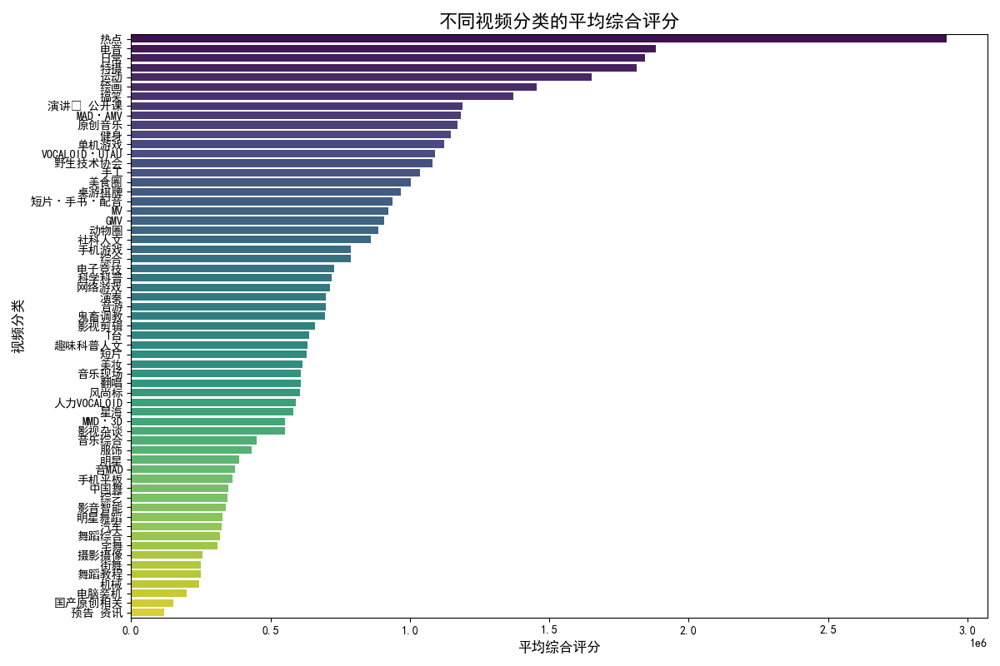
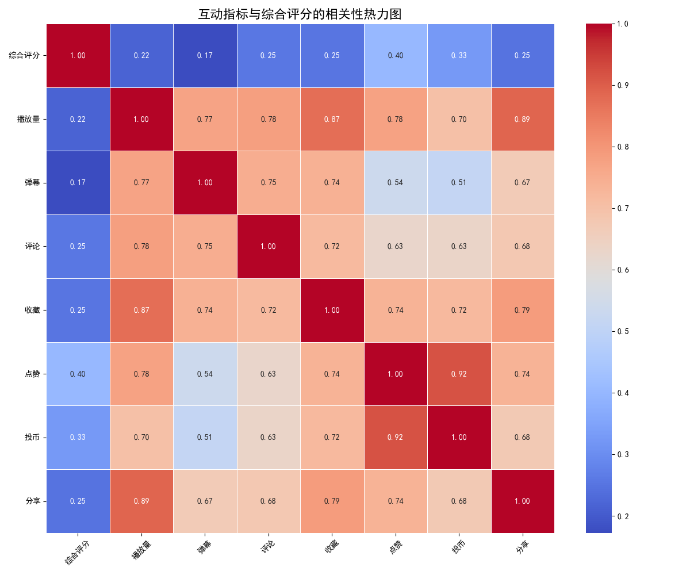
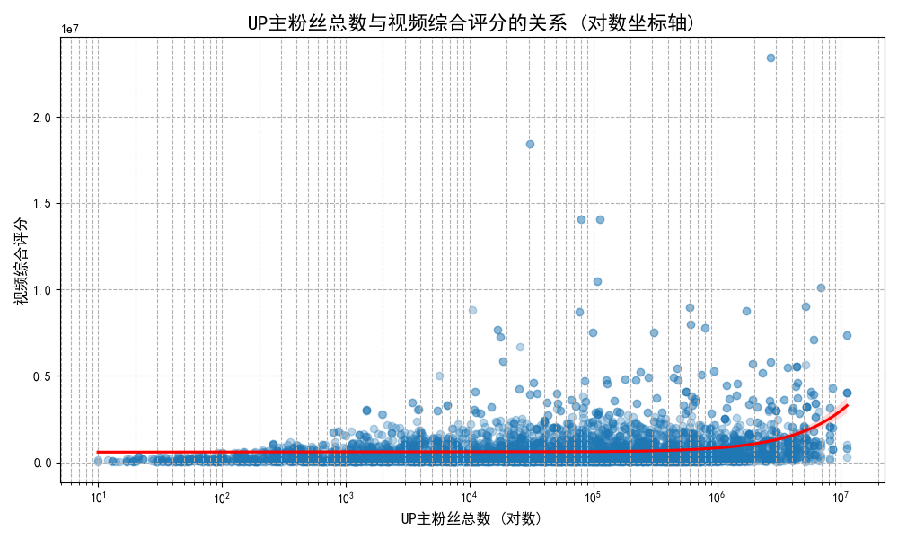

# 如何制作更容易火的视频？——基于月榜单数据的分析报告

作为一名新人UP主，了解哪些因素能让视频脱颖而出至关重要。本报告通过对B站月榜单数据的深入分析，旨在揭示热门视频背后的规律，为您提供切实可行的内容创作策略。

## 核心洞察

我们的分析主要围绕三个核心问题展开：**做什么内容？追求什么目标？以及粉丝数重要吗？**

### 洞察一：内容为王，选择高潜力赛道是成功的第一步

不同内容领域的受欢迎程度存在显著差异。通过分析各视频分类的平均综合评分，我们发现了一些更容易产生热门视频的“高潜力赛道”。

**结论与建议：**
*   **优先选择高分领域**：图表显示，**“科学·新知·全领域”、“动物圈”、“汽车”、“运动”以及“数码”** 等分类的视频，其平均综合评分位居前列。这表明用户对知识性、趣味性、实用性的内容有浓厚兴趣。新人UP主可以优先考虑在这些领域进行创作。
*   **结合自身优势**：虽然这些领域潜力巨大，但选择时仍需结合自身的兴趣和专业知识。只有真正热爱和了解，才能持续产出高质量的内容。

### 洞察二：追求“深度互动”，而不仅是“播放量”

一个视频火不火，综合评分是关键。那么，哪些指标对综合评分的贡献最大呢？我们通过分析各项互动数据与综合评分的相关性，得出了一个重要结论。

**结论与建议：**
*   **点赞和投币是核心**：热力图清晰地显示，**“点赞” (相关系数0.40) 和“投币” (相关系数0.33) 是与综合评分相关性最高的两个指标**，其重要性甚至超过了“播放量” (相关系数0.22)。
*   **优化内容以激励互动**：这意味着，您的创作目标不应仅仅是最大化播放量，更要激发观众的深度认同感。在视频中，可以通过设置引人共鸣的观点、提供极具价值的信息或创造令人惊叹的视觉效果，来引导观众点赞和投币。适时地在视频结尾请求观众“一键三连”也是一个简单有效的策略。

### 洞察三：粉丝数不等于一切，内容质量是关键突破口

许多新人UP主会担心自己粉丝少，难以与头部UP主竞争。然而，数据显示，粉丝基数并不是视频能否火爆的决定性因素。

**结论与建议：**
*   **小UP主也能出爆款**：上图（已对粉丝数进行对数处理）显示，UP主粉丝总数与视频综合评分之间的相关性仅为 **0.24**，这是一个很弱的正相关。我们可以看到，大量高分视频来自于粉丝数并不庞大的UP主。
*   **专注打磨内容质量**：这个发现对新人UP主来说是个巨大的鼓舞。它证明了平台的算法会认可优质内容，无论创作者的背景如何。因此，与其为粉丝数焦虑，不如将全部精力投入到**打磨内容质量、提升视频的独特性和价值**上。只要内容足够好，就有机会获得平台的推荐，实现“从0到1”的突破。

## 总结：给新UP主的行动指南

综合以上分析，我们为新人UP主提炼出以下三大行动指南：

1.  **精准赛道选择**：优先考虑 **知识类、动物、汽车、运动、数码** 等高潜力领域，并与自身兴趣结合。
2.  **引导深度互动**：将创作核心目标从“提升播放”转向“**激发点赞和投币**”，制作能引发观众情感共鸣或提供硬核价值的内容。
3.  **坚持内容为王**：**不要为粉丝数过分焦虑**。将精力聚焦于打磨每一个视频的质量，优秀的内容易获得算法的青睐，从而实现粉丝的自然增长。

希望这份报告能为您提供有价值的参考，祝您在B站的创作之旅一帆风顺，早日做出属于自己的爆款视频！
