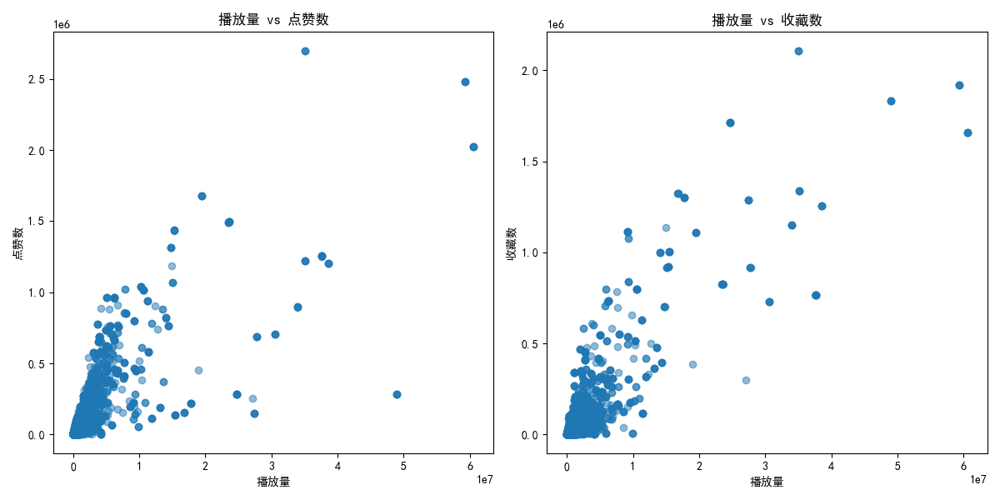

# 视频播放量分析报告

## 概述
我分析了视频播放量与互动指标（点赞、收藏等）之间的关系，以帮助UP主更好地了解如何制作热门视频。

## 分析
### 播放量相关性分析
播放量与各指标之间的相关性如下：
- 收藏：0.87
- 点赞：0.78
- UP主粉丝总数：0.14
- UP主视频数：0.02

收藏数与播放量之间的相关性最强。这表明视频被收藏的频率越高，其播放量也越高。点赞和收藏具有正相关关系，但它们对播放量的贡献不同。

### 图表分析

从图表可以看出：
- 播放量与点赞数之间存在正相关，但分布较为分散。
- 播放量与收藏数之间的关系更加集中，表明收藏可能是播放量的更强预测指标。

## 结论和建议
根据相关性分析：
### 播放量与收藏高度相关
视频的收藏数是播放量的关键驱动因素，因此UP主应该：
- 制作可回看性强、内容有深度的视频，以吸引观众收藏。
- 可以通过引导观众收藏（例如在视频结尾提示“喜欢的话记得收藏哦！”）来增加收藏率。

### 点赞数是次要驱动因素
虽然点赞数也与播放量正相关，但影响不如收藏数显著。UP主可以：
- 通过互动内容或话题，激发观众的点赞行为，例如使用投票、提问等技巧。

### 建议
1. 重视视频内容质量，提高收藏率。
2. 制作系列视频，从而增加观众对UP主视频的收藏倾向。
3. 通过引导观众点赞收藏，进一步提升视频曝光度。

最终建议：**收藏数是播放量的核心预测因素，优化视频内容以提高收藏率是最关键的策略。**
