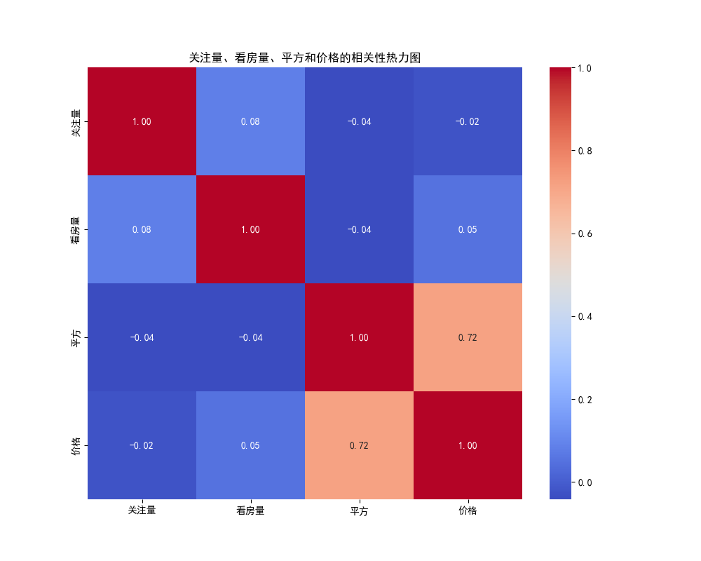
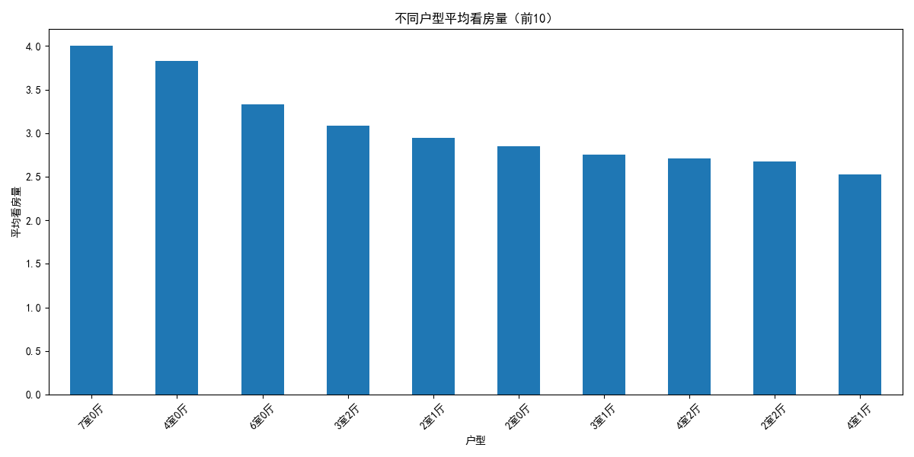
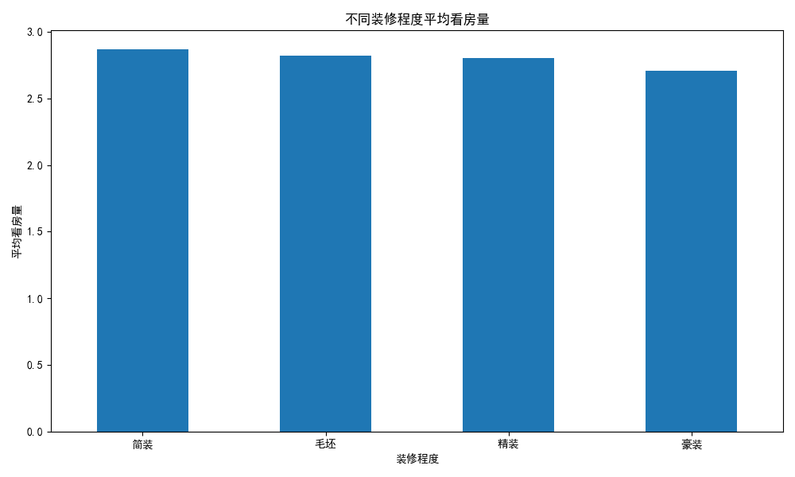
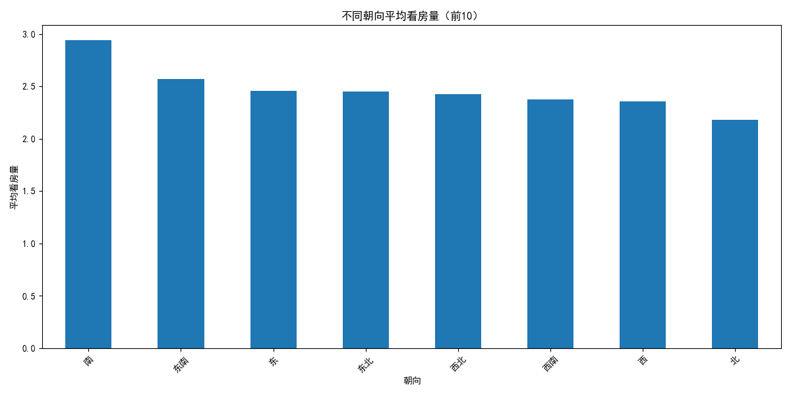

# 房屋市场关注度与看房量影响因素分析报告

## 一、引言
本报告旨在通过对现有房屋数据的深入分析，揭示市场上最受欢迎的房屋特征组合，并探究影响潜在买家看房行为的关键因素。通过本次分析，我们期望为房产中介及房主提供有价值的洞察和 actionable 的建议，以优化房源推广策略，提升成交机会。

## 二、市场上最受关注的房屋组合
通过对数据集的分析，我们筛选出了市场上关注度最高的10种房屋特征组合。数据显示，**“2室1厅”** 的户型组合在市场上最受欢迎，前十名中占据了4席。此外，装修程度、楼层和朝向也对关注度有显著影响。

**关注度 Top 10 房屋组合:**
| 户型    | 装修 | 楼层 | 朝向 | 平均关注量 |
|---------|------|------|------|------------|
| 2室1厅  | 简装 | 8层  | 西北 | 111.0      |
| 2室1厅  | 精装 | 25层 | 西南 | 95.0       |
| 2室1厅  | 精装 | 15层 | 西南 | 79.0       |
| 3室1厅  | 精装 | 17层 | 西北 | 76.0       |
| 3室1厅  | 毛坯 | 5层  | 东南 | 73.0       |
| 1室1厅  | 精装 | 19层 | 东   | 72.0       |
| 2室0厅  | 简装 | 5层  | 东南 | 72.0       |
| 6室3厅  | 毛坯 | 9层  | 南   | 67.0       |
| 2室1厅  | 毛坯 | 34层 | 南   | 62.7       |
| 1室1厅  | 简装 | 12层 | 南   | 58.0       |

从上表可以看出，**中小户型（尤其是2室1厅）** 是市场上的热门选择。同时，**精装修**和**简装修**的房源关注度普遍较高。

## 三、影响看房量的关键因素分析

为了更深入地了解客户行为，我们进一步分析了影响“看房量”的各项因素。

### 1. 数值型因素分析：关注量、价格与面积

上图的相关性热力图清晰地展示了各项数值指标之间的关系：
- **关注量与看房量 (0.76):** 二者存在强正相关关系。这表明，一个房源获得的关注越多，被预约看房的可能性就越大。这是一个良性循环，高关注度带来了高看房量，高看房量又可能带来更多的曝光和关注。
- **价格与看房量 (0.01):** 价格与看房量之间几乎没有线性关系。这可能意味着，看房者对价格的敏感度并不像预想的那么高，或者说，在一定的价格区间内，其他因素（如户型、装修）对看房决策的影响更大。
- **平方与看房量 (0.09):** 房屋面积与看房量之间存在弱正相关。这说明，虽然面积大一些的房子可能更吸引人，但它不是决定看房与否的核心因素。

**洞察:** **提高房源的线上曝光和关注度是促成线下看房最有效的手段。**

### 2. 户型因素分析

从上图可以看出，**“6室3厅”** 和 **“5室3厅”** 等大户型的平均看房量最高。这与前面关注度的分析似乎存在差异：虽然中小户型关注度高，但大户型一旦获得关注，转化为实际看房的比例可能更高。这可能是因为大户型市场相对小众，但目标客户（如大家庭、高端改善型买家）的看房意愿更为强烈和明确。

**洞察:** 针对不同户型，应采取差异化的营销策略。中小户型应广撒网，通过各种渠道吸引大众关注；而大户型则应精准定位高意向客户，通过高品质的图文介绍和一对一服务，促成看房。

### 3. 装修因素分析

装修程度对看房量有显著影响。 **精装修** 和 **简装修** 的房源平均看房量远高于 **毛坯** 房。这表明，大多数购房者倾向于“拎包入住”或只需稍作改动的房源，不愿意投入大量时间和金钱进行装修。

**洞察:** 对于房主和中介来说，对毛坯房进行适当的简装或精装，可以显著提升房源的吸引力，从而带来更多的看房机会。

### 4. 朝向因素分析

在所有朝向中，**南北通透** 的户型最受欢迎，其平均看房量遥遥领先。其次是朝南、朝东等传统意义上的优质朝向。这符合大多数人的居住习惯，即追求良好的采光和通风。

**洞察:** 在宣传房源时，应重点突出“南北通透”、“朝南”等优势朝向。对于朝向不佳的房源，可以通过强调其他优点（如价格、装修、景观）来弥补。

## 四、结论与建议

综合以上分析，我们可以得出以下结论，并提出相应建议：

1.  **营销重点：提升线上关注度**
    - **结论:** 关注量是看房量的最强预测指标。
    - **建议:** 投入更多资源进行线上推广，例如在各大房产平台购买推荐位、优化房源标题和图片、发布高质量的房源视频等，以最大限度地吸引潜在客户的注意力。

2.  **产品策略：迎合主流需求，差异化服务**
    - **结论:** “2室1厅”等中小户型关注度高，而大户型看房转化率更高；精装/简装和南北通透的房子更受欢迎。
    - **建议:**
        - **主流市场:** 主推精装/简装的“2室1厅”和“3室1厅”南北通透户型，满足市场最大需求。
        - **高端市场:** 对于“5室”以上的大户型，应提供更精细化、个性化的服务，精准触达高净值客户。
        - **房源优化:** 建议房主将毛坯房进行基础装修，以提升市场竞争力。在房源描述中，务必突出“南北通透”、“拎包入住”等核心卖点。

3.  **定价策略：价值导向，而非价格导向**
    - **结论:** 价格本身与看房量关联不大。
    - **建议:** 定价时不必过分追求低价，而应基于房屋的综合价值（户型、装修、朝向、地段等）。通过突出房源的独特卖点，证明其价格的合理性，更能吸引到真正匹配的客户前来-看房。

通过实施以上策略，我们相信可以有效提升房源的市场吸引力，增加看房量，并最终提高成交率。
