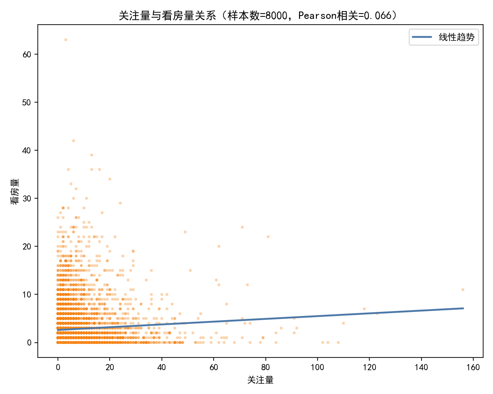
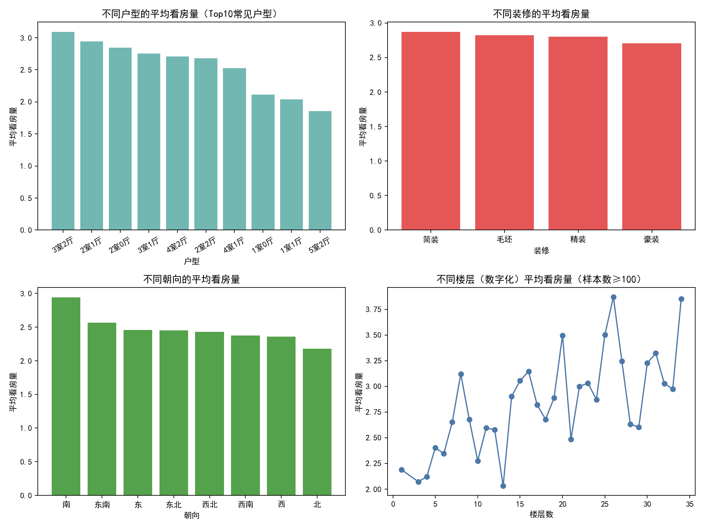
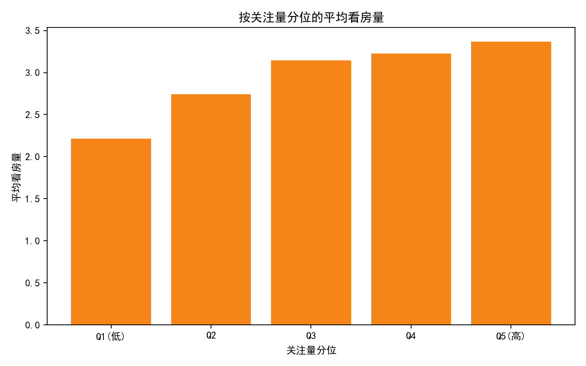

# 报告：户型×装修×楼层×朝向组合的关注量Top10与看房量影响因素分析

## 一、数据与目标
- 数据源：SQLite 表“数据”，共 29975 条。
- 关键字段：
  - 户型（文本）
  - 装修（文本）
  - 楼层（文本，如“7层”，“18层”）
  - 朝向（文本，如“南”、“东南”等）
  - 关注量（整数）
  - 看房量（整数）
- 目标：
  1) 找出“户型×装修×楼层×朝向”组合中，市场关注量较高的前10个组合。
  2) 研究哪些因素会显著影响看房量，并给出可操作建议。

备注：为保证结果稳健性，我们在计算组合Top10时要求样本数 n≥50。

## 二、方法与可视化
- 使用SQL进行分组聚合，计算“组合的平均关注量Top10”和各类别的平均看房量。
- 使用Python绘图，图像保存在当前目录：
  - top10_attention_combos_bar.png
  - view_vs_attention_scatter.png
  - avg_views_by_category.png
  - views_by_attention_quantile.png

为保证中文显示与负号正常显示，绘图代码中包含以下设置：
```python
plt.rcParams['font.sans-serif'] = ['SimHei']
plt.rcParams['axes.unicode_minus'] = False
```

关键可视化如下：
- 组合关注量Top10柱状图：top10_attention_combos_bar.png
- 关注量与看房量关系散点图：view_vs_attention_scatter.png
- 不同类别的平均看房量对比（户型/装修/朝向/楼层）：avg_views_by_category.png
- 按关注量分位的平均看房量：views_by_attention_quantile.png

图片：
- 
- 
- 
- 

## 三、结果与洞察

### 1) 组合的平均关注量Top10（样本数≥50）
根据我们导出的 top10_attention_combos.csv，Top10组合及其关键指标（取部分示例）：
- 1室1厅×精装×7层×南：n=57，平均关注量=8.74，平均看房量=2.11
- 3室1厅×简装×6层×南：n=234，平均关注量=8.39，平均看房量=3.51
- 2室2厅×精装×15层×南：n=77，平均关注量=8.31，平均看房量=3.66
- 3室2厅×简装×7层×南：n=202，平均关注量=8.20，平均看房量=2.71
- 3室1厅×简装×5层×南：n=62，平均关注量=8.19，平均看房量=3.27
- 3室2厅×简装×15层×南：n=54，平均关注量=8.17，平均看房量=3.67
- 3室1厅×简装×7层×南：n=218，平均关注量=8.09，平均看房量=3.03
- 3室2厅×精装×21层×南：n=94，平均关注量=7.55，平均看房量=2.35
- 3室2厅×简装×17层×南：n=79，平均关注量=7.41，平均看房量=3.35
- 2室2厅×简装×6层×南：n=183，平均关注量=7.39，平均看房量=2.75

总体特征：
- “南向”在Top10组合中占据绝对主导，说明南向显著提升关注度。
- 户型以“2-3室”为主，且“简装/精装”均能进入Top10；其中简装在多个组合中表现不俗，可能因“性价比”吸引更广泛用户。
- 楼层分布集中在中高层（5-21层），但也有中低层（如5层、7层）组合表现突出，暗示楼层与关注的关系并非单调。

### 2) 看房量的影响因素分析
我们分别从户型、装修、朝向、楼层四个维度，考察平均看房量（已在 avg_views_by_category.png 中可视化，同时下方列出关键数值）：

- 户型（样本数≥100）：
  - 3室2厅：平均看房量=3.09（n=12305）—最高
  - 2室1厅：2.95（n=3668）
  - 2室0厅：2.85（n=185）
  - 3室1厅：2.76（n=1542）
  - 4室2厅：2.71（n=5089）
  - 1室1厅：2.04（n=1157）、1室0厅：2.12（n=224）
  - 结论：以家庭居住为主的“3室2厅”明显更受看房端欢迎；一居产品看房量偏低。

- 装修：
  - 简装：2.87（n=9002）—最高
  - 毛坯：2.82（n=2780）
  - 精装：2.80（n=17903）
  - 豪装：2.71（n=287）
  - 结论：看房端更偏好“简装/毛坯”的可改造空间与性价比。精装虽提升关注，但未必提升看房量。

- 朝向：
  - 南：2.94（n=23342）—最高
  - 东南：2.57；东：2.46；东北：2.45；西北：2.43；西南：2.37；西：2.36；北：2.18
  - 结论：“南向”具有显著优势；西/北向劣势明显。

- 楼层：
  - 高层更优：26层=3.87（n=1054）、34层=3.85（n=796）、25层=3.50（n=779）、20层=3.50（n=516）……
  - 中低层普遍偏低：如6层=2.34（n=4144）、5层=2.40（n=1158）、7层=2.65（n=3402）
  - 结论：看房端对高层偏好更强，可能由于视野、采光、噪音等综合体验较好；但需注意电梯条件、楼龄、消防与家庭结构（老人/小孩）等差异化需求。

### 3) 关注量与看房量的关系
- 整体相关性（Pearson）：0.0828（弱正相关），整体平均关注量=5.851，整体平均看房量=2.824。
- 按关注量分位的平均看房量：
  - Q1(低)=2.217，Q2=2.741，Q3=3.145，Q4=3.225，Q5(高)=3.368。
- 解读：
  - 虽线性相关系数偏低，但分位分析呈现“单调上升”，说明更高关注量总体上对应更高看房量，但关系受其他因素（价格、地段、户型结构、图片质量、文案、带看效率等）显著干扰。
- 结合散点图（view_vs_attention_scatter.png），数据点分布较为分散，线性趋势线正斜率但幅度小，提示需要从运营侧提升“关注→到店看房”的转化效率。

## 四、综合结论
- 市场关注量Top10组合高度集中在“南向”“2-3室”“简装/精装”“中高层”，尤其是“3室系”的简装/精装在南向与合适楼层的组合中表现最佳。
- 看房量的提升因素排序（综合考虑均值与样本规模）：
  1) 户型：3室2厅显著更高；
  2) 楼层：高层（20层以上）相对更高；
  3) 朝向：南向>东南>东>西/北；
  4) 装修：简装/毛坯略优于精装，豪装不占优势。
- 关注量与看房量存在弱正相关，但转化效率并不高；需要从运营和房源呈现侧改善。

## 五、可操作建议（规范性）
- 选品策略：
  - 加大“3室2厅、南向、中高层（20-34层）”房源的上架比例；优先推广“简装/毛坯”或“高性价比精装”的产品组合。
  - 针对Top10关注组合中看房量更高的案例（如 2室2厅×精装×15层×南、3室2厅×简装×15层×南），作为重点配置与推广模板。
- 上架与展示优化：
  - 强化南向、采光/视野、通风等优势的图文呈现；对高层房源突出视野与隔音优势。
  - 简装/毛坯类房源强调“可改造空间/总价更友好”的价值点，精准触达刚需与改善型客群。
  - 文案与图片质量：提升主图质量与户型图说明，增加细节标签（学区、交通、社区配套、楼龄、物业等）。
- 转化提升：
  - 针对高关注低看房的房源，优化价格策略（如微调到更受欢迎的价格带）、增强带看安排（更灵活的时段）、完善房源细节答疑。
  - A/B测试主图与标题文案，缩短“关注→预约看房”的路径（增加明显的CTA、即时咨询）。
- 城市与客群细分：
  - 对高层偏好明显的区域，强化高层房源供给与定位；对老人/小孩为主的客群，针对性推荐中低层或带电梯的中层房源。

## 六、局限与后续
- 本分析为聚合层面的统计，未纳入价格、地段、楼龄、学区等更多关键变量，对因果解释有限。
- 关注量与看房量的关系可能非线性且受多重交互影响，建议后续引入多变量建模与分组对比（不进行训练的场景下可进一步做更细分的诊断）。
- 数据中“楼层”为文本格式（如“7层”），我们通过提取数字进行趋势描绘；细化楼层定义（低/中/高、是否顶层/底层）有助于更精细化策略。

## 七、附：绘图说明
本次分析通过Python生成四张图，均已保存在当前目录。示例代码片段如下（完整代码已在运行环境中执行）：
```python
import matplotlib.pyplot as plt

# 中文和负号显示
plt.rcParams['font.sans-serif'] = ['SimHei']
plt.rcParams['axes.unicode_minus'] = False

# 示例：保存图像
plt.figure()
plt.plot([1,2,3], [2,3,4])
plt.title('示例图')
plt.savefig('example.png', dpi=160)
plt.close()
```

以上。
