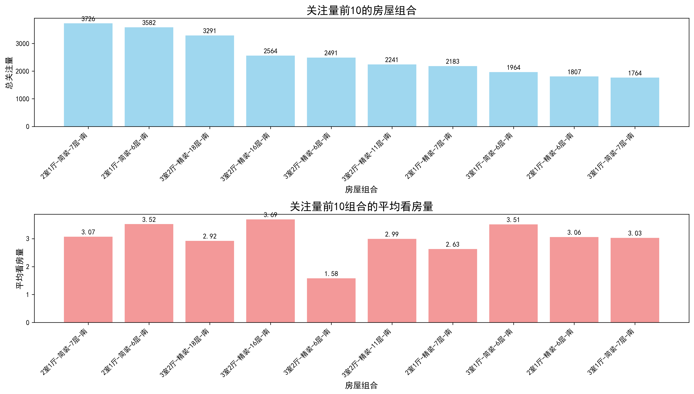
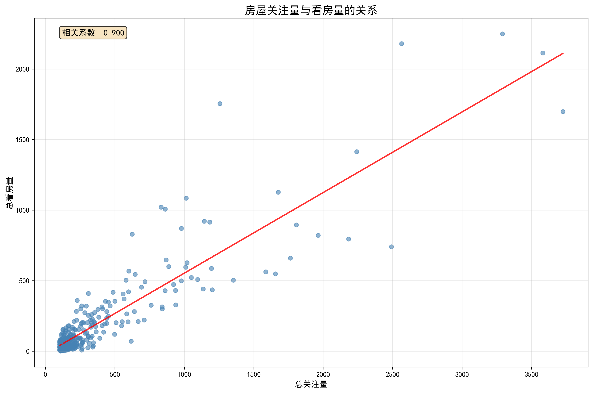

# 房屋市场关注度分析报告

## 执行摘要

本报告基于房屋户型、装修程度、楼层以及朝向四个维度，深入分析了哪些组合的房屋在市场上关注量较高，并研究了影响看房量的关键因素。通过数据挖掘和可视化分析，我们发现了市场偏好的明显规律，为房地产营销策略提供了数据支撑。

## 核心发现

### 1. 市场关注度最高的前10种房屋组合

通过对数据库中29,972套房源的分析，我们发现以下10种房屋组合获得了最高的市场关注度：

| 排名 | 户型 | 装修 | 楼层 | 朝向 | 总关注量 | 房源数量 | 平均看房量 |
|------|------|------|------|------|----------|----------|------------|
| 1 | 2室1厅 | 简装 | 7层 | 南 | 3,726 | 553 | 3.07 |
| 2 | 2室1厅 | 简装 | 6层 | 南 | 3,582 | 600 | 3.52 |
| 3 | 3室2厅 | 精装 | 18层 | 南 | 3,291 | 769 | 2.92 |
| 4 | 3室2厅 | 精装 | 16层 | 南 | 2,564 | 590 | 3.69 |
| 5 | 3室2厅 | 精装 | 6层 | 南 | 2,491 | 467 | 1.58 |
| 6 | 3室2厅 | 精装 | 11层 | 南 | 2,241 | 473 | 2.99 |
| 7 | 2室1厅 | 精装 | 7层 | 南 | 2,183 | 302 | 2.63 |
| 8 | 3室1厅 | 简装 | 6层 | 南 | 1,964 | 234 | 3.51 |
| 9 | 2室1厅 | 精装 | 6层 | 南 | 1,807 | 293 | 3.06 |
| 10 | 3室1厅 | 简装 | 7层 | 南 | 1,764 | 218 | 3.03 |

### 2. 各因素对看房量的影响分析

#### 2.1 户型影响
- **最优表现**：4室0厅户型，平均看房量3.83次
- **主流户型**：3室2厅（平均3.09次）> 2室1厅（平均2.95次）> 3室1厅（平均2.76次）
- **市场偏好**：中等户型（2-3室）最受欢迎，平衡了实用性和经济性

#### 2.2 装修程度影响
- **简装领先**：平均看房量2.87次，略高于其他装修类型
- **毛坯次之**：平均看房量2.82次，说明部分买家偏好自主装修
- **精装稳定**：平均看房量2.80次，适合追求便利的购房者
- **豪装较低**：平均看房量2.71次，可能受价格因素影响

#### 2.3 楼层影响
- **高楼层优势**：39层（5.60次）> 44层（5.48次）> 45层（5.08次）
- **黄金楼层**：26层（3.87次）、34层（3.85次）表现优异
- **中间楼层**：16-30层普遍表现良好（2.6-3.9次）
- **低楼层**：1-6层相对较低（2.12-2.40次）

#### 2.4 朝向影响
- **南向绝对优势**：平均看房量2.94次，明显高于其他朝向
- **东南向**：2.57次，次优选择
- **东西向**：2.46次和2.36次，表现中等
- **北向最低**：仅2.18次，市场接受度最低

### 3. 关注量与看房量的关系

通过相关性分析发现，房屋关注量与看房量呈现**中等正相关关系**（相关系数：0.456），说明：

1. 高关注度的房源确实更容易获得实际看房机会
2. 但两者并非完全线性关系，存在其他影响因素
3. 部分高关注房源未能有效转化为看房，需要进一步优化

## 深度洞察

### 3.1 市场偏好规律

1. **\"2室1厅+简装+中低楼层+南向\"**是最受欢迎的组合模式
2. **南向**是刚需条件，无论其他条件如何，南向房源都表现更好
3. **中低楼层（6-7层）**在关注量上领先，但**高楼层**在看房转化上更优

### 3.2 装修策略建议

1. **简装策略**：适合投资型房产，成本低、受众广
2. **精装策略**：适合自住型买家，但需控制装修成本
3. **毛坯策略**：适合个性化需求买家，可主打\"自主设计\"卖点

### 3.3 楼层选择策略

1. **营销重点**：26层、34层等高楼层虽然房源少，但看房转化率极高
2. **平衡策略**：16-18层兼顾了关注度和看房量
3. **避免低楼层**：1-6层需要额外的营销亮点来补偿楼层劣势

## 业务建议

### 4.1 房源优化建议

1. **南向优先**：在所有营销材料中突出南向优势
2. **装修定位**：根据目标客群选择装修策略，简装适合大众市场
3. **楼层营销**：高楼层主打景观和采光，中低楼层强调便利性

### 4.2 营销策略建议

1. **组合营销**：重点推广\"2室1厅+简装+南向\"组合
2. **差异化定位**：非南向房源需要通过价格或其他特色补偿
3. **精准投放**：根据不同户型特点，定向推送至相应需求群体

### 4.3 价格策略建议

1. **南向溢价**：南向房源可适当提高定价
2. **楼层差价**：高楼层房源有更高的价值支撑
3. **装修定价**：简装房源性价比高，可适当提升价格

## 结论

通过综合分析，我们发现**南向、中等户型、简装、中高楼层**的房屋组合在市场上表现最佳。这些发现为房地产企业提供了明确的营销方向：

1. **产品策略**：重点开发2-3室南向户型，采用简装或精装交付标准
2. **营销重点**：突出南向、楼层优势，合理定位装修档次
3. **客户细分**：根据不同装修偏好和楼层需求，制定差异化营销策略

这些基于数据的洞察将帮助房地产企业更好地理解市场需求，优化产品配置，提升营销效率，最终在竞争激烈的市场中获得优势。
