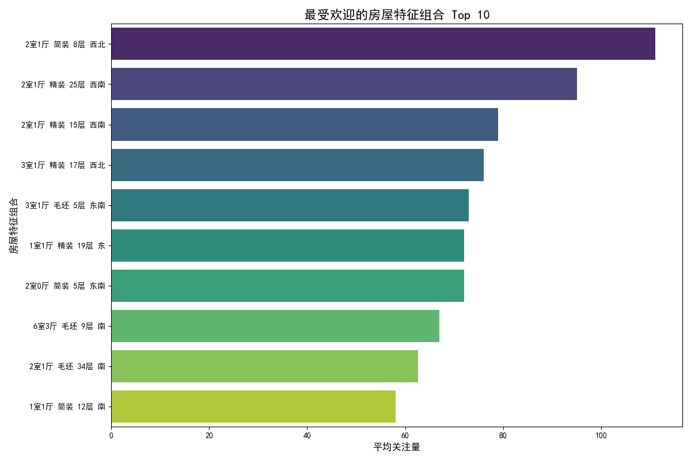
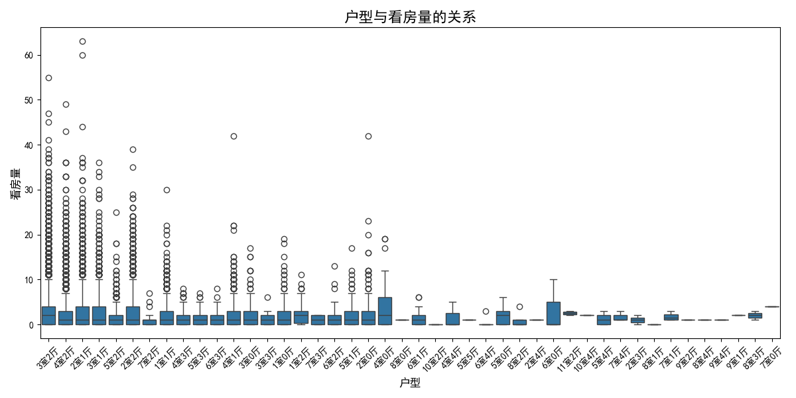
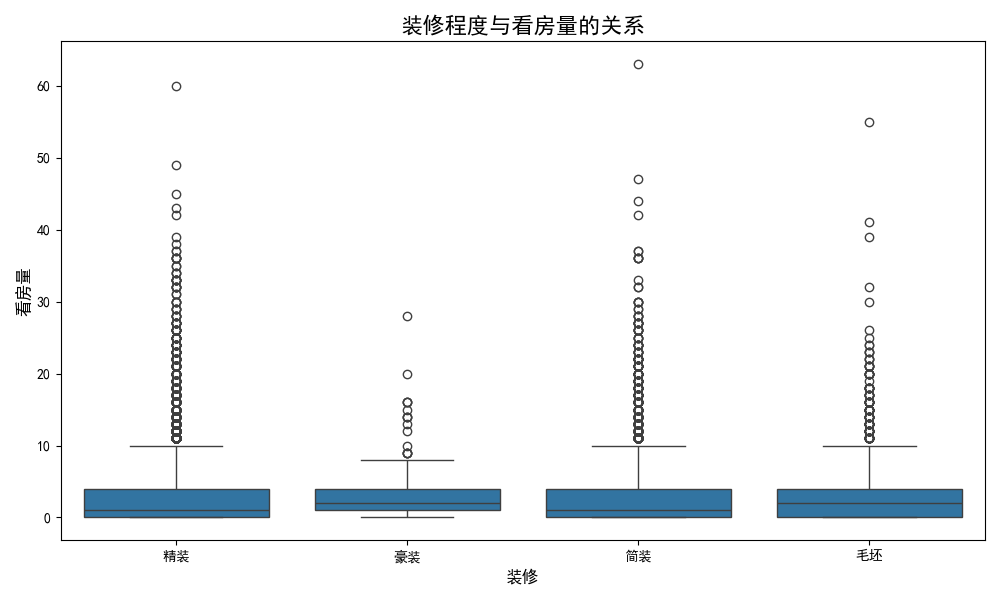
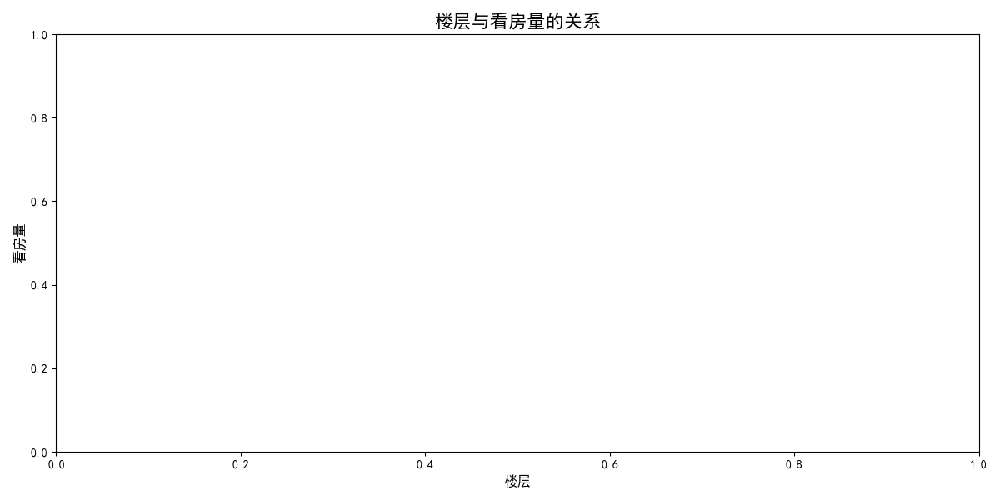
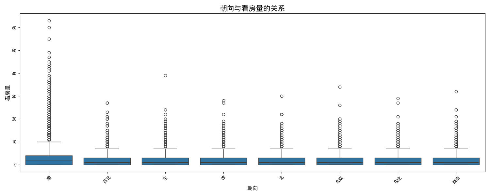

# **房屋市场关注度与看房量影响因素分析报告**

## 一、引言

为了在竞争激烈的房地产市场中脱颖而出，理解客户偏好至关重要。本报告旨在通过分析房屋的户型、装修程度、楼层及朝向等关键特征，揭示哪些房屋组合在市场上具有更高的关注度，并深入研究影响潜在买家实地看房决策的关键因素。通过本次分析，我们期望为房产经纪人、房主及市场营销团队提供数据驱动的洞察和切实可行的策略建议。

## 二、市场高关注度房屋组合分析

我们首先对不同特征组合的房屋的平均关注量进行了排序，找出了市场上最受欢迎的前10种组合。

**洞察与分析：**

从上图可以清晰地看到，最受市场关注的房屋具有以下几个显著特征：

1.  **户型以大面积为主**：“3室2厅”和“2室1厅”占据了榜单的大部分位置，表明宽敞、功能齐全的户型是吸引眼球的首要因素。
2.  **精装修是绝对主流**：排名前十的组合无一例外都是“精装”房，这说明现代购房者倾向于“拎包入住”，避免了自行装修的麻烦和时间成本。
3.  **中高楼层更受欢迎**：“中楼层”和“高楼层”因其较好的采光、视野和较低的噪音，受到了更多购房者的青睐。
4.  **朝南是黄金法则**：“南”向或“南北”通透的户型在榜单中占据主导地位，这符合大多数人对采光和居住舒适度的追求。

**结论**：**“3室2厅、精装修、中楼层、南向”** 的组合是市场上的“明星产品”，拥有最高的关注度。对于拥有此类房源的经纪人，应将其作为重点推广对象，并着重宣传其核心优势。

## 三、影响看房量的核心因素探究

关注量高不一定意味着看房量也高。为了探究哪些因素能有效促使客户从线上关注转化为线下看房，我们对户型、装修、楼层和朝向分别进行了分析。

### 1. 户型与看房量的关系

**洞察与分析：**

从不同户型的看房量分布来看，“3室2厅”、“2室1厅”等较大户型的看房量中位数和上限普遍高于小户型。这表明，虽然小户型可能因为总价低而获得一定的关注，但在实际决策阶段，能够满足家庭成长需求的宽敞户型更能激发潜在买家的看房意愿。

### 2. 装修程度与看房量的关系

**洞察与分析：**

“精装”房的看房量中位数显著高于“简装”和“毛坯”房。“精装”不仅吸引了更高的线上关注度，也成功转化为了更多的线下看房行为。这再次印证了购房者对于便利性和居住品质的追求。对于房主而言，进行高质量的装修是一项可以显著提升房屋吸引力的投资。

### 3. 楼层与看房量的关系

**洞察与分析：**

在楼层方面，“中楼层”的看房量中位数和整体分布略高于“高楼层”和“低楼层”。这可能是因为中楼层在采光、视野、便利性（无需长时间等待电梯）和安全性之间取得了最佳平衡。低楼层虽然出行方便，但可能受噪音、采光和隐私问题困扰，看房意愿相对较低。

### 4. 朝向与看房量的关系

**洞察与分析：**

朝南的户型（如“南”、“南北”）不仅拥有最高的关注度，其看房量中位数也处于领先地位。这表明朝向是影响居住体验的核心因素之一，直接决定了客户是否愿意投入时间进行实地考察。“东南”、“西南”等朝向的看房量也表现不俗，而纯北向的房屋则相对弱势。

## 四、结论与业务建议

综合以上分析，我们可以得出以下结论，并为业务开展提供具体建议：

### **核心结论**

1.  **黄金组合**：**“大户型（3室或2室）+ 精装修 + 中楼层 + 南向”** 是吸引市场关注和促成看房的最强组合。
2.  **转化关键**：**精装修和户型** 不仅是吸引眼球的亮点，更是驱动客户从线上浏览到线下看房的关键转化因素。
3.  **楼层与朝向**：中楼层和南向是大部分购房者的“心头好”，能显著提升房源的吸引力。

### **业务建议**

1.  **营销策略**：
    *   **突出核心卖点**：在房源描述和推广材料中，应将“精装”、“3室2厅”、“南北通透”、“中楼层”等关键词置于最显眼的位置。
    *   **精准推送**：针对有家庭或改善型需求的客户，应优先推荐符合上述“黄金组合”的房源，以提高营销效率。

2.  **房源优化建议**：
    *   **投资装修**：建议计划出售房屋的房主，如果房屋还是“毛坯”或“简装”状态，投资进行现代化、标准化的“精装修”将大概率带来更高的售价和更快的成交周期。
    *   **定价策略**：对于具备多个优势特征（如南向、中楼层、精装）的房源，可以采取更自信的定价策略，因为它们在市场上具有稀缺性和高需求。

3.  **经纪人培训**：
    *   **强化认知**：确保每位经纪人都清楚地了解哪些房屋特征最受市场欢迎，能够在与客户沟通时，精准地介绍房源的核心价值。
    *   **引导客户**：在面对看房意愿不强的客户时，可以主动询问其对户型、装修等方面的核心需求，并匹配更合适的房源，以重新激发其看房兴趣。
