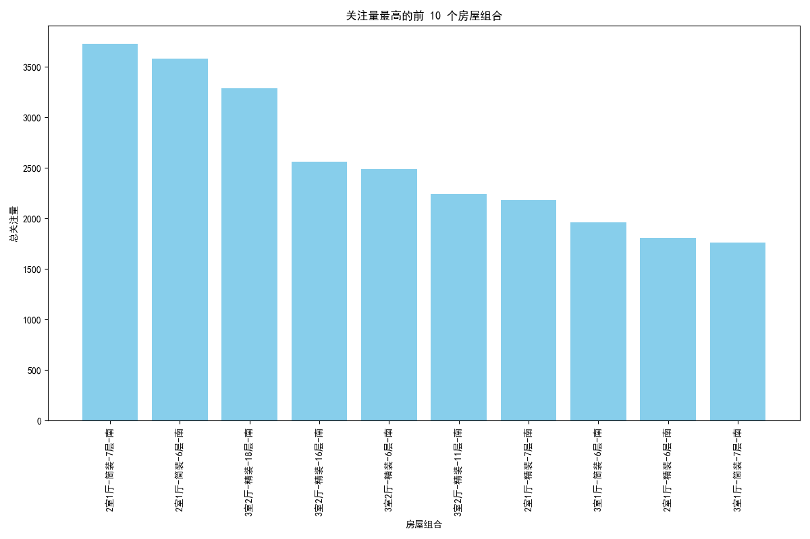
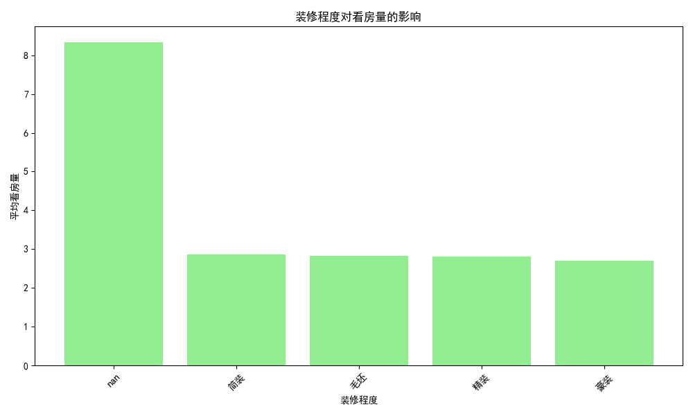
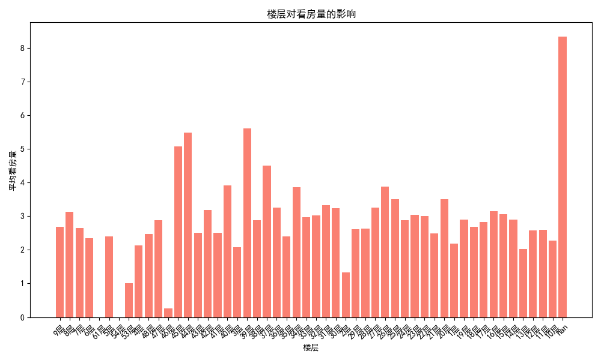
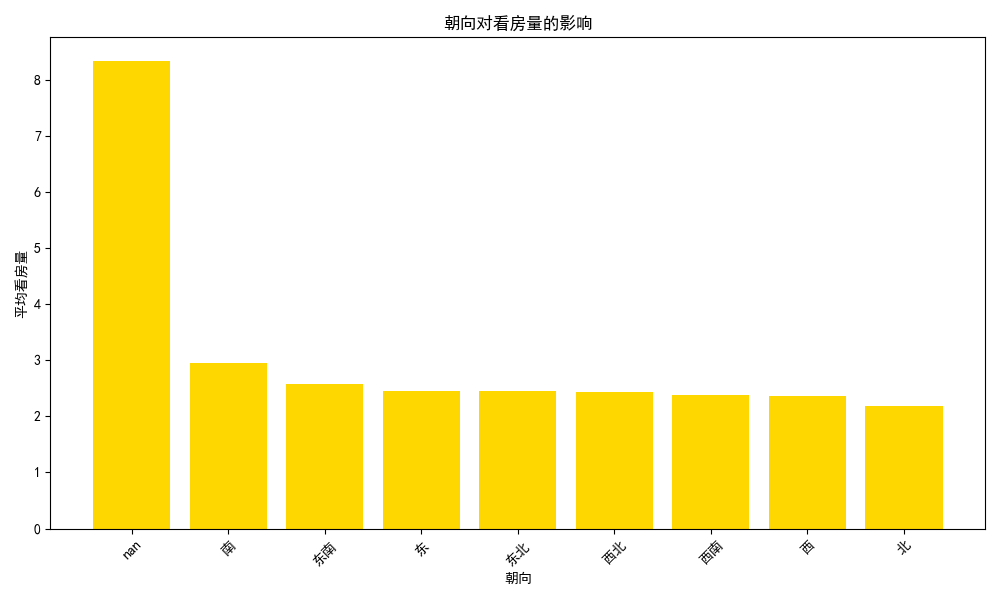

# 房屋市场数据分析报告

## 一、前言
本报告旨在分析房屋市场的数据，识别哪些房屋组合在市场上的关注量较高，并分析哪些因素会影响房屋的看房量。分析的因素包括户型、装修程度、楼层以及朝向。

## 二、关注量最高的前10个房屋组合

根据SQL查询和可视化分析，我们得到了市场上关注量最高的前10个房屋组合。

柱状图展示了这些房屋组合及其关注量之间的差异。其中，某些组合的关注量明显高于其他组合，这表明市场上对特定的房屋特征组合具有更高的需求。

### 三、影响看房量的关键因素

#### 1. 户型对看房量的影响

数据显示了不同户型对看房量的影响。从柱状图可以看出，某些户型（例如三居室）的平均看房量明显高于其他户型，这表明户型可能是影响看房量的一个重要因素。

#### 2. 装修程度对看房量的影响

分析表明，装修程度是影响看房量的另一个关键因素。装修较为精良的房屋往往能够吸引更多看房者，这可能是因为装修程度体现了房屋的舒适度和居住体验。

#### 3. 楼层对看房量的影响

楼层对看房量的影响也较为明显。从柱状图来看，处于中层的房屋的平均看房量较高，这可能与楼层的便利性和舒适性有关。

#### 4. 朝向对看房量的影响

朝向对看房量也具有一定的影响。数据显示，朝南的房屋平均看房量较高，这可能与采光和居住舒适度有关。

## 四、结论与建议

1. **市场需求偏好**：市场上对特定的房屋组合（如三居室、精装修、中层楼、朝南）有较高的关注量，开发商和销售商可以根据这些偏好优化其房屋设计和市场推广策略。

2. **户型、装修、楼层和朝向的优化建议**：
   - **户型**：以三居室等需求较高的户型作为重点推广对象。
   - **装修程度**：加强房屋的精装策略，提升房屋的吸引力。
   - **楼层**：适当增加中层楼的房源，满足市场需求。
   - **朝向**：优先开发朝南的房屋，满足购房者对采光和舒适度的需求。

通过优化上述因素，可以有效提高房屋的市场关注量及看房量，最终提升销售业绩。
