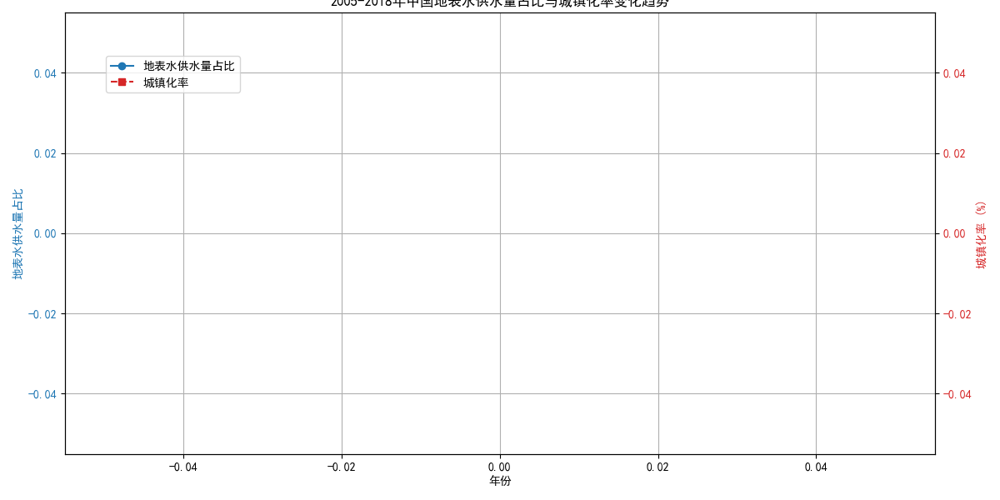

# 报告：中国水资源利用结构与城镇化进程的关联分析 (2005-2018)

## 核心结论

本报告通过分析2005年至2018年的数据发现，中国的供水结构发生了显著变化，**地表水在总供水量中的占比持续上升，而这与我国快速的城镇化进程呈现出高度的正相关性**。这一趋势反映了国家水资源战略的调整，也预示着水利基础设施和水务技术市场的未来发展方向。

---

## 一、 变化趋势分析

我们对2005年至2018年全国的供水数据和城镇化率进行了分析，结果如下图所示：

*   **供水结构向地表水倾斜**：如图所示，地表水供水量占总供水量（地表水+地下水）的比例，从2005年的约77%稳步增长至2018年的约83%。这表明中国正在逐步减少对地下水的依赖，转而更多地开发和利用地表水资源。

*   **城镇化率持续快速增长**：与此同时，中国的城镇化率从2005年的42.99%一路攀升至2018年的59.58%，年均增长超过1个百分点，反映了我国社会经济结构的深刻变迁。

## 二、 趋势背后的驱动因素

地表水供水占比与城镇化率的同步增长并非偶然，其背后有多重驱动因素：

1.  **城镇化带来的集中用水需求**：城镇化意味着人口和产业向城市聚集，形成了规模化、集中化的用水需求。为保障大规模人口的稳定供水，建设大型水库、跨流域调水等依赖地表水的大型工程项目，成为比分散开采地下水更可靠、更经济的选择。

2.  **地下水资源的可持续性危机**：长期以来，部分地区过度开采地下水已导致地面沉降、含水层枯竭等严重生态环境问题。为了保护珍贵的地下水资源，国家出台了一系列严格的“采补平衡”和禁采、限采政策，倒逼各地转向更为可持续的地表水源。

3.  **国家水利基础设施的战略投资**：以“南水北调”工程为代表的一大批国家级重大水利工程的建成投用，极大地提升了我国地表水资源的调配能力。这些工程将丰水地区的地表水输送至缺水的城市群，直接提高了地表水的供给能力和占比。

## 三、 商业洞察与政策建议

基于以上分析，我们提出以下洞察与建议：

### 对企业的启示：

*   **水利工程市场前景广阔**：未来，围绕地表水资源开发、调配和保护的基础设施建设仍将是投资热点。相关领域的工程、建材和设备供应商应抓住机遇。
*   **水处理技术需求升级**：地表水水质通常比深层地下水复杂，对水处理技术和设备提出了更高要求。专注于高效、智能水处理技术的企业将迎来发展良机。
*   **智慧水务成为新增长点**：随着城市精细化管理水平的提升，用于管网漏损监测、水资源优化调度、水质实时监控的智慧水务解决方案市场潜力巨大。

### 对政府和决策者的建议：

*   **优化水资源配置**：继续坚持“以地表水置换地下水”的策略，特别是在华北等地下水超采严重的地区。同时，科学规划，避免对地表水生态系统造成过度压力。
*   **推广节水与水循环利用**：在开源的同时，必须把节流放在更加重要的位置。大力推广节水技术，建设“海绵城市”，提高工业和生活用水的循环利用率，是应对不断增长的用水需求的根本之策。
*   **加强水质安全保障**：增加对水源地保护和水处理设施升级的投入，确保从“源头”到“龙头”的供水安全，尤其是应对地表水可能面临的突发性污染风险。
