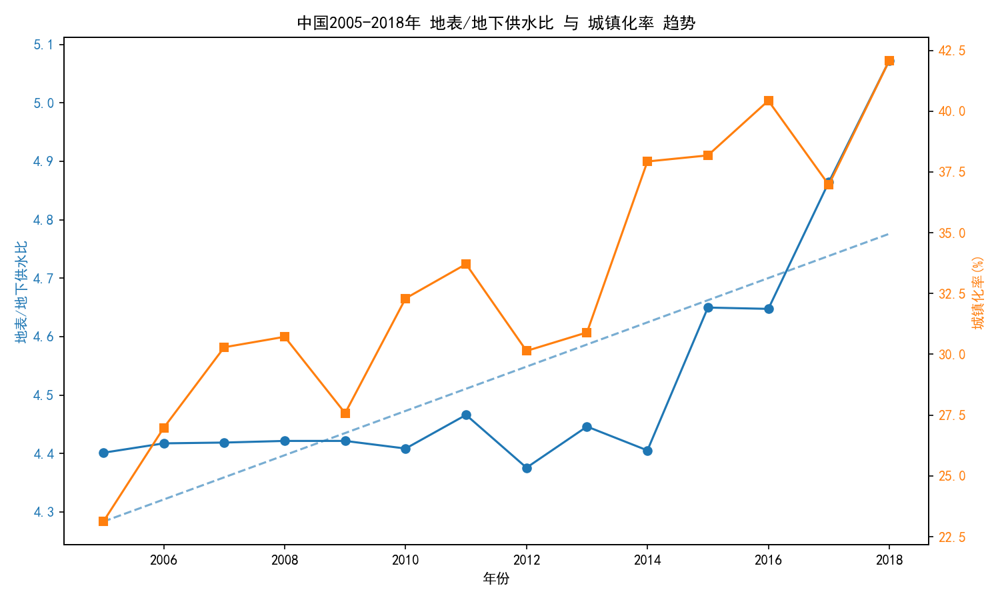
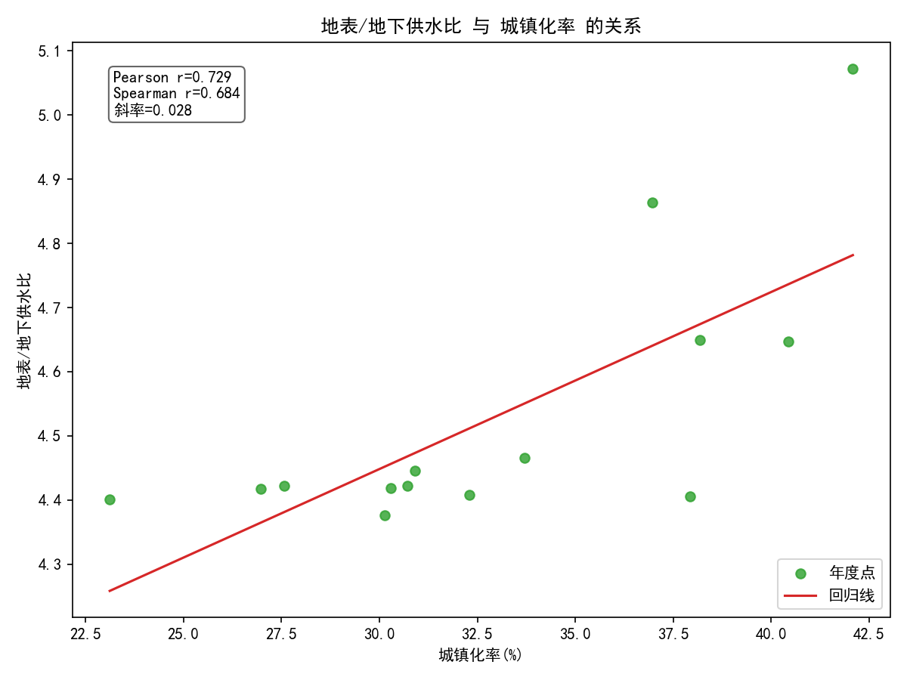

# 中国2005-2018年地表水与地下水供水比的变化趋势及其与城镇化率的关系

## 结论摘要
- 2005-2018年，全国地表水/地下水供水比稳步上升：从约4.40提升到约5.07，线性趋势斜率约为每年+0.038。
- 该比值与城镇化率呈显著正相关：Pearson r≈0.729，Spearman r≈0.684。线性回归显示比值≈0.0276×城镇化率(%) + 3.62。
- 直观解读：随着城镇化推进，供水结构更依赖地表水（如水库、跨流域调水和地表水厂），地下水占比相对下降或增长更慢。

下文提供数据依据、图表与原因分析，并给出策略建议。

---

## 数据与方法
- 数据源：SQLite数据库 dacomp-016.sqlite
  - 工作表1：含地表水供水量(亿m³)、地下水供水量(亿m³)
  - 经济指标数据：含城镇化率(%)
- 取值范围：全国（地区名称=中国），年度2005-2018。
- 指标构造：地表/地下供水比 = 地表水供水量 ÷ 地下水供水量。
- 统计方法：时间趋势线性回归；与城镇化率的Pearson/Spearman相关；比值对城镇化率的线性回归。

---

## 关键结果
- 年份范围: 2005-2018
- 2005年地表/地下供水比: 4.401
- 2018年地表/地下供水比: 5.072
- 比值随年份线性趋势斜率(每年变化): 0.0379
- 比值与城镇化率 Pearson 相关系数: 0.729
- 比值与城镇化率 Spearman 相关系数: 0.684
- 线性回归（比值 = a×城镇化率 + b）: a=0.0276, b=3.6200
  - 回归方程：比值 ≈ 0.0276 × 城镇化率(%) + 3.62

---

## 可视化

- 地表/地下供水比与城镇化率的时间趋势（双轴）：


- 地表/地下供水比随城镇化率变化的散点与回归线：


---

## 解释与洞察
1. 为什么地表/地下供水比上升？
   - 城镇化驱动的供水基础设施建设：城镇人口与工业集中度上升，更多依赖大中型地表水厂、水库及跨流域调水工程（如南水北调）以保障城市稳定供水，带动地表水供给更快增长。
   - 地下水过度开采治理趋严：华北等地区长期超采导致地面沉降与生态问题，政策层面加强地下水取水总量控制与压采，地下水供给增速受限甚至收缩，抬升“地表/地下”之比。
   - 水源安全与水质要求提升：城市供水对水质与供应可靠性要求更高，地表水通过净化与调度更易达标和统筹，促进结构优化向地表水倾斜。
   - 规模经济与调度能力：地表水工程的规模化、信息化调度能力增强，保障高峰期供水与跨季节平衡，进一步提升地表水的供水权重。

2. 与城镇化率的关系何在？
   - 显著正相关（r≈0.73）说明：城镇化率越高的年份，地表/地下供水比通常越高。拟合关系显示城镇化率每提高1个百分点，地表/地下比值平均上升约0.0276。
   - 但需注意相关非因果：城镇化与供水结构的共同推手还包括水资源工程投资、取水监管、产业结构转型、降水时空分布等。Spearman r≈0.684也支持单调正关系。

3. 规模与节奏
   - 年度斜率约+0.038/年，表明比值提升稳健但非剧烈，符合“渐进式结构优化”的供给特征。
   - 这与重大战略工程逐步投产、地下水压采政策逐步推进的节奏一致。

---

## 策略建议
- 地下水保护与刚性约束并重：
  - 延续并优化地下水压采与取水总量控制，重点治理超采区，推进含水层恢复和补给工程，建立长期监测评估机制。
- 强化地表水供给的韧性与协同：
  - 完善跨流域调水与蓄水体系，提升枯丰错峰调度能力；推进流域一体化治理和生态基流保障，降低极端气候下的供水脆弱性。
- 城市侧需求管理：
  - 推进供水管网漏损治理、阶梯水价与节水器具普及；针对工业园区推进高循环与中水回用，降低新增城镇化对原水的边际压力。
- 结构优化与区域差异化：
  - 北方缺水与地下水超采区：优先保障地表水替代与非常规水（再生水、海水淡化）发展。
  - 南方丰水区：在生态约束下实现地表水安全供给与水源地保护并重，警惕局部地下水污染与过度开采。
- 风险与前瞻布局：
  - 将供水结构优化与气候变化适应结合，开展多情景推演；完善城市群协同供水网络和备用水源，提升系统抗风险能力。

---

## 局限与进一步工作
- 本分析基于全国口径年度汇总，未展开地区与行业异质性，可能掩盖区域差异和结构性特征。
- 相关不代表因果，未纳入降水、气候、政策强度、投资规模等控制变量。
- 时间范围至2018年，后续趋势可能受新工程投产、极端气候、政策变化影响。
- 建议后续：
  - 分区域（如南北方、重点流域）分解分析；
  - 纳入降水与蓄水、非常规水比重等变量做多元回归；
  - 结合政策时点做断点/事件研究，增强因果识别。

---

## 复现：绘图与统计代码
下面代码用于读取数据、计算趋势与相关并生成两幅图（已在当前目录保存为 ratio_urban_trend.png 和 ratio_vs_urban_scatter.png）：

```python
import pandas as pd
import numpy as np
import matplotlib.pyplot as plt

# 配置中文显示
plt.rcParams['font.sans-serif'] = ['SimHei']
plt.rcParams['axes.unicode_minus'] = False

# 读取数据
df = pd.read_csv('china_water_urban_2005_2018.csv')

# 排序并选择需要的列
df = df.sort_values('年度')
years = df['年度'].values
surface = df['地表水供水量_亿立方米'].values
ground = df['地下水供水量_亿立方米'].values
ratio = df['地表与地下比值'].values
urban = df['城镇化率_百分比'].values

# 基本统计与趋势计算
slope_year_ratio, intercept_year_ratio = np.polyfit(years, ratio, 1)  # 每年变化的斜率
pearson_r = np.corrcoef(ratio, urban)[0, 1]
slope_ratio_urban, intercept_ratio_urban = np.polyfit(urban, ratio, 1)

# Spearman相关
rank_ratio = pd.Series(ratio).rank(method='average').values
rank_urban = pd.Series(urban).rank(method='average').values
spearman_r = np.corrcoef(rank_ratio, rank_urban)[0, 1]

# 图1：比值与城镇化率的时间趋势（双轴）
fig, ax1 = plt.subplots(figsize=(10, 6))
color1 = 'tab:blue'
ax1.set_xlabel('年份')
ax1.set_ylabel('地表/地下供水比', color=color1)
ax1.plot(years, ratio, color=color1, marker='o', label='地表/地下供水比')
ax1.tick_params(axis='y', labelcolor=color1)
ratio_trend = slope_year_ratio * years + intercept_year_ratio
ax1.plot(years, ratio_trend, color=color1, linestyle='--', alpha=0.6, label='比值趋势线')

ax2 = ax1.twinx()
color2 = 'tab:orange'
ax2.set_ylabel('城镇化率(%)', color=color2)
ax2.plot(years, urban, color=color2, marker='s', label='城镇化率(%)')
ax2.tick_params(axis='y', labelcolor=color2)

plt.title('中国2005-2018年 地表/地下供水比 与 城镇化率 趋势')
fig.tight_layout()
plt.savefig('ratio_urban_trend.png', dpi=150)

# 图2：比值 vs 城镇化率散点及回归线
plt.figure(figsize=(8, 6))
plt.scatter(urban, ratio, color='tab:green', alpha=0.8, label='年度点')
xline = np.linspace(urban.min(), urban.max(), 100)
yline = slope_ratio_urban * xline + intercept_ratio_urban
plt.plot(xline, yline, color='tab:red', label='回归线')
plt.xlabel('城镇化率(%)')
plt.ylabel('地表/地下供水比')
plt.title('地表/地下供水比 与 城镇化率 的关系')
plt.legend()
plt.text(0.05, 0.95, f\"Pearson r={pearson_r:.3f}\
Spearman r={spearman_r:.3f}\
斜率={slope_ratio_urban:.3f}\",
         transform=plt.gca().transAxes, va='top', ha='left',
         bbox=dict(boxstyle='round', facecolor='white', alpha=0.6))
plt.tight_layout()
plt.savefig('ratio_vs_urban_scatter.png', dpi=150)
```

---

## 小结
2005-2018年间，随着城镇化持续推进，我国供水结构出现“地表水相对走强、地下水相对受限”的显著趋势。建议在持续推进地下水保护的同时，增强地表水工程的韧性与调度能力，并通过需求侧管理和非常规水发展，构建更安全、更可持续的城市供水体系。
