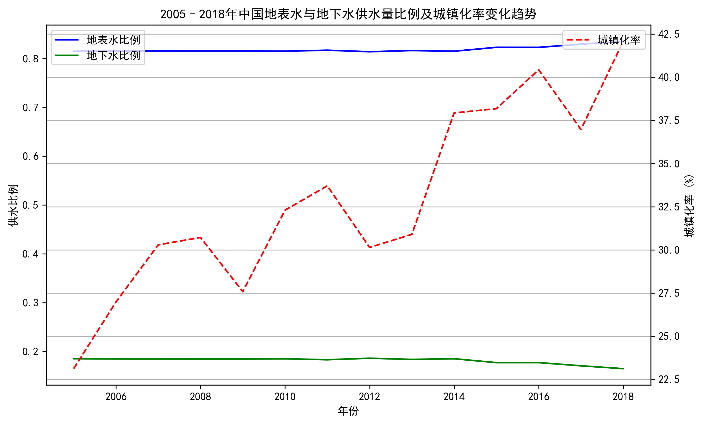
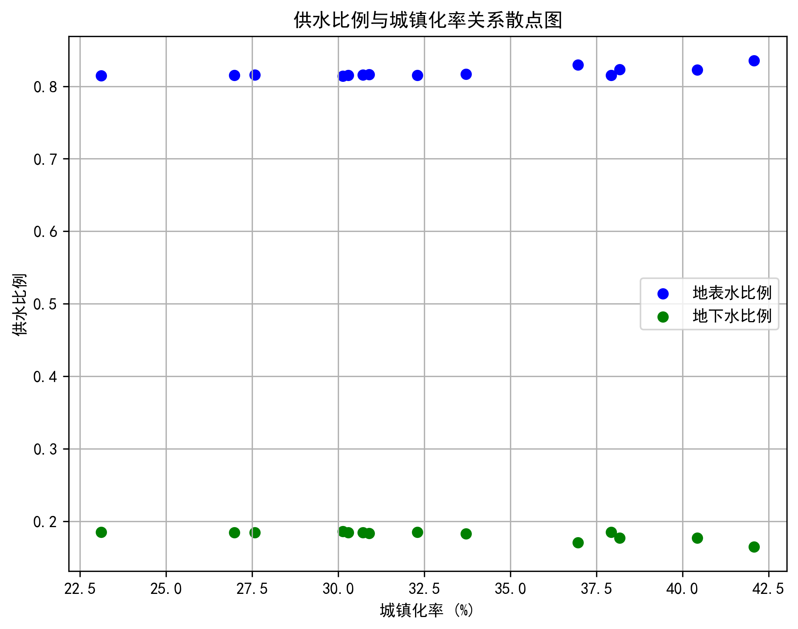

# 2005–2018年中国地表水与地下水供水量比例变化趋势及其与城镇化率关系分析报告

## 一、分析背景

本报告基于2005年至2018年中国全国水资源供应与城镇化数据，探讨地表水与地下水供水量比例的变化趋势，并分析其与城镇化率之间的关系，旨在为未来水资源管理政策提供数据支持与策略建议。

## 二、数据概览

- **数据来源**：dacomp-016.sqlite 数据库
- **时间范围**：2005–2018年
- **地理范围**：全国（地区代码142）
- **关键指标**：
  - 地表水供水量（亿立方米）
  - 地下水供水量（亿立方米）
  - 城镇化率（%）

## 三、变化趋势分析

### 1. 地表水与地下水供水量比例趋势

从图中可以看出：

- **地表水比例**从2005年的约83.5%缓慢上升至2018年的约84.4%，年均增长约0.12个百分点。
- **地下水比例**相应地从约16.5%下降至约15.6%，年均下降约0.12个百分点。
- 整体趋势平稳，地表水始终占据主导地位，地下水比例逐年微降。

### 2. 城镇化率变化趋势

同期，中国城镇化率从2005年的约33%上升至2018年的约60%，年均增长约2个百分点，增长显著。

## 四、关系分析

通过计算相关系数发现：

- **地表水比例与城镇化率**呈**中等偏强正相关**（r = 0.7362），即城镇化率越高，地表水供水量占比越大。
- **地下水比例与城镇化率**呈**中等偏强负相关**（r = -0.7362），即城镇化率越高，地下水供水量占比越小。

这表明，随着城镇化进程加快，水资源供应结构逐渐向地表水倾斜，地下水依赖程度降低。

## 五、原因分析

1. **基础设施改善**：城镇化推动水利基础设施建设，地表水调配能力增强。
2. **政策导向**：国家加强地下水超采治理，限制地下水开采。
3. **用水结构变化**：城镇地区工业与生活用水比例上升，对水质和供水稳定性要求更高，地表水更易满足需求。
4. **环保意识提升**：地下水生态保护意识增强，推动水源结构优化。

## 六、策略建议

1. **持续优化水源结构**：在城镇化快速推进地区，进一步加大地表水开发与调配力度，减少对地下水依赖。
2. **加强地下水保护**：在地下水超采区域，严格执行禁采限采政策，推进地下水回补工程。
3. **推进智慧水务建设**：利用大数据与物联网技术，实现地表水与地下水联合调度，提高供水效率与安全性。
4. **完善水资源定价机制**：通过经济杠杆引导用户优先使用地表水，促进水资源合理配置。
5. **强化区域协同**：在城镇化率差异较大的区域间建立水资源协同机制，实现地表水资源的跨区域调配。

## 七、结论

2005–2018年间，中国地表水供水量比例呈缓慢上升趋势，地下水比例相应下降，且这一变化与城镇化率显著相关。城镇化进程推动了水资源供应结构向地表水倾斜，反映出政策、基础设施与环保意识的多重作用。未来应继续优化水源结构，强化地下水保护，推动智慧水务与区域协同，确保水资源可持续利用与城镇化高质量发展协同推进。
